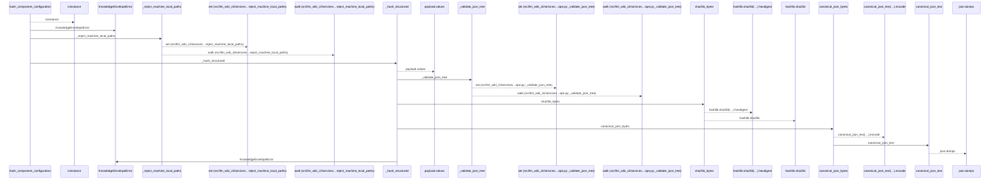
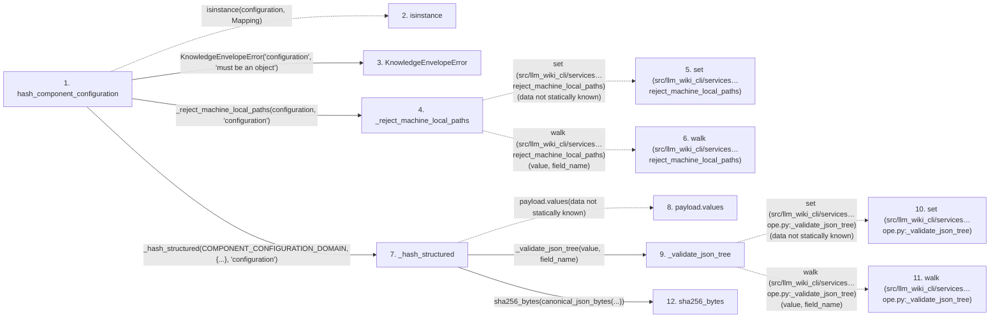

# hash_component_configuration

**Entry point:** `hash_component_configuration` (`api`)
**Source:** [knowledge_envelope](../modules/knowledge_envelope.md)
**Modules touched:** [knowledge_envelope](../modules/knowledge_envelope.md), [knowledge_evidence](../modules/knowledge_evidence.md)

## Call sequence

<!-- Auto-generated from static call edges. Dashed arrows are external or unresolved calls. Reviewed runtime conditions and side effects belong in Behavior. -->

## Data flow

<!-- Auto-generated static analysis. Treat values and boundaries as best-effort hints, not runtime proof. -->

### Step data

| Step | Inputs | Reads | Writes | Returns |
|---|---|---|---|---|
| `hash_component_configuration` | `configuration: Mapping[str, Any]` | `Mapping`, `COMPONENT_CONFIGURATION_DOMAIN` | - | `_hash_structured(...)` |
| `isinstance` | - | - | - | - |
| `KnowledgeEnvelopeError` | - | - | - | - |
| `_reject_machine_local_paths` | `value: object`, `field_name: str` | - | - | - |
| `set (src/llm_wiki_cli/services…reject_machine_local_paths)` | - | - | - | - |
| `walk (src/llm_wiki_cli/services…reject_machine_local_paths)` | - | - | - | - |
| `_hash_structured` | `domain: str`, `payload: Mapping[str, Any]`, `field_name: str` | `KnowledgeEnvelopeError` | - | `sha256_bytes(...)` |
| `payload.values` | - | - | - | - |
| `_validate_json_tree` | `value: object`, `field_name: str` | - | - | - |
| `set (src/llm_wiki_cli/services…ope.py:_validate_json_tree)` | - | - | - | - |
| `walk (src/llm_wiki_cli/services…ope.py:_validate_json_tree)` | - | - | - | - |
| `sha256_bytes` | `value: bytes` | - | - | `...` |

### Call data

| From | To | Line | Call |
|---|---|---:|---|
| hash_component_configuration | isinstance | 859 | `isinstance(configuration, Mapping)` |
| hash_component_configuration | KnowledgeEnvelopeError | 860 | `KnowledgeEnvelopeError('configuration', 'must be an object')` |
| hash_component_configuration | _reject_machine_local_paths | 861 | `_reject_machine_local_paths(configuration, 'configuration')` |
| _reject_machine_local_paths | set (src/llm_wiki_cli/services…reject_machine_local_paths) | 1713 | `set(data not statically known)` |
| _reject_machine_local_paths | walk (src/llm_wiki_cli/services…reject_machine_local_paths) | 1757 | `walk(value, field_name)` |
| hash_component_configuration | _hash_structured | 862 | `_hash_structured(COMPONENT_CONFIGURATION_DOMAIN, {...}, 'configuration')` |
| _hash_structured | payload.values | 1604 | `payload.values(data not statically known)` |
| _hash_structured | _validate_json_tree | 1605 | `_validate_json_tree(value, field_name)` |
| _validate_json_tree | set (src/llm_wiki_cli/services…ope.py:_validate_json_tree) | 1626 | `set(data not statically known)` |
| _validate_json_tree | walk (src/llm_wiki_cli/services…ope.py:_validate_json_tree) | 1667 | `walk(value, field_name)` |
| _hash_structured | sha256_bytes | 1606 | `sha256_bytes(canonical_json_bytes(...))` |

### Boundary effects

*No boundary effects detected.*

### Static analysis gaps

| Kind | Step | Target | Line |
|---|---|---|---:|
| external_call | `hash_component_configuration` | `isinstance` | 859 |
| unresolved_call | `_reject_machine_local_paths` | `walk` | 1757 |
| unresolved_call | `_hash_structured` | `payload.values` | 1604 |
| unresolved_call | `_validate_json_tree` | `walk` | 1667 |
| step_limit | `hash_component_configuration` | `first 12 steps` | 0 |

## Behavior

This flow starts at `hash_component_configuration` and is classified as `api`. The generated call and data-flow sections are bounded static projections; runtime conditions and side effects require source-level confirmation.
