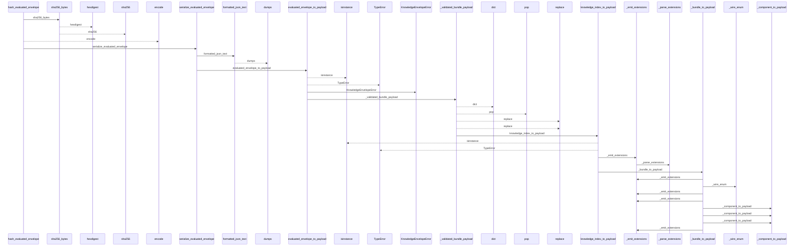
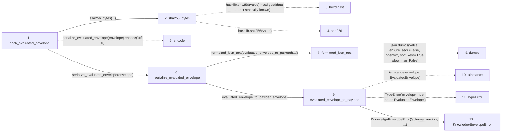

# hash_evaluated_envelope

**Entry point:** `hash_evaluated_envelope` (`api`)
**Source:** [knowledge_envelope](../modules/knowledge_envelope.md)
**Modules touched:** [knowledge_envelope](../modules/knowledge_envelope.md), [knowledge_evidence](../modules/knowledge_evidence.md), [knowledge_governance](../modules/knowledge_governance.md), and 1 more

**Complete modules touched:**

- [knowledge_envelope](../modules/knowledge_envelope.md)
- [knowledge_evidence](../modules/knowledge_evidence.md)
- [knowledge_governance](../modules/knowledge_governance.md)
- [knowledge_model](../modules/knowledge_model.md)

## Call sequence

<!-- Auto-generated from static call edges. Dashed arrows are external or unresolved calls. Reviewed runtime conditions and side effects belong in Behavior. -->

> Call sequence diagram shows 30 of 96 interactions; 66 omitted to keep the visualization within the 30-interaction and generated-diagram limits.

> Trace truncated at the depth limit; deeper calls are omitted.

## Data flow

<!-- Auto-generated static analysis. Treat values and boundaries as best-effort hints, not runtime proof. -->

### Step data

| Step | Inputs | Reads | Writes | Returns |
|---|---|---|---|---|
| `hash_evaluated_envelope` | `envelope: EvaluatedEnvelope` | - | - | `sha256_bytes(...)` |
| `sha256_bytes` | `value: bytes` | - | - | `...` |
| `hexdigest` | - | - | - | - |
| `sha256` | - | - | - | - |
| `encode` | - | - | - | - |
| `serialize_evaluated_envelope` | `envelope: EvaluatedEnvelope` | `KnowledgeEnvelopeError` | - | `formatted_json_text(...)` |
| `formatted_json_text` | `value: Any` | - | - | `...` |
| `dumps` | - | - | - | - |
| `evaluated_envelope_to_payload` | `envelope: EvaluatedEnvelope` | `EvaluatedEnvelope`, `EVALUATED_ENVELOPE_VERSION`, `EVALUATED_ENVELOPE_VERSION`, `INVENTORY_HASH_EXTENSION`, `INVENTORY_HASH_EXTENSION` | - | `{...}` |
| `isinstance` | - | - | - | - |
| `TypeError` | - | - | - | - |
| `KnowledgeEnvelopeError` | - | - | - | - |

### Call data

| From | To | Line | Call |
|---|---|---:|---|
| hash_evaluated_envelope | sha256_bytes | 1170 | `sha256_bytes(...)` |
| sha256_bytes | hexdigest | 197 | `hashlib.sha256(value).hexdigest(data not statically known)` |
| sha256_bytes | sha256 | 197 | `hashlib.sha256(value)` |
| hash_evaluated_envelope | encode | 1170 | `serialize_evaluated_envelope(envelope).encode('utf-8')` |
| hash_evaluated_envelope | serialize_evaluated_envelope | 1170 | `serialize_evaluated_envelope(envelope)` |
| serialize_evaluated_envelope | formatted_json_text | 1157 | `formatted_json_text(evaluated_envelope_to_payload(...))` |
| formatted_json_text | dumps | 177 | `json.dumps(value, ensure_ascii=False, indent=2, sort_keys=True, allow_nan=False)` |
| serialize_evaluated_envelope | evaluated_envelope_to_payload | 1157 | `evaluated_envelope_to_payload(envelope)` |
| evaluated_envelope_to_payload | isinstance | 1131 | `isinstance(envelope, EvaluatedEnvelope)` |
| evaluated_envelope_to_payload | TypeError | 1132 | `TypeError('envelope must be an EvaluatedEnvelope')` |
| evaluated_envelope_to_payload | KnowledgeEnvelopeError | 1134 | `KnowledgeEnvelopeError('schema_version', ...)` |

### Boundary effects

*No boundary effects detected.*

### Static analysis gaps

| Kind | Step | Target | Line |
|---|---|---|---:|
| external_call | `sha256_bytes` | `hashlib.sha256(value).hexdigest` | 197 |
| external_call | `sha256_bytes` | `hashlib.sha256` | 197 |
| unresolved_call | `hash_evaluated_envelope` | `serialize_evaluated_envelope(envelope).encode` | 1170 |
| external_call | `formatted_json_text` | `json.dumps` | 177 |
| unresolved_call | `evaluated_envelope_to_payload` | `isinstance` | 1131 |
| unresolved_call | `evaluated_envelope_to_payload` | `TypeError` | 1132 |
| step_limit | `hash_evaluated_envelope` | `first 12 steps` | 0 |
| truncated_flow | `hash_evaluated_envelope` | `depth limit` | 0 |

## Behavior

This flow starts at `hash_evaluated_envelope` and is classified as `api`. The generated call and data-flow sections are bounded static projections; runtime conditions and side effects require source-level confirmation.
