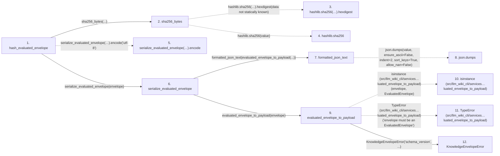

# hash_evaluated_envelope

**Entry point:** `hash_evaluated_envelope` (`api`)
**Source:** [knowledge_envelope](../modules/knowledge_envelope.md)
**Modules touched:** [knowledge_envelope](../modules/knowledge_envelope.md), [knowledge_evidence](../modules/knowledge_evidence.md), [knowledge_governance](../modules/knowledge_governance.md), and 1 more

**Complete modules touched:**

- [knowledge_envelope](../modules/knowledge_envelope.md)
- [knowledge_evidence](../modules/knowledge_evidence.md)
- [knowledge_governance](../modules/knowledge_governance.md)
- [knowledge_model](../modules/knowledge_model.md)

## Call sequence

```mermaid
sequenceDiagram
    participant p0 as hash_evaluated_envelope
    participant p1 as sha256_bytes
    participant p2 as hashlib.sha256(…).hexdigest
    participant p3 as hashlib.sha256
    participant p4 as serialize_evaluated_envelope(…).encode
    participant p5 as serialize_evaluated_envelope
    participant p6 as formatted_json_text
    participant p7 as json.dumps
    participant p8 as evaluated_envelope_to_payload
    participant p9 as isinstance (src/llm_wiki_cli/services…luated_envelope_to_payload)
    participant p10 as TypeError (src/llm_wiki_cli/services…luated_envelope_to_payload)
    participant p11 as KnowledgeEnvelopeError
    participant p12 as _validated_bundle_payload
    participant p13 as dict
    participant p14 as snapshot_extensions.pop
    participant p15 as replace
    participant p16 as knowledge_index_to_payload
    participant p17 as isinstance (src/llm_wiki_cli/services…knowledge_index_to_payload)
    participant p18 as TypeError (src/llm_wiki_cli/services…knowledge_index_to_payload)
    participant p19 as _emit_extensions
    participant p20 as isinstance (src/llm_wiki_cli/services…_model.py:_emit_extensions)
    participant p21 as _parse_extensions
    participant p22 as _bundle_to_payload
    participant p23 as _wire_enum
    participant p24 as _component_to_payload
    p0->>p1: sha256_bytes
    p1-->>p2: hashlib.sha256(…).hexdigest
    p1-->>p3: hashlib.sha256
    p0-->>p4: serialize_evaluated_envelope(…).encode
    p0->>p5: serialize_evaluated_envelope
    p5->>p6: formatted_json_text
    p6-->>p7: json.dumps
    p5->>p8: evaluated_envelope_to_payload
    p8-->>p9: isinstance (src/llm_wiki_cli/services…luated_envelope_to_payload)
    p8-->>p10: TypeError (src/llm_wiki_cli/services…luated_envelope_to_payload)
    p8->>p11: KnowledgeEnvelopeError
    p8->>p12: _validated_bundle_payload
    p12-->>p13: dict
    p12-->>p14: snapshot_extensions.pop
    p12-->>p15: replace
    p12-->>p15: replace
    p12->>p16: knowledge_index_to_payload
    p16-->>p17: isinstance (src/llm_wiki_cli/services…knowledge_index_to_payload)
    p16-->>p18: TypeError (src/llm_wiki_cli/services…knowledge_index_to_payload)
    p16->>p19: _emit_extensions
    p19-->>p20: isinstance (src/llm_wiki_cli/services…_model.py:_emit_extensions)
    p19->>p21: _parse_extensions
    p16->>p22: _bundle_to_payload
    p22->>p19: _emit_extensions
    p22->>p23: _wire_enum
    p22->>p19: _emit_extensions
    p22->>p19: _emit_extensions
    p22->>p24: _component_to_payload
    p22->>p24: _component_to_payload
    p22->>p24: _component_to_payload
```

<!-- Auto-generated from static call edges. Dashed arrows are external or unresolved calls. Reviewed runtime conditions and side effects belong in Behavior. -->

> Call sequence diagram shows 30 of 97 interactions; 67 omitted to keep the visualization within the 30-interaction and generated-diagram limits.

> Trace truncated at the depth limit; deeper calls are omitted.

## Data flow

<!-- Auto-generated static analysis. Treat values and boundaries as best-effort hints, not runtime proof. -->

### Step data

| Step | Inputs | Reads | Writes | Returns |
|---|---|---|---|---|
| `hash_evaluated_envelope` | `envelope: EvaluatedEnvelope` | - | - | `sha256_bytes(...)` |
| `sha256_bytes` | `value: bytes` | - | - | `...` |
| `hashlib.sha256(…).hexdigest` | - | - | - | - |
| `hashlib.sha256` | - | - | - | - |
| `serialize_evaluated_envelope(…).encode` | - | - | - | - |
| `serialize_evaluated_envelope` | `envelope: EvaluatedEnvelope` | `KnowledgeEnvelopeError` | - | `formatted_json_text(...)` |
| `formatted_json_text` | `value: Any` | - | - | `...` |
| `json.dumps` | - | - | - | - |
| `evaluated_envelope_to_payload` | `envelope: EvaluatedEnvelope` | `EvaluatedEnvelope`, `EVALUATED_ENVELOPE_VERSION`, `EVALUATED_ENVELOPE_VERSION`, `INVENTORY_HASH_EXTENSION`, `INVENTORY_HASH_EXTENSION` | - | `{...}` |
| `isinstance (src/llm_wiki_cli/services…luated_envelope_to_payload)` | - | - | - | - |
| `TypeError (src/llm_wiki_cli/services…luated_envelope_to_payload)` | - | - | - | - |
| `KnowledgeEnvelopeError` | - | - | - | - |

### Call data

| From | To | Line | Call |
|---|---|---:|---|
| hash_evaluated_envelope | sha256_bytes | 1180 | `sha256_bytes(...)` |
| sha256_bytes | hashlib.sha256(…).hexdigest | 198 | `hashlib.sha256(value).hexdigest(data not statically known)` |
| sha256_bytes | hashlib.sha256 | 198 | `hashlib.sha256(value)` |
| hash_evaluated_envelope | serialize_evaluated_envelope(…).encode | 1180 | `serialize_evaluated_envelope(envelope).encode('utf-8')` |
| hash_evaluated_envelope | serialize_evaluated_envelope | 1180 | `serialize_evaluated_envelope(envelope)` |
| serialize_evaluated_envelope | formatted_json_text | 1167 | `formatted_json_text(evaluated_envelope_to_payload(...))` |
| formatted_json_text | json.dumps | 178 | `json.dumps(value, ensure_ascii=False, indent=2, sort_keys=True, allow_nan=False)` |
| serialize_evaluated_envelope | evaluated_envelope_to_payload | 1167 | `evaluated_envelope_to_payload(envelope)` |
| evaluated_envelope_to_payload | isinstance (src/llm_wiki_cli/services…luated_envelope_to_payload) | 1141 | `isinstance(envelope, EvaluatedEnvelope)` |
| evaluated_envelope_to_payload | TypeError (src/llm_wiki_cli/services…luated_envelope_to_payload) | 1142 | `TypeError('envelope must be an EvaluatedEnvelope')` |
| evaluated_envelope_to_payload | KnowledgeEnvelopeError | 1144 | `KnowledgeEnvelopeError('schema_version', ...)` |

### Boundary effects

*No boundary effects detected.*

### Static analysis gaps

| Kind | Step | Target | Line |
|---|---|---|---:|
| unresolved_call | `sha256_bytes` | `hashlib.sha256(value).hexdigest` | 198 |
| external_call | `sha256_bytes` | `hashlib.sha256` | 198 |
| unresolved_call | `hash_evaluated_envelope` | `serialize_evaluated_envelope(envelope).encode` | 1180 |
| external_call | `formatted_json_text` | `json.dumps` | 178 |
| external_call | `evaluated_envelope_to_payload` | `isinstance` | 1141 |
| external_call | `evaluated_envelope_to_payload` | `TypeError` | 1142 |
| step_limit | `hash_evaluated_envelope` | `first 12 steps` | 0 |
| truncated_flow | `hash_evaluated_envelope` | `depth limit` | 0 |

## Behavior

This flow starts at `hash_evaluated_envelope` and is classified as `api`. The generated call and data-flow sections are bounded static projections; runtime conditions and side effects require source-level confirmation.
