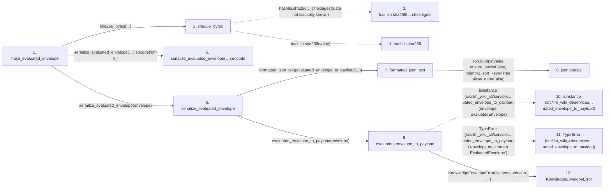

# hash_evaluated_envelope

**Entry point:** `hash_evaluated_envelope` (`api`)
**Source:** [knowledge_envelope](../modules/knowledge_envelope.md)
**Modules touched:** [implementation_evidence](../modules/implementation_evidence.md), [knowledge_envelope](../modules/knowledge_envelope.md), [knowledge_evidence](../modules/knowledge_evidence.md), and 3 more

**Complete modules touched:**

- [implementation_evidence](../modules/implementation_evidence.md)
- [knowledge_envelope](../modules/knowledge_envelope.md)
- [knowledge_evidence](../modules/knowledge_evidence.md)
- [knowledge_governance](../modules/knowledge_governance.md)
- [knowledge_model](../modules/knowledge_model.md)
- [maintenance_projection](../modules/maintenance_projection.md)

## Call sequence

> Static overview in presentation order, not runtime execution order. Arrows retain captured callers; siblings are shown before deeper helper detail.

<!-- Auto-generated from static call edges. Dashed arrows are external or unresolved calls. Reviewed runtime conditions and side effects belong in Behavior. -->

```mermaid
sequenceDiagram
    participant p0 as hash_evaluated_envelope
    participant p1 as sha256_bytes
    participant p2 as serialize_evaluated_envelope(…).encode
    participant p3 as serialize_evaluated_envelope
    participant p4 as hashlib.sha256(…).hexdigest
    participant p5 as formatted_json_text
    participant p6 as hashlib.sha256
    participant p7 as evaluated_envelope_to_payload
    participant p8 as KnowledgeEnvelopeError
    participant p9 as json.dumps
    participant p10 as isinstance (src/llm_wiki_cli/services…uated_envelope_to_payload)
    participant p11 as TypeError (src/llm_wiki_cli/services…uated_envelope_to_payload)
    participant p12 as _validated_bundle_payload
    participant p13 as bundle_payload[…].get(…).get
    participant p14 as bundle_payload[…].get
    participant p15 as is_valid_sha256
    participant p16 as dict
    participant p17 as isinstance (src/llm_wiki_cli/services…idence.py:is_valid_sha256)
    participant p18 as snapshot_extensions.pop
    participant p19 as _SHA256_RE.fullmatch
    participant p20 as replace
    participant p21 as knowledge_index_to_payload
    participant p22 as KnowledgeIndex
    participant p23 as isinstance (src/llm_wiki_cli/services…nowledge_index_to_payload)
    participant p24 as TypeError (src/llm_wiki_cli/services…nowledge_index_to_payload)
    participant p25 as _emit_extensions
    participant p26 as _bundle_to_payload
    p0->>p1: sha256_bytes
    p0-->>p2: serialize_evaluated_envelope(…).encode('utf-8')
    p0->>p3: serialize_evaluated_envelope
    p1-->>p4: hashlib.sha256(…).hexdigest
    p3->>p5: formatted_json_text
    p1-->>p6: hashlib.sha256(value)
    p3->>p7: evaluated_envelope_to_payload
    p3->>p8: KnowledgeEnvelopeError
    p5-->>p9: json.dumps(value, ensure_ascii=False, indent=2, sort_keys=True, allow_nan=False)
    p7-->>p10: isinstance (src/llm_wiki_cli/services…uated_envelope_to_payload)(envelope, EvaluatedEnvelope)
    p7-->>p11: TypeError (src/llm_wiki_cli/services…uated_envelope_to_payload)('envelope must be an EvaluatedEnvelope')
    p7->>p8: KnowledgeEnvelopeError
    p7->>p12: _validated_bundle_payload
    p7-->>p13: bundle_payload[…].get(…).get(INVENTORY_HASH_EXTENSION)
    p7-->>p14: bundle_payload[…].get('extensions', {...})
    p7->>p15: is_valid_sha256
    p7->>p8: KnowledgeEnvelopeError
    p12-->>p16: dict(bundle.snapshot.extensions)
    p15-->>p17: isinstance (src/llm_wiki_cli/services…idence.py:is_valid_sha256)(value, str)
    p12-->>p18: snapshot_extensions.pop(GOVERNANCE_HASH_EXTENSION_KEY, None)
    p15-->>p19: _SHA256_RE.fullmatch(value)
    p12-->>p20: replace(bundle, snapshot=replace(...))
    p12-->>p20: replace(bundle.snapshot, extensions=snapshot_extensions)
    p12->>p21: knowledge_index_to_payload
    p12->>p22: KnowledgeIndex
    p12->>p8: KnowledgeEnvelopeError
    p21-->>p23: isinstance (src/llm_wiki_cli/services…nowledge_index_to_payload)(model, KnowledgeIndex)
    p21-->>p24: TypeError (src/llm_wiki_cli/services…nowledge_index_to_payload)('model must be a KnowledgeIndex')
    p21->>p25: _emit_extensions
    p21->>p26: _bundle_to_payload
```

> Call sequence diagram shows 30 of 103 interactions; 73 omitted to keep the visualization within the 30-interaction and generated-diagram limits, with uncertain identities omitted rather than inferred.

> Captured boundary calls: external 10 of 29 (19 omitted); unresolved 6 of 6 (0 omitted). These counts cover the captured static trace.

Omitted captured detail, grouped by actual caller occurrence and target module:

| Caller | Parent step | Target module | Kind | Omitted interactions |
| --- | --- | --- | --- | --- |
| `src/llm_wiki_cli/services/knowledge_model.py:_emit_extensions` | 21 | - | external | 1 |
| `src/llm_wiki_cli/services/knowledge_model.py:_emit_extensions` | 21 | [src/llm_wiki_cli/services/knowledge_model.py](../modules/knowledge_model.md) | internal | 1 |
| `src/llm_wiki_cli/services/knowledge_model.py:_bundle_to_payload` | 24 | [src/llm_wiki_cli/services/knowledge_model.py](../modules/knowledge_model.md) | internal | 8 |
| `src/llm_wiki_cli/services/knowledge_model.py:knowledge_index_to_payload` | 18 | [src/llm_wiki_cli/services/knowledge_model.py](../modules/knowledge_model.md) | internal | 5 |
| `src/llm_wiki_cli/services/knowledge_model.py:_concept_to_payload` | 33 | [src/llm_wiki_cli/services/knowledge_model.py](../modules/knowledge_model.md) | internal | 13 |
| `src/llm_wiki_cli/services/knowledge_model.py:_relationship_to_payload` | 47 | [src/llm_wiki_cli/services/knowledge_model.py](../modules/knowledge_model.md) | internal | 6 |
| `src/llm_wiki_cli/services/knowledge_model.py:parse_knowledge_index` | 55 | [src/llm_wiki_cli/services/knowledge_model.py](../modules/knowledge_model.md) | internal | 14 |
| `src/llm_wiki_cli/services/knowledge_model.py:parse_knowledge_index` | 55 | - | external | 14 |
> Omission summary shows 8 of 13 groups; 5 further groups are not expanded here. Counts above include all omitted interactions.
> Detailed flow queries retain their own coverage and limits; omitted paths may execute at runtime.

> Trace truncated at the depth limit; deeper calls are omitted.

## Data flow

<!-- Auto-generated static analysis. Treat values and boundaries as best-effort hints, not runtime proof. -->

```mermaid
flowchart LR
    s1["1. hash_evaluated_envelope"]
    s2["2. sha256_bytes"]
    s3["3. hashlib.sha256(…).hexdigest"]
    s4["4. hashlib.sha256"]
    s5["5. serialize_evaluated_envelope(…).encode"]
    s6["6. serialize_evaluated_envelope"]
    s7["7. formatted_json_text"]
    s8["8. json.dumps"]
    s9["9. evaluated_envelope_to_payload"]
    s10["10. isinstance (src/llm_wiki_cli/services…uated_envelope_to_payload)"]
    s11["11. TypeError (src/llm_wiki_cli/services…uated_envelope_to_payload)"]
    s12["12. KnowledgeEnvelopeError"]
    s1 -->|"sha256_bytes(...)"| s2
    s2 -. "hashlib.sha256(…).hexdigest(data not statically known)" .-> s3
    s2 -. "hashlib.sha256(value)" .-> s4
    s1 -. "serialize_evaluated_envelope(…).encode('utf-8')" .-> s5
    s1 -->|"serialize_evaluated_envelope(envelope)"| s6
    s6 -->|"formatted_json_text(evaluated_envelope_to_payload(...))"| s7
    s7 -. "json.dumps(value, ensure_ascii=False, indent=2, sort_keys=True, allow_nan=False)" .-> s8
    s6 -->|"evaluated_envelope_to_payload(envelope)"| s9
    s9 -. "isinstance (src/llm_wiki_cli/services…uated_envelope_to_payload)(envelope, EvaluatedEnvelope)" .-> s10
    s9 -. "TypeError (src/llm_wiki_cli/services…uated_envelope_to_payload)('envelope must be an EvaluatedEnvelope')" .-> s11
    s9 -->|"KnowledgeEnvelopeError('schema_version', ...)"| s12
    click s1 "../modules/knowledge_envelope.md"
    click s2 "../modules/knowledge_evidence.md"
    click s6 "../modules/knowledge_envelope.md"
    click s7 "../modules/knowledge_evidence.md"
    click s9 "../modules/knowledge_envelope.md"
    click s12 "../modules/knowledge_envelope.md"
```

### Step data

| Step | Inputs | Reads | Writes | Returns |
|---|---|---|---|---|
| `hash_evaluated_envelope` | `envelope: EvaluatedEnvelope` | - | - | `sha256_bytes(...)` |
| `sha256_bytes` | `value: bytes` | - | - | `...` |
| `hashlib.sha256(…).hexdigest` | - | - | - | - |
| `hashlib.sha256` | - | - | - | - |
| `serialize_evaluated_envelope(…).encode` | - | - | - | - |
| `serialize_evaluated_envelope` | `envelope: EvaluatedEnvelope` | `KnowledgeEnvelopeError` | - | `formatted_json_text(...)` |
| `formatted_json_text` | `value: Any` | - | - | `...` |
| `json.dumps` | - | - | - | - |
| `evaluated_envelope_to_payload` | `envelope: EvaluatedEnvelope` | `EvaluatedEnvelope`, `EVALUATED_ENVELOPE_VERSION`, `EVALUATED_ENVELOPE_VERSION`, `INVENTORY_HASH_EXTENSION`, `INVENTORY_HASH_EXTENSION` | - | `{...}` |
| `isinstance (src/llm_wiki_cli/services…uated_envelope_to_payload)` | - | - | - | - |
| `TypeError (src/llm_wiki_cli/services…uated_envelope_to_payload)` | - | - | - | - |
| `KnowledgeEnvelopeError` | - | - | - | - |

### Call data

| From | To | Line | Call |
|---|---|---:|---|
| hash_evaluated_envelope | sha256_bytes | 1180 | `sha256_bytes(...)` |
| sha256_bytes | hashlib.sha256(…).hexdigest | 199 | `hashlib.sha256(value).hexdigest(data not statically known)` |
| sha256_bytes | hashlib.sha256 | 199 | `hashlib.sha256(value)` |
| hash_evaluated_envelope | serialize_evaluated_envelope(…).encode | 1180 | `serialize_evaluated_envelope(envelope).encode('utf-8')` |
| hash_evaluated_envelope | serialize_evaluated_envelope | 1180 | `serialize_evaluated_envelope(envelope)` |
| serialize_evaluated_envelope | formatted_json_text | 1167 | `formatted_json_text(evaluated_envelope_to_payload(...))` |
| formatted_json_text | json.dumps | 179 | `json.dumps(value, ensure_ascii=False, indent=2, sort_keys=True, allow_nan=False)` |
| serialize_evaluated_envelope | evaluated_envelope_to_payload | 1167 | `evaluated_envelope_to_payload(envelope)` |
| evaluated_envelope_to_payload | isinstance (src/llm_wiki_cli/services…uated_envelope_to_payload) | 1141 | `isinstance(envelope, EvaluatedEnvelope)` |
| evaluated_envelope_to_payload | TypeError (src/llm_wiki_cli/services…uated_envelope_to_payload) | 1142 | `TypeError('envelope must be an EvaluatedEnvelope')` |
| evaluated_envelope_to_payload | KnowledgeEnvelopeError | 1144 | `KnowledgeEnvelopeError('schema_version', ...)` |

### Boundary effects

*No boundary effects detected.*

### Static analysis gaps

| Kind | Step | Target | Line |
|---|---|---|---:|
| unresolved_call | `sha256_bytes` | `hashlib.sha256(value).hexdigest` | 199 |
| external_call | `sha256_bytes` | `hashlib.sha256` | 199 |
| unresolved_call | `hash_evaluated_envelope` | `serialize_evaluated_envelope(envelope).encode` | 1180 |
| external_call | `formatted_json_text` | `json.dumps` | 179 |
| external_call | `evaluated_envelope_to_payload` | `isinstance` | 1141 |
| external_call | `evaluated_envelope_to_payload` | `TypeError` | 1142 |
| step_limit | `hash_evaluated_envelope` | `first 12 steps` | 0 |
| truncated_flow | `hash_evaluated_envelope` | `depth limit` | 0 |

## Behavior

This flow starts at `hash_evaluated_envelope` and is classified as `api`. The generated call and data-flow sections are bounded static projections; runtime conditions and side effects require source-level confirmation.
