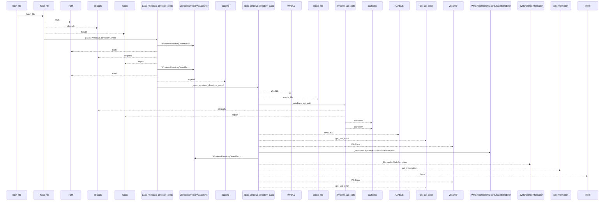
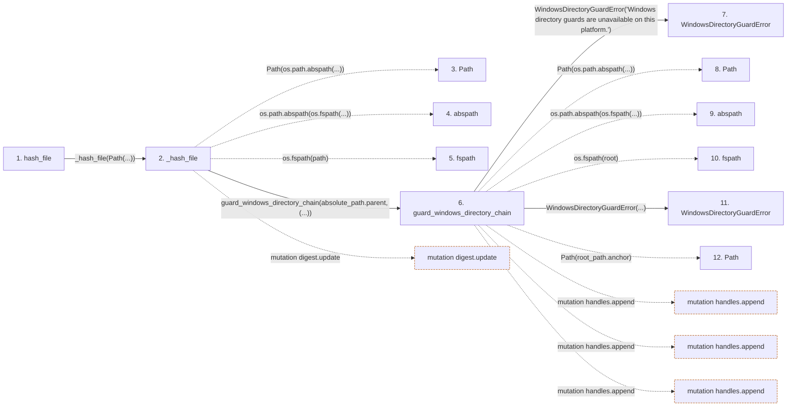

# hash_file

**Entry point:** `hash_file` (`api`)
**Source:** [documentation_policy](../modules/documentation_policy.md)
**Modules touched:** [documentation_policy](../modules/documentation_policy.md), [filesystem_guard](../modules/filesystem_guard.md)

## Call sequence

<!-- Auto-generated from static call edges. Dashed arrows are external or unresolved calls. Reviewed runtime conditions and side effects belong in Behavior. -->

> Call sequence diagram shows 30 of 356 interactions; 326 omitted to keep the visualization within the 30-interaction and generated-diagram limits.

> Trace truncated at the depth limit; deeper calls are omitted.

## Data flow

<!-- Auto-generated static analysis. Treat values and boundaries as best-effort hints, not runtime proof. -->

### Step data

| Step | Inputs | Reads | Writes | Returns |
|---|---|---|---|---|
| `hash_file` | `path: str \| Path` | - | - | `_hash_file(...)` |
| `_hash_file` | `path: Path`, `inspected: os.stat_result \| None`, `max_bytes: int \| None` | `os`, `WindowsDirectoryGuardError`, `os`, `os`, `os`, `os` | - | `_hash_windows_file(...)`, `...` |
| `Path` | - | - | - | - |
| `abspath` | - | - | - | - |
| `fspath` | - | - | - | - |
| `guard_windows_directory_chain` | `root: Path`, `relative_components: Sequence[str]`, `create_missing: bool`, `require_restrictive_dacl: bool` | `os`, `WindowsDurabilityError` | - | - |
| `WindowsDirectoryGuardError` | - | - | - | - |
| `Path` | - | - | - | - |
| `abspath` | - | - | - | - |
| `fspath` | - | - | - | - |
| `WindowsDirectoryGuardError` | - | - | - | - |
| `Path` | - | - | - | - |

### Call data

| From | To | Line | Call |
|---|---|---:|---|
| hash_file | _hash_file | 524 | `_hash_file(Path(...))` |
| _hash_file | Path | 626 | `Path(os.path.abspath(...))` |
| _hash_file | abspath | 626 | `os.path.abspath(os.fspath(...))` |
| _hash_file | fspath | 626 | `os.fspath(path)` |
| _hash_file | guard_windows_directory_chain | 628 | `guard_windows_directory_chain(absolute_path.parent, (...))` |
| guard_windows_directory_chain | WindowsDirectoryGuardError | 170 | `WindowsDirectoryGuardError('Windows directory guards are unavailable on this platform.')` |
| guard_windows_directory_chain | Path | 174 | `Path(os.path.abspath(...))` |
| guard_windows_directory_chain | abspath | 174 | `os.path.abspath(os.fspath(...))` |
| guard_windows_directory_chain | fspath | 174 | `os.fspath(root)` |
| guard_windows_directory_chain | WindowsDirectoryGuardError | 176 | `WindowsDirectoryGuardError(...)` |
| guard_windows_directory_chain | Path | 179 | `Path(root_path.anchor)` |

### Boundary effects

| Kind | Target | Step | Line |
|---|---|---|---:|
| mutation | `digest.update` | `_hash_file` | 677 |
| mutation | `handles.append` | `guard_windows_directory_chain` | 182 |
| mutation | `handles.append` | `guard_windows_directory_chain` | 189 |
| mutation | `handles.append` | `guard_windows_directory_chain` | 216 |

### Static analysis gaps

| Kind | Step | Target | Line |
|---|---|---|---:|
| external_call | `_hash_file` | `os.path.abspath` | 626 |
| external_call | `_hash_file` | `os.fspath` | 626 |
| external_call | `guard_windows_directory_chain` | `os.path.abspath` | 174 |
| external_call | `guard_windows_directory_chain` | `os.fspath` | 174 |
| step_limit | `hash_file` | `first 12 steps` | 0 |
| truncated_flow | `hash_file` | `depth limit` | 0 |

## Behavior

This flow starts at `hash_file` and is classified as `api`. The generated call and data-flow sections are bounded static projections; runtime conditions and side effects require source-level confirmation.
