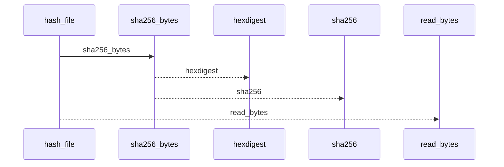
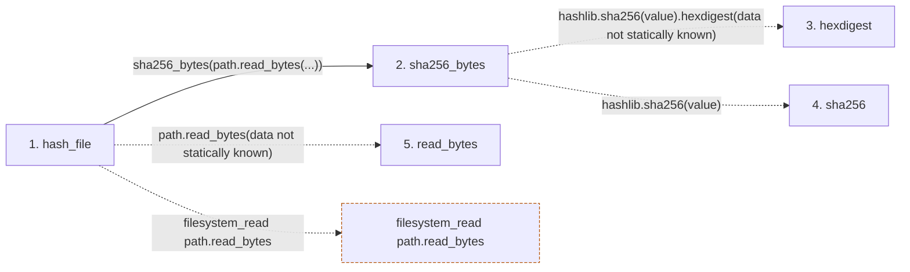

# hash_file

**Entry point:** `hash_file` (`api`)
**Source:** [knowledge_evidence](../modules/knowledge_evidence.md)
**Modules touched:** [knowledge_evidence](../modules/knowledge_evidence.md)

## Call sequence

<!-- Auto-generated from static call edges. Dashed arrows are external or unresolved calls. Reviewed runtime conditions and side effects belong in Behavior. -->

## Data flow

<!-- Auto-generated static analysis. Treat values and boundaries as best-effort hints, not runtime proof. -->

### Step data

| Step | Inputs | Reads | Writes | Returns |
|---|---|---|---|---|
| `hash_file` | `path: Path` | - | - | `sha256_bytes(...)`, `''` |
| `sha256_bytes` | `value: bytes` | - | - | `...` |
| `hexdigest` | - | - | - | - |
| `sha256` | - | - | - | - |
| `read_bytes` | - | - | - | - |

### Call data

| From | To | Line | Call |
|---|---|---:|---|
| hash_file | sha256_bytes | 950 | `sha256_bytes(path.read_bytes(...))` |
| sha256_bytes | hexdigest | 197 | `hashlib.sha256(value).hexdigest(data not statically known)` |
| sha256_bytes | sha256 | 197 | `hashlib.sha256(value)` |
| hash_file | read_bytes | 950 | `path.read_bytes(data not statically known)` |

### Boundary effects

| Kind | Target | Step | Line |
|---|---|---|---:|
| filesystem_read | `path.read_bytes` | `hash_file` | 950 |

### Static analysis gaps

| Kind | Step | Target | Line |
|---|---|---|---:|
| external_call | `sha256_bytes` | `hashlib.sha256(value).hexdigest` | 197 |
| external_call | `sha256_bytes` | `hashlib.sha256` | 197 |

## Behavior

This flow starts at `hash_file` and is classified as `api`. The generated call and data-flow sections are bounded static projections; runtime conditions and side effects require source-level confirmation.
