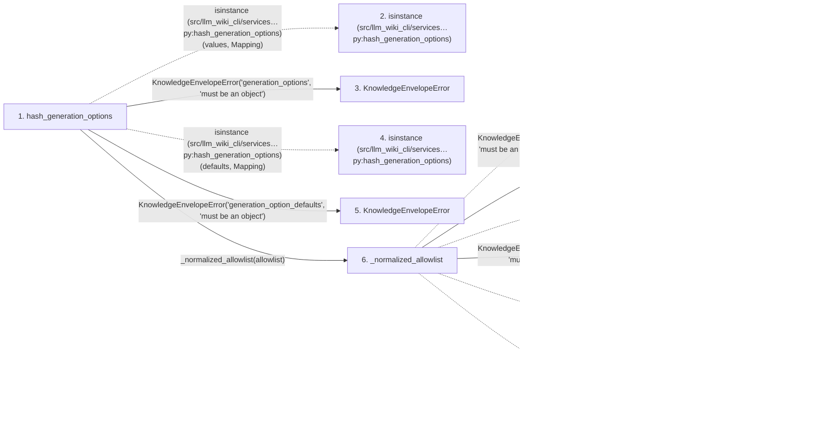

# hash_generation_options

**Entry point:** `hash_generation_options` (`api`)
**Source:** [knowledge_envelope](../modules/knowledge_envelope.md)
**Modules touched:** [knowledge_envelope](../modules/knowledge_envelope.md), [knowledge_evidence](../modules/knowledge_evidence.md)

## Call sequence

```mermaid
sequenceDiagram
    participant p0 as hash_generation_options
    participant p1 as isinstance (src/llm_wiki_cli/services…py:hash_generation_options)
    participant p2 as KnowledgeEnvelopeError
    participant p3 as _normalized_allowlist
    participant p4 as isinstance (src/llm_wiki_cli/services…e.py:_normalized_allowlist)
    participant p5 as tuple
    participant p6 as any (src/llm_wiki_cli/services…e.py:_normalized_allowlist)
    participant p7 as len
    participant p8 as set (src/llm_wiki_cli/services…e.py:_normalized_allowlist)
    participant p9 as sorted
    participant p10 as _reject_unknown_option_keys
    participant p11 as any (src/llm_wiki_cli/services…reject_unknown_option_keys)
    participant p12 as isinstance (src/llm_wiki_cli/services…reject_unknown_option_keys)
    participant p13 as set (src/llm_wiki_cli/services…reject_unknown_option_keys)
    participant p14 as min
    participant p15 as _reject_machine_local_paths
    participant p16 as set (src/llm_wiki_cli/services…reject_machine_local_paths)
    p0-->>p1: isinstance (src/llm_wiki_cli/services…py:hash_generation_options)
    p0->>p2: KnowledgeEnvelopeError
    p0-->>p1: isinstance (src/llm_wiki_cli/services…py:hash_generation_options)
    p0->>p2: KnowledgeEnvelopeError
    p0->>p3: _normalized_allowlist
    p3-->>p4: isinstance (src/llm_wiki_cli/services…e.py:_normalized_allowlist)
    p3->>p2: KnowledgeEnvelopeError
    p3-->>p5: tuple
    p3->>p2: KnowledgeEnvelopeError
    p3-->>p6: any (src/llm_wiki_cli/services…e.py:_normalized_allowlist)
    p3-->>p4: isinstance (src/llm_wiki_cli/services…e.py:_normalized_allowlist)
    p3->>p2: KnowledgeEnvelopeError
    p3-->>p7: len
    p3-->>p7: len
    p3-->>p8: set (src/llm_wiki_cli/services…e.py:_normalized_allowlist)
    p3->>p2: KnowledgeEnvelopeError
    p3-->>p5: tuple
    p3-->>p9: sorted
    p0->>p10: _reject_unknown_option_keys
    p10-->>p11: any (src/llm_wiki_cli/services…reject_unknown_option_keys)
    p10-->>p12: isinstance (src/llm_wiki_cli/services…reject_unknown_option_keys)
    p10->>p2: KnowledgeEnvelopeError
    p10-->>p13: set (src/llm_wiki_cli/services…reject_unknown_option_keys)
    p10-->>p13: set (src/llm_wiki_cli/services…reject_unknown_option_keys)
    p10-->>p14: min
    p10->>p2: KnowledgeEnvelopeError
    p0->>p10: _reject_unknown_option_keys
    p0->>p2: KnowledgeEnvelopeError
    p0->>p15: _reject_machine_local_paths
    p15-->>p16: set (src/llm_wiki_cli/services…reject_machine_local_paths)
```

<!-- Auto-generated from static call edges. Dashed arrows are external or unresolved calls. Reviewed runtime conditions and side effects belong in Behavior. -->

> Call sequence diagram shows 30 of 44 interactions; 14 omitted to keep the visualization within the 30-interaction and generated-diagram limits.

## Data flow

<!-- Auto-generated static analysis. Treat values and boundaries as best-effort hints, not runtime proof. -->

### Step data

| Step | Inputs | Reads | Writes | Returns |
|---|---|---|---|---|
| `hash_generation_options` | `values: Mapping[str, Any]`, `defaults: Mapping[str, Any]`, `allowlist: Iterable[str]` | `Mapping`, `Mapping`, `GENERATION_OPTIONS_DOMAIN` | `effective[...]`, `effective[...]` | `_hash_structured(...)` |
| `isinstance (src/llm_wiki_cli/services…py:hash_generation_options)` | - | - | - | - |
| `KnowledgeEnvelopeError` | - | - | - | - |
| `isinstance (src/llm_wiki_cli/services…py:hash_generation_options)` | - | - | - | - |
| `KnowledgeEnvelopeError` | - | - | - | - |
| `_normalized_allowlist` | `value: Iterable[str]` | - | - | `tuple(...)` |
| `isinstance (src/llm_wiki_cli/services…e.py:_normalized_allowlist)` | - | - | - | - |
| `KnowledgeEnvelopeError` | - | - | - | - |
| `tuple` | - | - | - | - |
| `KnowledgeEnvelopeError` | - | - | - | - |
| `any (src/llm_wiki_cli/services…e.py:_normalized_allowlist)` | - | - | - | - |
| `isinstance (src/llm_wiki_cli/services…e.py:_normalized_allowlist)` | - | - | - | - |

### Call data

| From | To | Line | Call |
|---|---|---:|---|
| hash_generation_options | isinstance (src/llm_wiki_cli/services…py:hash_generation_options) | 827 | `isinstance(values, Mapping)` |
| hash_generation_options | KnowledgeEnvelopeError | 828 | `KnowledgeEnvelopeError('generation_options', 'must be an object')` |
| hash_generation_options | isinstance (src/llm_wiki_cli/services…py:hash_generation_options) | 829 | `isinstance(defaults, Mapping)` |
| hash_generation_options | KnowledgeEnvelopeError | 830 | `KnowledgeEnvelopeError('generation_option_defaults', 'must be an object')` |
| hash_generation_options | _normalized_allowlist | 834 | `_normalized_allowlist(allowlist)` |
| _normalized_allowlist | isinstance (src/llm_wiki_cli/services…e.py:_normalized_allowlist) | 1671 | `isinstance(value, (...))` |
| _normalized_allowlist | KnowledgeEnvelopeError | 1672 | `KnowledgeEnvelopeError('generation_option_allowlist', 'must be an iterable of option names, not scalar text or bytes')` |
| _normalized_allowlist | tuple | 1677 | `tuple(value)` |
| _normalized_allowlist | KnowledgeEnvelopeError | 1679 | `KnowledgeEnvelopeError('generation_option_allowlist', 'must be an iterable of option names')` |
| _normalized_allowlist | any (src/llm_wiki_cli/services…e.py:_normalized_allowlist) | 1683 | `any(...)` |
| _normalized_allowlist | isinstance (src/llm_wiki_cli/services…e.py:_normalized_allowlist) | 1683 | `isinstance(item, str)` |

### Boundary effects

*No boundary effects detected.*

### Static analysis gaps

| Kind | Step | Target | Line |
|---|---|---|---:|
| external_call | `hash_generation_options` | `isinstance` | 827 |
| external_call | `hash_generation_options` | `isinstance` | 829 |
| external_call | `_normalized_allowlist` | `isinstance` | 1671 |
| external_call | `_normalized_allowlist` | `any` | 1683 |
| external_call | `_normalized_allowlist` | `isinstance` | 1683 |
| step_limit | `hash_generation_options` | `first 12 steps` | 0 |

## Behavior

This flow starts at `hash_generation_options` and is classified as `api`. The generated call and data-flow sections are bounded static projections; runtime conditions and side effects require source-level confirmation.
