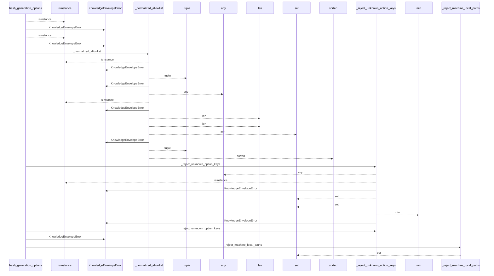
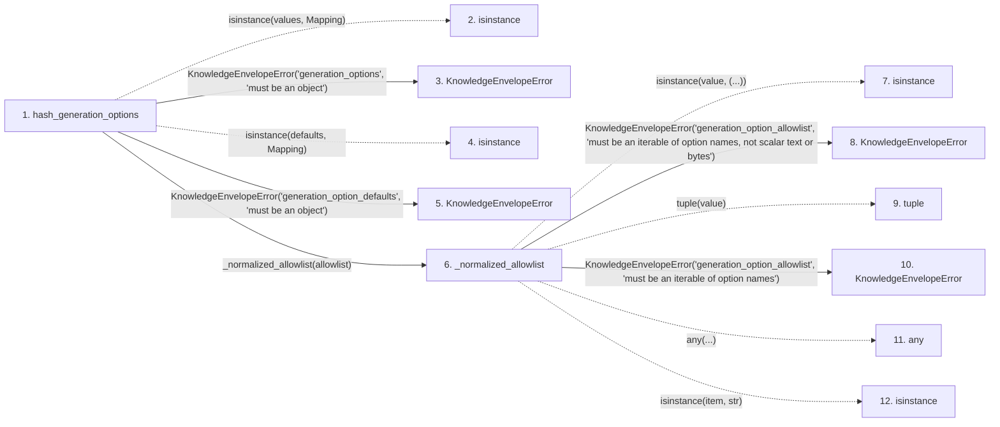

# hash_generation_options

**Entry point:** `hash_generation_options` (`api`)
**Source:** [knowledge_envelope](../modules/knowledge_envelope.md)
**Modules touched:** [knowledge_envelope](../modules/knowledge_envelope.md), [knowledge_evidence](../modules/knowledge_evidence.md)

## Call sequence

<!-- Auto-generated from static call edges. Dashed arrows are external or unresolved calls. Reviewed runtime conditions and side effects belong in Behavior. -->

> Call sequence diagram shows 30 of 44 interactions; 14 omitted to keep the visualization within the 30-interaction and generated-diagram limits.

## Data flow

<!-- Auto-generated static analysis. Treat values and boundaries as best-effort hints, not runtime proof. -->

### Step data

| Step | Inputs | Reads | Writes | Returns |
|---|---|---|---|---|
| `hash_generation_options` | `values: Mapping[str, Any]`, `defaults: Mapping[str, Any]`, `allowlist: Iterable[str]` | `Mapping`, `Mapping`, `GENERATION_OPTIONS_DOMAIN` | `effective[...]`, `effective[...]` | `_hash_structured(...)` |
| `isinstance` | - | - | - | - |
| `KnowledgeEnvelopeError` | - | - | - | - |
| `isinstance` | - | - | - | - |
| `KnowledgeEnvelopeError` | - | - | - | - |
| `_normalized_allowlist` | `value: Iterable[str]` | - | - | `tuple(...)` |
| `isinstance` | - | - | - | - |
| `KnowledgeEnvelopeError` | - | - | - | - |
| `tuple` | - | - | - | - |
| `KnowledgeEnvelopeError` | - | - | - | - |
| `any` | - | - | - | - |
| `isinstance` | - | - | - | - |

### Call data

| From | To | Line | Call |
|---|---|---:|---|
| hash_generation_options | isinstance | 825 | `isinstance(values, Mapping)` |
| hash_generation_options | KnowledgeEnvelopeError | 826 | `KnowledgeEnvelopeError('generation_options', 'must be an object')` |
| hash_generation_options | isinstance | 827 | `isinstance(defaults, Mapping)` |
| hash_generation_options | KnowledgeEnvelopeError | 828 | `KnowledgeEnvelopeError('generation_option_defaults', 'must be an object')` |
| hash_generation_options | _normalized_allowlist | 832 | `_normalized_allowlist(allowlist)` |
| _normalized_allowlist | isinstance | 1656 | `isinstance(value, (...))` |
| _normalized_allowlist | KnowledgeEnvelopeError | 1657 | `KnowledgeEnvelopeError('generation_option_allowlist', 'must be an iterable of option names, not scalar text or bytes')` |
| _normalized_allowlist | tuple | 1662 | `tuple(value)` |
| _normalized_allowlist | KnowledgeEnvelopeError | 1664 | `KnowledgeEnvelopeError('generation_option_allowlist', 'must be an iterable of option names')` |
| _normalized_allowlist | any | 1668 | `any(...)` |
| _normalized_allowlist | isinstance | 1668 | `isinstance(item, str)` |

### Boundary effects

*No boundary effects detected.*

### Static analysis gaps

| Kind | Step | Target | Line |
|---|---|---|---:|
| unresolved_call | `hash_generation_options` | `isinstance` | 825 |
| unresolved_call | `hash_generation_options` | `isinstance` | 827 |
| unresolved_call | `_normalized_allowlist` | `isinstance` | 1656 |
| unresolved_call | `_normalized_allowlist` | `any` | 1668 |
| unresolved_call | `_normalized_allowlist` | `isinstance` | 1668 |
| step_limit | `hash_generation_options` | `first 12 steps` | 0 |

## Behavior

This flow starts at `hash_generation_options` and is classified as `api`. The generated call and data-flow sections are bounded static projections; runtime conditions and side effects require source-level confirmation.
