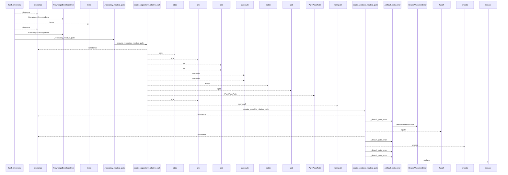
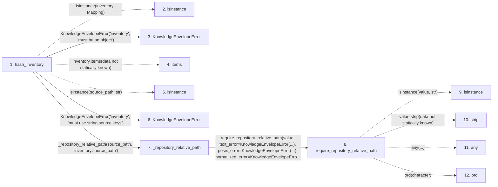

# hash_inventory

**Entry point:** `hash_inventory` (`api`)
**Source:** [knowledge_envelope](../modules/knowledge_envelope.md)
**Modules touched:** [knowledge_envelope](../modules/knowledge_envelope.md), [knowledge_evidence](../modules/knowledge_evidence.md), [validation](../modules/validation.md)

## Call sequence

<!-- Auto-generated from static call edges. Dashed arrows are external or unresolved calls. Reviewed runtime conditions and side effects belong in Behavior. -->

> Call sequence diagram shows 30 of 78 interactions; 48 omitted to keep the visualization within the 30-interaction and generated-diagram limits.

## Data flow

<!-- Auto-generated static analysis. Treat values and boundaries as best-effort hints, not runtime proof. -->

### Step data

| Step | Inputs | Reads | Writes | Returns |
|---|---|---|---|---|
| `hash_inventory` | `inventory: Mapping[str, Any]` | `Mapping`, `INVENTORY_SNAPSHOT_DOMAIN` | - | `_hash_structured(...)` |
| `isinstance` | - | - | - | - |
| `KnowledgeEnvelopeError` | - | - | - | - |
| `items` | - | - | - | - |
| `isinstance` | - | - | - | - |
| `KnowledgeEnvelopeError` | - | - | - | - |
| `_repository_relative_path` | `value: object`, `field_name: str` | - | - | `require_repository_relative_path(...)` |
| `require_repository_relative_path` | `value: object`, `text_error: Exception`, `posix_error: Exception`, `normalized_error: Exception`, `absolute_error: Exception \| None`, `separator_error: Exception \| None`, `control_error: Exception \| None`, `reject_delete_character: bool` | - | - | `require_portable_relative_path(...)` |
| `isinstance` | - | - | - | - |
| `strip` | - | - | - | - |
| `any` | - | - | - | - |
| `ord` | - | - | - | - |

### Call data

| From | To | Line | Call |
|---|---|---:|---|
| hash_inventory | isinstance | 763 | `isinstance(inventory, Mapping)` |
| hash_inventory | KnowledgeEnvelopeError | 764 | `KnowledgeEnvelopeError('inventory', 'must be an object')` |
| hash_inventory | items | 766 | `inventory.items(data not statically known)` |
| hash_inventory | isinstance | 767 | `isinstance(source_path, str)` |
| hash_inventory | KnowledgeEnvelopeError | 768 | `KnowledgeEnvelopeError('inventory', 'must use string source keys')` |
| hash_inventory | _repository_relative_path | 769 | `_repository_relative_path(source_path, 'inventory.source_path')` |
| _repository_relative_path | require_repository_relative_path | 1486 | `require_repository_relative_path(value, text_error=KnowledgeEnvelopeError(...), posix_error=KnowledgeEnvelopeError(...), normalized_error=KnowledgeEnvelopeError(...))` |
| require_repository_relative_path | isinstance | 256 | `isinstance(value, str)` |
| require_repository_relative_path | strip | 258 | `value.strip(data not statically known)` |
| require_repository_relative_path | any | 260 | `any(...)` |
| require_repository_relative_path | ord | 261 | `ord(character)` |

### Boundary effects

*No boundary effects detected.*

### Static analysis gaps

| Kind | Step | Target | Line |
|---|---|---|---:|
| unresolved_call | `hash_inventory` | `isinstance` | 763 |
| unresolved_call | `hash_inventory` | `inventory.items` | 766 |
| unresolved_call | `hash_inventory` | `isinstance` | 767 |
| unresolved_call | `require_repository_relative_path` | `isinstance` | 256 |
| unresolved_call | `require_repository_relative_path` | `value.strip` | 258 |
| unresolved_call | `require_repository_relative_path` | `any` | 260 |
| unresolved_call | `require_repository_relative_path` | `ord` | 261 |
| step_limit | `hash_inventory` | `first 12 steps` | 0 |

## Behavior

This flow starts at `hash_inventory` and is classified as `api`. The generated call and data-flow sections are bounded static projections; runtime conditions and side effects require source-level confirmation.
