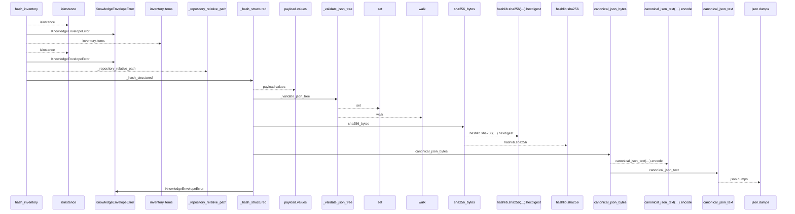
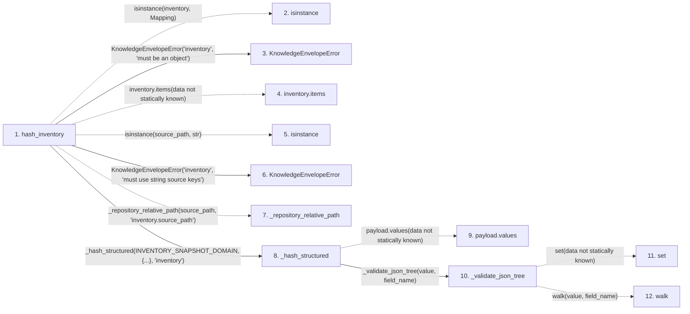

# hash_inventory

**Entry point:** `hash_inventory` (`api`)
**Source:** [knowledge_envelope](../modules/knowledge_envelope.md)
**Modules touched:** [knowledge_envelope](../modules/knowledge_envelope.md), [knowledge_evidence](../modules/knowledge_evidence.md)

## Call sequence

<!-- Auto-generated from static call edges. Dashed arrows are external or unresolved calls. Reviewed runtime conditions and side effects belong in Behavior. -->

## Data flow

<!-- Auto-generated static analysis. Treat values and boundaries as best-effort hints, not runtime proof. -->

### Step data

| Step | Inputs | Reads | Writes | Returns |
|---|---|---|---|---|
| `hash_inventory` | `inventory: Mapping[str, Any]` | `Mapping`, `INVENTORY_SNAPSHOT_DOMAIN` | - | `_hash_structured(...)` |
| `isinstance` | - | - | - | - |
| `KnowledgeEnvelopeError` | - | - | - | - |
| `inventory.items` | - | - | - | - |
| `isinstance` | - | - | - | - |
| `KnowledgeEnvelopeError` | - | - | - | - |
| `_repository_relative_path` | - | - | - | - |
| `_hash_structured` | `domain: str`, `payload: Mapping[str, Any]`, `field_name: str` | `KnowledgeEnvelopeError` | - | `sha256_bytes(...)` |
| `payload.values` | - | - | - | - |
| `_validate_json_tree` | `value: object`, `field_name: str` | - | - | - |
| `set` | - | - | - | - |
| `walk` | - | - | - | - |

### Call data

| From | To | Line | Call |
|---|---|---:|---|
| hash_inventory | isinstance | 765 | `isinstance(inventory, Mapping)` |
| hash_inventory | KnowledgeEnvelopeError | 766 | `KnowledgeEnvelopeError('inventory', 'must be an object')` |
| hash_inventory | inventory.items | 768 | `inventory.items(data not statically known)` |
| hash_inventory | isinstance | 769 | `isinstance(source_path, str)` |
| hash_inventory | KnowledgeEnvelopeError | 770 | `KnowledgeEnvelopeError('inventory', 'must use string source keys')` |
| hash_inventory | _repository_relative_path | 771 | `_repository_relative_path(source_path, 'inventory.source_path')` |
| hash_inventory | _hash_structured | 774 | `_hash_structured(INVENTORY_SNAPSHOT_DOMAIN, {...}, 'inventory')` |
| _hash_structured | payload.values | 1604 | `payload.values(data not statically known)` |
| _hash_structured | _validate_json_tree | 1605 | `_validate_json_tree(value, field_name)` |
| _validate_json_tree | set | 1626 | `set(data not statically known)` |
| _validate_json_tree | walk | 1667 | `walk(value, field_name)` |

### Boundary effects

*No boundary effects detected.*

### Static analysis gaps

| Kind | Step | Target | Line |
|---|---|---|---:|
| external_call | `hash_inventory` | `isinstance` | 765 |
| unresolved_call | `hash_inventory` | `inventory.items` | 768 |
| external_call | `hash_inventory` | `isinstance` | 769 |
| unresolved_call | `hash_inventory` | `_repository_relative_path` | 771 |
| unresolved_call | `_hash_structured` | `payload.values` | 1604 |
| unresolved_call | `_validate_json_tree` | `walk` | 1667 |
| step_limit | `hash_inventory` | `first 12 steps` | 0 |

## Behavior

This flow starts at `hash_inventory` and is classified as `api`. The generated call and data-flow sections are bounded static projections; runtime conditions and side effects require source-level confirmation.
