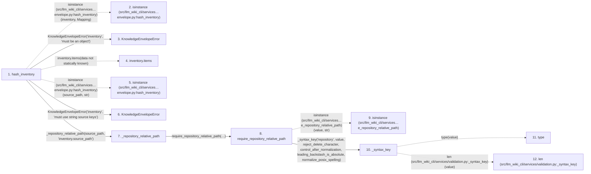

# hash_inventory

**Entry point:** `hash_inventory` (`api`)
**Source:** [knowledge_envelope](../modules/knowledge_envelope.md)
**Modules touched:** [knowledge_envelope](../modules/knowledge_envelope.md), [knowledge_evidence](../modules/knowledge_evidence.md), [validation](../modules/validation.md)

## Call sequence

> Static overview in presentation order, not runtime execution order. Arrows retain captured callers; siblings are shown before deeper helper detail.

<!-- Auto-generated from static call edges. Dashed arrows are external or unresolved calls. Reviewed runtime conditions and side effects belong in Behavior. -->

```mermaid
sequenceDiagram
    participant p0 as hash_inventory
    participant p1 as isinstance (src/llm_wiki_cli/services…envelope.py:hash_inventory)
    participant p2 as KnowledgeEnvelopeError
    participant p3 as inventory.items
    participant p4 as _repository_relative_path
    participant p5 as _hash_structured
    participant p6 as require_repository_relative_path
    participant p7 as payload.values
    participant p8 as _validate_json_tree
    participant p9 as sha256_bytes
    participant p10 as canonical_json_bytes
    participant p11 as isinstance (src/llm_wiki_cli/services…e_repository_relative_path)
    participant p12 as set
    participant p13 as hashlib.sha256(…).hexdigest
    participant p14 as canonical_json_text(…).encode
    participant p15 as _syntax_key
    participant p16 as walk
    participant p17 as hashlib.sha256
    participant p18 as canonical_json_text
    participant p19 as _known_syntax
    participant p20 as value.strip
    participant p21 as any (src/llm_wiki_cli/services…e_repository_relative_path)
    participant p22 as ord (src/llm_wiki_cli/services…e_repository_relative_path)
    participant p23 as value.startswith
    p0-->>p1: isinstance (src/llm_wiki_cli/services…envelope.py:hash_inventory)(inventory, Mapping)
    p0->>p2: KnowledgeEnvelopeError
    p0-->>p3: inventory.items
    p0-->>p1: isinstance (src/llm_wiki_cli/services…envelope.py:hash_inventory)(source_path, str)
    p0->>p2: KnowledgeEnvelopeError
    p0->>p4: _repository_relative_path
    p0->>p5: _hash_structured
    p4->>p6: require_repository_relative_path
    p5-->>p7: payload.values
    p4->>p2: KnowledgeEnvelopeError
    p5->>p8: _validate_json_tree
    p4->>p2: KnowledgeEnvelopeError
    p5->>p9: sha256_bytes
    p4->>p2: KnowledgeEnvelopeError
    p5->>p10: canonical_json_bytes
    p5->>p2: KnowledgeEnvelopeError
    p6-->>p11: isinstance (src/llm_wiki_cli/services…e_repository_relative_path)(value, str)
    p8-->>p12: set
    p9-->>p13: hashlib.sha256(…).hexdigest
    p10-->>p14: canonical_json_text(…).encode('utf-8')
    p6->>p15: _syntax_key
    p8-->>p16: walk(value, field_name)
    p9-->>p17: hashlib.sha256(value)
    p10->>p18: canonical_json_text
    p6->>p19: _known_syntax
    p6-->>p20: value.strip
    p6-->>p21: any (src/llm_wiki_cli/services…e_repository_relative_path)(...)
    p6-->>p22: ord (src/llm_wiki_cli/services…e_repository_relative_path)(character)
    p6-->>p22: ord (src/llm_wiki_cli/services…e_repository_relative_path)(character)
    p6-->>p23: value.startswith('/')
```

> Call sequence diagram shows 30 of 97 interactions; 67 omitted to keep the visualization within the 30-interaction and generated-diagram limits, with uncertain identities omitted rather than inferred.

> Captured boundary calls: external 8 of 29 (21 omitted); unresolved 7 of 30 (23 omitted). These counts cover the captured static trace.

Omitted captured detail, grouped by actual caller occurrence and target module:

| Caller | Parent step | Target module | Kind | Omitted interactions |
| --- | --- | --- | --- | --- |
| `src/llm_wiki_cli/services/validation.py:_syntax_key` | 10 | - | external | 6 |
| `src/llm_wiki_cli/services/validation.py:_known_syntax` | 17 | - | unresolved | 2 |
| `src/llm_wiki_cli/services/validation.py:require_repository_relative_path` | 8 | - | unresolved | 3 |
| `src/llm_wiki_cli/services/validation.py:require_repository_relative_path` | 8 | - | external | 3 |
| `src/llm_wiki_cli/services/validation.py:require_repository_relative_path` | 8 | [src/llm_wiki_cli/services/validation.py](../modules/validation.md) | internal | 2 |
| `src/llm_wiki_cli/services/validation.py:require_portable_relative_path` | 31 | - | external | 4 |
| `src/llm_wiki_cli/services/validation.py:require_portable_relative_path` | 31 | [src/llm_wiki_cli/services/validation.py](../modules/validation.md) | internal | 13 |
| `src/llm_wiki_cli/services/validation.py:_default_path_error` | 33 | [src/llm_wiki_cli/services/validation.py](../modules/validation.md) | internal | 1 |
> Omission summary shows 8 of 19 groups; 11 further groups are not expanded here. Counts above include all omitted interactions.
> Detailed flow queries retain their own coverage and limits; omitted paths may execute at runtime.

## Data flow

<!-- Auto-generated static analysis. Treat values and boundaries as best-effort hints, not runtime proof. -->

```mermaid
flowchart LR
    s1["1. hash_inventory"]
    s2["2. isinstance (src/llm_wiki_cli/services…envelope.py:hash_inventory)"]
    s3["3. KnowledgeEnvelopeError"]
    s4["4. inventory.items"]
    s5["5. isinstance (src/llm_wiki_cli/services…envelope.py:hash_inventory)"]
    s6["6. KnowledgeEnvelopeError"]
    s7["7. _repository_relative_path"]
    s8["8. require_repository_relative_path"]
    s9["9. isinstance (src/llm_wiki_cli/services…e_repository_relative_path)"]
    s10["10. _syntax_key"]
    s11["11. type"]
    s12["12. len (src/llm_wiki_cli/services/validation.py:_syntax_key)"]
    s1 -. "isinstance (src/llm_wiki_cli/services…envelope.py:hash_inventory)(inventory, Mapping)" .-> s2
    s1 -->|"KnowledgeEnvelopeError('inventory', 'must be an object')"| s3
    s1 -. "inventory.items(data not statically known)" .-> s4
    s1 -. "isinstance (src/llm_wiki_cli/services…envelope.py:hash_inventory)(source_path, str)" .-> s5
    s1 -->|"KnowledgeEnvelopeError('inventory', 'must use string source keys')"| s6
    s1 -->|"_repository_relative_path(source_path, 'inventory.source_path')"| s7
    s7 -->|"require_repository_relative_path(…)"| s8
    s8 -. "isinstance (src/llm_wiki_cli/services…e_repository_relative_path)(value, str)" .-> s9
    s8 -->|"_syntax_key('repository', value, reject_delete_character, control_after_normalization, leading_backslash_is_absolute, normalize_posix_spelling)"| s10
    s10 -. "type(value)" .-> s11
    s10 -. "len (src/llm_wiki_cli/services/validation.py:_syntax_key)(value)" .-> s12
    click s1 "../modules/knowledge_envelope.md"
    click s3 "../modules/knowledge_envelope.md"
    click s6 "../modules/knowledge_envelope.md"
    click s7 "../modules/knowledge_envelope.md"
    click s8 "../modules/validation.md"
    click s10 "../modules/validation.md"
```

### Step data

| Step | Inputs | Reads | Writes | Returns |
|---|---|---|---|---|
| `hash_inventory` | `inventory: Mapping[str, Any]` | `Mapping`, `INVENTORY_SNAPSHOT_DOMAIN` | - | `_hash_structured(...)` |
| `isinstance (src/llm_wiki_cli/services…envelope.py:hash_inventory)` | - | - | - | - |
| `KnowledgeEnvelopeError` | - | - | - | - |
| `inventory.items` | - | - | - | - |
| `isinstance (src/llm_wiki_cli/services…envelope.py:hash_inventory)` | - | - | - | - |
| `KnowledgeEnvelopeError` | - | - | - | - |
| `_repository_relative_path` | `value: object`, `field_name: str` | - | - | `require_repository_relative_path(...)` |
| `require_repository_relative_path` | `value: object`, `text_error: Exception`, `posix_error: Exception`, `normalized_error: Exception`, `absolute_error: Exception \| None`, `separator_error: Exception \| None`, `control_error: Exception \| None`, `reject_delete_character: bool` | - | - | `cached`, `_remember_syntax(...)` |
| `isinstance (src/llm_wiki_cli/services…e_repository_relative_path)` | - | - | - | - |
| `_syntax_key` | `kind`, `value`, `options` | - | - | `None`, `(...)` |
| `type` | - | - | - | - |
| `len (src/llm_wiki_cli/services/validation.py:_syntax_key)` | - | - | - | - |

### Call data

| From | To | Line | Call |
|---|---|---:|---|
| hash_inventory | isinstance (src/llm_wiki_cli/services…envelope.py:hash_inventory) | 765 | `isinstance(inventory, Mapping)` |
| hash_inventory | KnowledgeEnvelopeError | 766 | `KnowledgeEnvelopeError('inventory', 'must be an object')` |
| hash_inventory | inventory.items | 768 | `inventory.items(data not statically known)` |
| hash_inventory | isinstance (src/llm_wiki_cli/services…envelope.py:hash_inventory) | 769 | `isinstance(source_path, str)` |
| hash_inventory | KnowledgeEnvelopeError | 770 | `KnowledgeEnvelopeError('inventory', 'must use string source keys')` |
| hash_inventory | _repository_relative_path | 771 | `_repository_relative_path(source_path, 'inventory.source_path')` |
| _repository_relative_path | require_repository_relative_path | 1505 | `require_repository_relative_path(value, text_error=KnowledgeEnvelopeError(...), posix_error=KnowledgeEnvelopeError(...), normalized_error=KnowledgeEnvelopeError(...))` |
| require_repository_relative_path | isinstance (src/llm_wiki_cli/services…e_repository_relative_path) | 299 | `isinstance(value, str)` |
| require_repository_relative_path | _syntax_key | 301 | `_syntax_key('repository', value, reject_delete_character, control_after_normalization, leading_backslash_is_absolute, normalize_posix_spelling)` |
| _syntax_key | type | 54 | `type(value)` |
| _syntax_key | len (src/llm_wiki_cli/services/validation.py:_syntax_key) | 54 | `len(value)` |

### Boundary effects

*No boundary effects detected.*

### Static analysis gaps

| Kind | Step | Target | Line |
|---|---|---|---:|
| external_call | `hash_inventory` | `isinstance` | 765 |
| unresolved_call | `hash_inventory` | `inventory.items` | 768 |
| external_call | `hash_inventory` | `isinstance` | 769 |
| external_call | `require_repository_relative_path` | `isinstance` | 299 |
| external_call | `_syntax_key` | `type` | 54 |
| step_limit | `hash_inventory` | `first 12 steps` | 0 |

## Behavior

This flow starts at `hash_inventory` and is classified as `api`. The generated call and data-flow sections are bounded static projections; runtime conditions and side effects require source-level confirmation.
