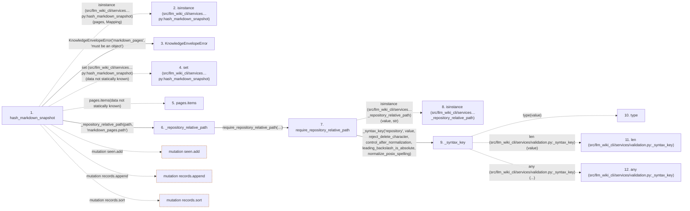

# hash_markdown_snapshot

**Entry point:** `hash_markdown_snapshot` (`api`)
**Source:** [knowledge_envelope](../modules/knowledge_envelope.md)
**Modules touched:** [knowledge_envelope](../modules/knowledge_envelope.md), [knowledge_evidence](../modules/knowledge_evidence.md), [validation](../modules/validation.md)

## Call sequence

```mermaid
sequenceDiagram
    participant p0 as hash_markdown_snapshot
    participant p1 as isinstance (src/llm_wiki_cli/services…py:hash_markdown_snapshot)
    participant p2 as KnowledgeEnvelopeError
    participant p3 as set (src/llm_wiki_cli/services…py:hash_markdown_snapshot)
    participant p4 as pages.items
    participant p5 as _repository_relative_path
    participant p6 as require_repository_relative_path
    participant p7 as isinstance (src/llm_wiki_cli/services…_repository_relative_path)
    participant p8 as _syntax_key
    participant p9 as type
    participant p10 as len (src/llm_wiki_cli/services/validation.py:_syntax_key)
    participant p11 as any (src/llm_wiki_cli/services/validation.py:_syntax_key)
    participant p12 as _known_syntax
    participant p13 as _PATH_SYNTAX.get
    participant p14 as _PATH_SYNTAX.move_to_end (src/llm_wiki_cli/services…lidation.py:_known_syntax)
    participant p15 as value.strip
    participant p16 as any (src/llm_wiki_cli/services…_repository_relative_path)
    participant p17 as ord (src/llm_wiki_cli/services…_repository_relative_path)
    participant p18 as value.startswith
    participant p19 as _WINDOWS_DRIVE_PREFIX_RE.match
    participant p20 as value.split
    participant p21 as PurePosixPath (src/llm_wiki_cli/services…_repository_relative_path)
    participant p22 as posixpath.normpath
    participant p23 as require_portable_relative_path
    participant p24 as isinstance (src/llm_wiki_cli/services…re_portable_relative_path)
    p0-->>p1: isinstance (src/llm_wiki_cli/services…py:hash_markdown_snapshot)
    p0->>p2: KnowledgeEnvelopeError
    p0-->>p3: set (src/llm_wiki_cli/services…py:hash_markdown_snapshot)
    p0-->>p4: pages.items
    p0->>p5: _repository_relative_path
    p5->>p6: require_repository_relative_path
    p6-->>p7: isinstance (src/llm_wiki_cli/services…_repository_relative_path)
    p6->>p8: _syntax_key
    p8-->>p9: type
    p8-->>p10: len (src/llm_wiki_cli/services/validation.py:_syntax_key)
    p8-->>p11: any (src/llm_wiki_cli/services/validation.py:_syntax_key)
    p8-->>p9: type
    p8-->>p9: type
    p8-->>p10: len (src/llm_wiki_cli/services/validation.py:_syntax_key)
    p6->>p12: _known_syntax
    p12-->>p13: _PATH_SYNTAX.get
    p12-->>p14: _PATH_SYNTAX.move_to_end (src/llm_wiki_cli/services…lidation.py:_known_syntax)
    p6-->>p15: value.strip
    p6-->>p16: any (src/llm_wiki_cli/services…_repository_relative_path)
    p6-->>p17: ord (src/llm_wiki_cli/services…_repository_relative_path)
    p6-->>p17: ord (src/llm_wiki_cli/services…_repository_relative_path)
    p6-->>p18: value.startswith
    p6-->>p18: value.startswith
    p6-->>p19: _WINDOWS_DRIVE_PREFIX_RE.match
    p6-->>p20: value.split
    p6-->>p21: PurePosixPath (src/llm_wiki_cli/services…_repository_relative_path)
    p6-->>p16: any (src/llm_wiki_cli/services…_repository_relative_path)
    p6-->>p22: posixpath.normpath
    p6->>p23: require_portable_relative_path
    p23-->>p24: isinstance (src/llm_wiki_cli/services…re_portable_relative_path)
```

<!-- Auto-generated from static call edges. Dashed arrows are external or unresolved calls. Reviewed runtime conditions and side effects belong in Behavior. -->

> Call sequence diagram shows 30 of 113 interactions; 83 omitted to keep the visualization within the 30-interaction and generated-diagram limits.

## Data flow

<!-- Auto-generated static analysis. Treat values and boundaries as best-effort hints, not runtime proof. -->

### Step data

| Step | Inputs | Reads | Writes | Returns |
|---|---|---|---|---|
| `hash_markdown_snapshot` | `pages: Mapping[str, str \| bytes]` | `Mapping`, `MARKDOWN_SNAPSHOT_DOMAIN` | - | `_hash_structured(...)` |
| `isinstance (src/llm_wiki_cli/services…py:hash_markdown_snapshot)` | - | - | - | - |
| `KnowledgeEnvelopeError` | - | - | - | - |
| `set (src/llm_wiki_cli/services…py:hash_markdown_snapshot)` | - | - | - | - |
| `pages.items` | - | - | - | - |
| `_repository_relative_path` | `value: object`, `field_name: str` | - | - | `require_repository_relative_path(...)` |
| `require_repository_relative_path` | `value: object`, `text_error: Exception`, `posix_error: Exception`, `normalized_error: Exception`, `absolute_error: Exception \| None`, `separator_error: Exception \| None`, `control_error: Exception \| None`, `reject_delete_character: bool` | - | - | `cached`, `_remember_syntax(...)` |
| `isinstance (src/llm_wiki_cli/services…_repository_relative_path)` | - | - | - | - |
| `_syntax_key` | `kind`, `value`, `options` | - | - | `None`, `(...)` |
| `type` | - | - | - | - |
| `len (src/llm_wiki_cli/services/validation.py:_syntax_key)` | - | - | - | - |
| `any (src/llm_wiki_cli/services/validation.py:_syntax_key)` | - | - | - | - |

### Call data

| From | To | Line | Call |
|---|---|---:|---|
| hash_markdown_snapshot | isinstance (src/llm_wiki_cli/services…py:hash_markdown_snapshot) | 784 | `isinstance(pages, Mapping)` |
| hash_markdown_snapshot | KnowledgeEnvelopeError | 785 | `KnowledgeEnvelopeError('markdown_pages', 'must be an object')` |
| hash_markdown_snapshot | set (src/llm_wiki_cli/services…py:hash_markdown_snapshot) | 787 | `set(data not statically known)` |
| hash_markdown_snapshot | pages.items | 788 | `pages.items(data not statically known)` |
| hash_markdown_snapshot | _repository_relative_path | 789 | `_repository_relative_path(path, 'markdown_pages.path')` |
| _repository_relative_path | require_repository_relative_path | 1505 | `require_repository_relative_path(value, text_error=KnowledgeEnvelopeError(...), posix_error=KnowledgeEnvelopeError(...), normalized_error=KnowledgeEnvelopeError(...))` |
| require_repository_relative_path | isinstance (src/llm_wiki_cli/services…_repository_relative_path) | 299 | `isinstance(value, str)` |
| require_repository_relative_path | _syntax_key | 301 | `_syntax_key('repository', value, reject_delete_character, control_after_normalization, leading_backslash_is_absolute, normalize_posix_spelling)` |
| _syntax_key | type | 54 | `type(value)` |
| _syntax_key | len (src/llm_wiki_cli/services/validation.py:_syntax_key) | 54 | `len(value)` |
| _syntax_key | any (src/llm_wiki_cli/services/validation.py:_syntax_key) | 55 | `any(...)` |

### Boundary effects

| Kind | Target | Step | Line |
|---|---|---|---:|
| mutation | `seen.add` | `hash_markdown_snapshot` | 800 |
| mutation | `records.append` | `hash_markdown_snapshot` | 805 |
| mutation | `records.sort` | `hash_markdown_snapshot` | 811 |

### Static analysis gaps

| Kind | Step | Target | Line |
|---|---|---|---:|
| external_call | `hash_markdown_snapshot` | `isinstance` | 784 |
| unresolved_call | `hash_markdown_snapshot` | `pages.items` | 788 |
| external_call | `require_repository_relative_path` | `isinstance` | 299 |
| external_call | `_syntax_key` | `type` | 54 |
| external_call | `_syntax_key` | `any` | 55 |
| step_limit | `hash_markdown_snapshot` | `first 12 steps` | 0 |

## Behavior

This flow starts at `hash_markdown_snapshot` and is classified as `api`. The generated call and data-flow sections are bounded static projections; runtime conditions and side effects require source-level confirmation.
