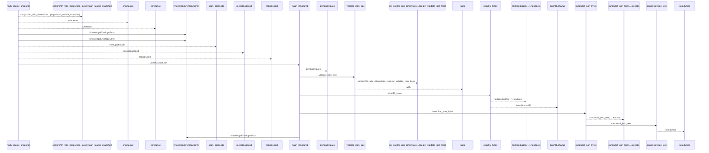
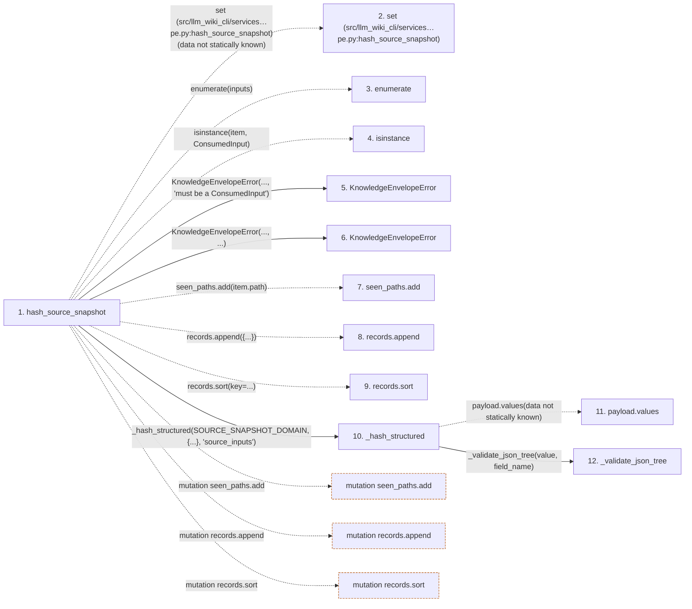

# hash_source_snapshot

**Entry point:** `hash_source_snapshot` (`api`)
**Source:** [knowledge_envelope](../modules/knowledge_envelope.md)
**Modules touched:** [knowledge_envelope](../modules/knowledge_envelope.md), [knowledge_evidence](../modules/knowledge_evidence.md)

## Call sequence

<!-- Auto-generated from static call edges. Dashed arrows are external or unresolved calls. Reviewed runtime conditions and side effects belong in Behavior. -->

## Data flow

<!-- Auto-generated static analysis. Treat values and boundaries as best-effort hints, not runtime proof. -->

### Step data

| Step | Inputs | Reads | Writes | Returns |
|---|---|---|---|---|
| `hash_source_snapshot` | `inputs: Iterable[ConsumedInput]` | `ConsumedInput`, `SOURCE_SNAPSHOT_DOMAIN` | - | `_hash_structured(...)` |
| `set (src/llm_wiki_cli/services…pe.py:hash_source_snapshot)` | - | - | - | - |
| `enumerate` | - | - | - | - |
| `isinstance` | - | - | - | - |
| `KnowledgeEnvelopeError` | - | - | - | - |
| `KnowledgeEnvelopeError` | - | - | - | - |
| `seen_paths.add` | - | - | - | - |
| `records.append` | - | - | - | - |
| `records.sort` | - | - | - | - |
| `_hash_structured` | `domain: str`, `payload: Mapping[str, Any]`, `field_name: str` | `KnowledgeEnvelopeError` | - | `sha256_bytes(...)` |
| `payload.values` | - | - | - | - |
| `_validate_json_tree` | `value: object`, `field_name: str` | - | - | - |

### Call data

| From | To | Line | Call |
|---|---|---:|---|
| hash_source_snapshot | set (src/llm_wiki_cli/services…pe.py:hash_source_snapshot) | 734 | `set(data not statically known)` |
| hash_source_snapshot | enumerate | 735 | `enumerate(inputs)` |
| hash_source_snapshot | isinstance | 736 | `isinstance(item, ConsumedInput)` |
| hash_source_snapshot | KnowledgeEnvelopeError | 737 | `KnowledgeEnvelopeError(..., 'must be a ConsumedInput')` |
| hash_source_snapshot | KnowledgeEnvelopeError | 742 | `KnowledgeEnvelopeError(..., ...)` |
| hash_source_snapshot | seen_paths.add | 746 | `seen_paths.add(item.path)` |
| hash_source_snapshot | records.append | 747 | `records.append({...})` |
| hash_source_snapshot | records.sort | 754 | `records.sort(key=...)` |
| hash_source_snapshot | _hash_structured | 755 | `_hash_structured(SOURCE_SNAPSHOT_DOMAIN, {...}, 'source_inputs')` |
| _hash_structured | payload.values | 1604 | `payload.values(data not statically known)` |
| _hash_structured | _validate_json_tree | 1605 | `_validate_json_tree(value, field_name)` |

### Boundary effects

| Kind | Target | Step | Line |
|---|---|---|---:|
| mutation | `seen_paths.add` | `hash_source_snapshot` | 746 |
| mutation | `records.append` | `hash_source_snapshot` | 747 |
| mutation | `records.sort` | `hash_source_snapshot` | 754 |

### Static analysis gaps

| Kind | Step | Target | Line |
|---|---|---|---:|
| external_call | `hash_source_snapshot` | `enumerate` | 735 |
| external_call | `hash_source_snapshot` | `isinstance` | 736 |
| unresolved_call | `_hash_structured` | `payload.values` | 1604 |
| step_limit | `hash_source_snapshot` | `first 12 steps` | 0 |

## Behavior

This flow starts at `hash_source_snapshot` and is classified as `api`. The generated call and data-flow sections are bounded static projections; runtime conditions and side effects require source-level confirmation.
