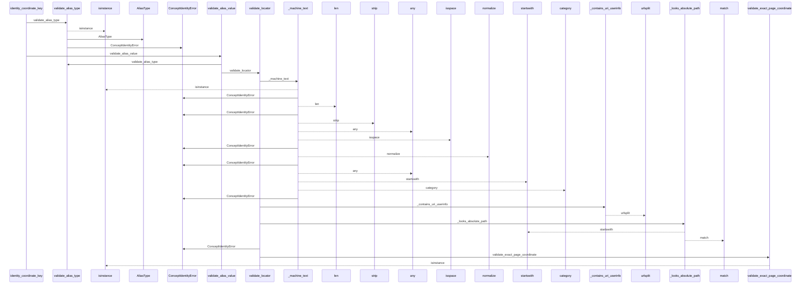
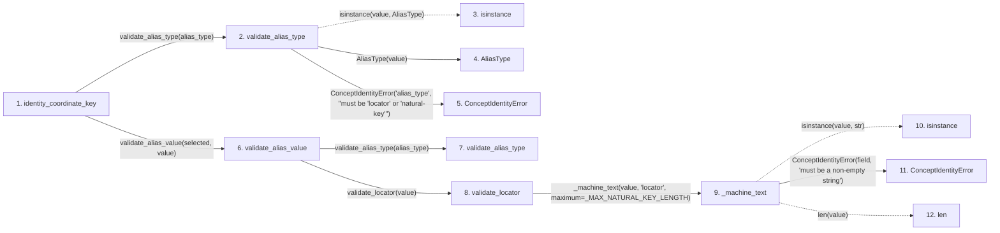

# identity_coordinate_key

**Entry point:** `identity_coordinate_key` (`api`)
**Source:** [concept_identity](../modules/concept_identity.md)
**Modules touched:** [concept_identity](../modules/concept_identity.md), [validation](../modules/validation.md), [wiki_surface](../modules/wiki_surface.md)

## Call sequence

<!-- Auto-generated from static call edges. Dashed arrows are external or unresolved calls. Reviewed runtime conditions and side effects belong in Behavior. -->

> Call sequence diagram shows 30 of 125 interactions; 95 omitted to keep the visualization within the 30-interaction and generated-diagram limits.

> Trace truncated at the depth limit; deeper calls are omitted.

## Data flow

<!-- Auto-generated static analysis. Treat values and boundaries as best-effort hints, not runtime proof. -->

### Step data

| Step | Inputs | Reads | Writes | Returns |
|---|---|---|---|---|
| `identity_coordinate_key` | `alias_type: AliasType \| str`, `value: object` | `AliasType` | - | `normalized`, `mcp_uri(...)`, `mcp_uri(...)` |
| `validate_alias_type` | `value: AliasType \| str` | `AliasType` | - | `...` |
| `isinstance` | - | - | - | - |
| `AliasType` | - | - | - | - |
| `ConceptIdentityError` | - | - | - | - |
| `validate_alias_value` | `alias_type: AliasType \| str`, `value: object` | `AliasType` | - | `validate_locator(...)`, `validate_natural_key(...)` |
| `validate_alias_type` | `value: AliasType \| str` | `AliasType` | - | `...` |
| `validate_locator` | `value: object` | `_MAX_NATURAL_KEY_LENGTH`, `WikiSurfaceError` | - | `normalized` |
| `_machine_text` | `value: object`, `field: str`, `maximum: int` | - | - | `value` |
| `isinstance` | - | - | - | - |
| `ConceptIdentityError` | - | - | - | - |
| `len` | - | - | - | - |

### Call data

| From | To | Line | Call |
|---|---|---:|---|
| identity_coordinate_key | validate_alias_type | 474 | `validate_alias_type(alias_type)` |
| validate_alias_type | isinstance | 445 | `isinstance(value, AliasType)` |
| validate_alias_type | AliasType | 445 | `AliasType(value)` |
| validate_alias_type | ConceptIdentityError | 447 | `ConceptIdentityError('alias_type', "must be 'locator' or 'natural-key'")` |
| identity_coordinate_key | validate_alias_value | 475 | `validate_alias_value(selected, value)` |
| validate_alias_value | validate_alias_type | 456 | `validate_alias_type(alias_type)` |
| validate_alias_value | validate_locator | 458 | `validate_locator(value)` |
| validate_locator | _machine_text | 408 | `_machine_text(value, 'locator', maximum=_MAX_NATURAL_KEY_LENGTH)` |
| _machine_text | isinstance | 912 | `isinstance(value, str)` |
| _machine_text | ConceptIdentityError | 913 | `ConceptIdentityError(field, 'must be a non-empty string')` |
| _machine_text | len | 914 | `len(value)` |

### Boundary effects

*No boundary effects detected.*

### Static analysis gaps

| Kind | Step | Target | Line |
|---|---|---|---:|
| unresolved_call | `validate_alias_type` | `isinstance` | 445 |
| unresolved_call | `_machine_text` | `isinstance` | 912 |
| step_limit | `identity_coordinate_key` | `first 12 steps` | 0 |
| truncated_flow | `identity_coordinate_key` | `depth limit` | 0 |

## Behavior

This flow starts at `identity_coordinate_key` and is classified as `api`. The generated call and data-flow sections are bounded static projections; runtime conditions and side effects require source-level confirmation.
