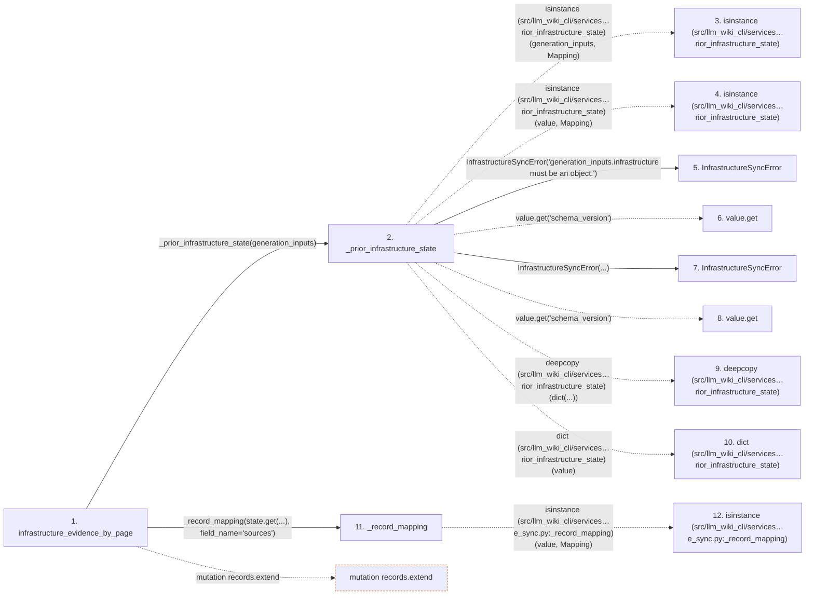

# infrastructure_evidence_by_page

**Entry point:** `infrastructure_evidence_by_page` (`api`)
**Source:** [infrastructure_sync](../modules/infrastructure_sync.md)
**Modules touched:** [infrastructure_sync](../modules/infrastructure_sync.md), [knowledge_evidence](../modules/knowledge_evidence.md), [validation](../modules/validation.md)

## Call sequence

```mermaid
sequenceDiagram
    participant p0 as infrastructure_evidence_by_page
    participant p1 as _prior_infrastructure_state
    participant p2 as isinstance (src/llm_wiki_cli/services…rior_infrastructure_state)
    participant p3 as InfrastructureSyncError
    participant p4 as value.get
    participant p5 as deepcopy (src/llm_wiki_cli/services…rior_infrastructure_state)
    participant p6 as dict (src/llm_wiki_cli/services…rior_infrastructure_state)
    participant p7 as _record_mapping
    participant p8 as isinstance (src/llm_wiki_cli/services…e_sync.py:_record_mapping)
    participant p9 as value.items
    participant p10 as _valid_repository_path
    participant p11 as PurePosixPath (src/llm_wiki_cli/services…py:_valid_repository_path)
    participant p12 as is_portable_relative_path
    participant p13 as require_portable_relative_path
    participant p14 as isinstance (src/llm_wiki_cli/services…re_portable_relative_path)
    participant p15 as _default_path_error
    participant p16 as SharedValidationError
    participant p17 as os.fspath
    participant p18 as raw.encode
    participant p19 as raw.replace
    p0->>p1: _prior_infrastructure_state
    p1-->>p2: isinstance (src/llm_wiki_cli/services…rior_infrastructure_state)
    p1-->>p2: isinstance (src/llm_wiki_cli/services…rior_infrastructure_state)
    p1->>p3: InfrastructureSyncError
    p1-->>p4: value.get
    p1->>p3: InfrastructureSyncError
    p1-->>p4: value.get
    p1-->>p5: deepcopy (src/llm_wiki_cli/services…rior_infrastructure_state)
    p1-->>p6: dict (src/llm_wiki_cli/services…rior_infrastructure_state)
    p0->>p7: _record_mapping
    p7-->>p8: isinstance (src/llm_wiki_cli/services…e_sync.py:_record_mapping)
    p7->>p3: InfrastructureSyncError
    p7-->>p9: value.items
    p7-->>p8: isinstance (src/llm_wiki_cli/services…e_sync.py:_record_mapping)
    p7-->>p8: isinstance (src/llm_wiki_cli/services…e_sync.py:_record_mapping)
    p7->>p3: InfrastructureSyncError
    p7->>p10: _valid_repository_path
    p10-->>p11: PurePosixPath (src/llm_wiki_cli/services…py:_valid_repository_path)
    p10->>p12: is_portable_relative_path
    p12->>p13: require_portable_relative_path
    p13-->>p14: isinstance (src/llm_wiki_cli/services…re_portable_relative_path)
    p13->>p15: _default_path_error
    p15->>p16: SharedValidationError
    p13-->>p17: os.fspath
    p13-->>p14: isinstance (src/llm_wiki_cli/services…re_portable_relative_path)
    p13->>p15: _default_path_error
    p13-->>p18: raw.encode
    p13->>p15: _default_path_error
    p13->>p15: _default_path_error
    p13-->>p19: raw.replace
```

<!-- Auto-generated from static call edges. Dashed arrows are external or unresolved calls. Reviewed runtime conditions and side effects belong in Behavior. -->

> Call sequence diagram shows 30 of 150 interactions; 120 omitted to keep the visualization within the 30-interaction and generated-diagram limits.

## Data flow

<!-- Auto-generated static analysis. Treat values and boundaries as best-effort hints, not runtime proof. -->

### Step data

| Step | Inputs | Reads | Writes | Returns |
|---|---|---|---|---|
| `infrastructure_evidence_by_page` | `generation_inputs: Mapping[str, object] \| None` | `INFRASTRUCTURE_EXTRACTOR_REF` | `result[...]` | `{...}`, `result` |
| `_prior_infrastructure_state` | `generation_inputs: Mapping[str, object] \| None` | `Mapping`, `INFRASTRUCTURE_GENERATION_INPUT_KEY`, `INFRASTRUCTURE_GENERATION_INPUT_KEY`, `Mapping`, `INFRASTRUCTURE_SYNC_SCHEMA_VERSION` | - | `{...}`, `{...}`, `deepcopy(...)` |
| `isinstance (src/llm_wiki_cli/services…rior_infrastructure_state)` | - | - | - | - |
| `isinstance (src/llm_wiki_cli/services…rior_infrastructure_state)` | - | - | - | - |
| `InfrastructureSyncError` | - | - | - | - |
| `value.get` | - | - | - | - |
| `InfrastructureSyncError` | - | - | - | - |
| `value.get` | - | - | - | - |
| `deepcopy (src/llm_wiki_cli/services…rior_infrastructure_state)` | - | - | - | - |
| `dict (src/llm_wiki_cli/services…rior_infrastructure_state)` | - | - | - | - |
| `_record_mapping` | `value: object`, `field_name: str` | `Mapping`, `Mapping`, `Mapping`, `INFRASTRUCTURE_DISCOVERY_ROOT` | `result[...]` | `{...}`, `result` |
| `isinstance (src/llm_wiki_cli/services…e_sync.py:_record_mapping)` | - | - | - | - |

### Call data

| From | To | Line | Call |
|---|---|---:|---|
| infrastructure_evidence_by_page | _prior_infrastructure_state | 262 | `_prior_infrastructure_state(generation_inputs)` |
| _prior_infrastructure_state | isinstance (src/llm_wiki_cli/services…rior_infrastructure_state) | 107 | `isinstance(generation_inputs, Mapping)` |
| _prior_infrastructure_state | isinstance (src/llm_wiki_cli/services…rior_infrastructure_state) | 112 | `isinstance(value, Mapping)` |
| _prior_infrastructure_state | InfrastructureSyncError | 113 | `InfrastructureSyncError('generation_inputs.infrastructure must be an object.')` |
| _prior_infrastructure_state | value.get | 116 | `value.get('schema_version')` |
| _prior_infrastructure_state | InfrastructureSyncError | 117 | `InfrastructureSyncError(...)` |
| _prior_infrastructure_state | value.get | 119 | `value.get('schema_version')` |
| _prior_infrastructure_state | deepcopy (src/llm_wiki_cli/services…rior_infrastructure_state) | 121 | `deepcopy(dict(...))` |
| _prior_infrastructure_state | dict (src/llm_wiki_cli/services…rior_infrastructure_state) | 121 | `dict(value)` |
| infrastructure_evidence_by_page | _record_mapping | 265 | `_record_mapping(state.get(...), field_name='sources')` |
| _record_mapping | isinstance (src/llm_wiki_cli/services…e_sync.py:_record_mapping) | 149 | `isinstance(value, Mapping)` |

### Boundary effects

| Kind | Target | Step | Line |
|---|---|---|---:|
| mutation | `records.extend` | `infrastructure_evidence_by_page` | 268 |

### Static analysis gaps

| Kind | Step | Target | Line |
|---|---|---|---:|
| external_call | `_prior_infrastructure_state` | `isinstance` | 107 |
| external_call | `_prior_infrastructure_state` | `isinstance` | 112 |
| unresolved_call | `_prior_infrastructure_state` | `value.get` | 116 |
| unresolved_call | `_prior_infrastructure_state` | `value.get` | 119 |
| external_call | `_prior_infrastructure_state` | `deepcopy` | 121 |
| external_call | `_record_mapping` | `isinstance` | 149 |
| step_limit | `infrastructure_evidence_by_page` | `first 12 steps` | 0 |

## Behavior

This flow starts at `infrastructure_evidence_by_page` and is classified as `api`. The generated call and data-flow sections are bounded static projections; runtime conditions and side effects require source-level confirmation.
