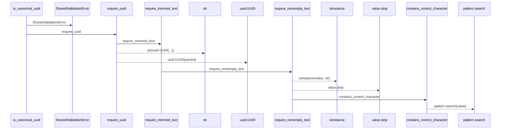

# is_canonical_uuid

**Entry point:** `is_canonical_uuid` (`api`)
**Source:** [validation](../modules/validation.md)
**Modules touched:** [validation](../modules/validation.md)

## Call sequence

> Static overview in presentation order, not runtime execution order. Arrows retain captured callers; representative internal continuations and boundary examples precede repeated helper detail.

<!-- Auto-generated from static call edges. Dashed arrows are external or unresolved calls. Reviewed runtime conditions and side effects belong in Behavior. -->

```mermaid
sequenceDiagram
    participant p0 as is_canonical_uuid
    participant p1 as SharedValidationError
    participant p2 as require_uuid
    participant p3 as require_trimmed_text
    participant p4 as str
    participant p5 as uuid.UUID
    participant p6 as require_nonempty_text
    participant p7 as isinstance
    participant p8 as value.strip
    participant p9 as contains_control_character
    participant p10 as pattern.search
    p0->>p1: SharedValidationError
    p0->>p2: require_uuid
    p2->>p3: require_trimmed_text
    p2-->>p4: str(uuid.UUID(...))
    p2-->>p5: uuid.UUID(parsed)
    p3->>p6: require_nonempty_text
    p6-->>p7: isinstance(value, str)
    p6-->>p8: value.strip
    p6->>p9: contains_control_character
    p9-->>p10: pattern.search(value)
```

> Call sequence diagram shows 10 of 10 interactions; 0 omitted to keep the visualization within the 30-interaction and generated-diagram limits, with uncertain identities omitted rather than inferred.

> Captured boundary calls: external 3 of 3 (0 omitted); unresolved 2 of 2 (0 omitted). These counts cover the captured static trace.
> Detailed flow queries retain their own coverage and limits; omitted paths may execute at runtime.

## Data flow

<!-- Auto-generated static analysis. Treat values and boundaries as best-effort hints, not runtime proof. -->

### Analysis coverage

**Effect analysis partially available.** Flow assembly and source effect analysis are separate; empty observations do not prove an empty handler body.

Source steps: 6; effect analysis evaluated: 5, partial: 0, unavailable: 1. Counts include steps omitted from the displayed trace.

Collector observations for 5 source steps with known totals: observed: 26, emitted: 26, omitted: 0. Unavailable totals are excluded.

- Callable record unavailable; the selected entry symbol has no represented callable body.
- Effect collector totals unavailable; observed counts cover captured records only.

| Step | Callable record | Effect analysis | Collector totals | Observed | Emitted | Omitted |
|---|---|---|---|---:|---:|---:|
| `is_canonical_uuid` | `available` | `evaluated` | `available` | `3` | `3` | `0` |
| `SharedValidationError` | `unavailable` | `unavailable` | `unavailable` | — | — | — |
| `require_uuid` | `available` | `evaluated` | `available` | `6` | `6` | `0` |
| `require_trimmed_text` | `available` | `evaluated` | `available` | `4` | `4` | `0` |
| `require_nonempty_text` | `available` | `evaluated` | `available` | `8` | `8` | `0` |
| `isinstance` | `not_applicable` | `not_applicable` | `not_applicable` | — | — | — |
| `value.strip` | `not_applicable` | `not_applicable` | `not_applicable` | — | — | — |
| `contains_control_character` | `available` | `evaluated` | `available` | `5` | `5` | `0` |
| `pattern.search` | `not_applicable` | `not_applicable` | `not_applicable` | — | — | — |
| `str` | `not_applicable` | `not_applicable` | `not_applicable` | — | — | — |
| `uuid.UUID` | `not_applicable` | `not_applicable` | `not_applicable` | — | — | — |

```mermaid
flowchart LR
    s1["1. is_canonical_uuid"]
    s2["2. SharedValidationError"]
    s3["3. require_uuid"]
    s4["4. require_trimmed_text"]
    s5["5. require_nonempty_text"]
    s6["6. isinstance"]
    s7["7. value.strip"]
    s8["8. contains_control_character"]
    s9["9. pattern.search"]
    s10["10. str"]
    s11["11. uuid.UUID"]
    s1 -->|"SharedValidationError('value must be a canonical UUID')"| s2
    s1 -->|"require_uuid(value, text_error=error, uuid_error=error, canonical_error=error)"| s3
    s3 -->|"require_trimmed_text(value, error=text_error, reject_control_characters=reject_control_characters)"| s4
    s4 -->|"require_nonempty_text(value, error=error, require_trimmed=True, reject_control_characters=reject_control_characters)"| s5
    s5 -. "isinstance(value, str)" .-> s6
    s5 -. "value.strip(data not statically known)" .-> s7
    s5 -->|"contains_control_character(parsed, reject_delete_character=reject_delete_character)"| s8
    s8 -. "pattern.search(value)" .-> s9
    s3 -. "str(uuid.UUID(...))" .-> s10
    s3 -. "uuid.UUID(parsed)" .-> s11
    click s1 "../modules/validation.md"
    click s2 "../modules/validation.md"
    click s3 "../modules/validation.md"
    click s4 "../modules/validation.md"
    click s5 "../modules/validation.md"
    click s8 "../modules/validation.md"
```

### Step data

| Step | Inputs | Reads | Writes | Returns |
|---|---|---|---|---|
| `is_canonical_uuid` | `value: object` | - | - | `False`, `True` |
| `SharedValidationError` | - | - | - | - |
| `require_uuid` | `value: object`, `text_error: Exception`, `uuid_error: Exception`, `canonical_error: Exception`, `reject_control_characters: bool` | - | - | `parsed` |
| `require_trimmed_text` | `value: object`, `error: Exception`, `reject_control_characters: bool` | - | - | `require_nonempty_text(...)` |
| `require_nonempty_text` | `value: object`, `error: Exception`, `trim_error: Exception \| None`, `normalize: bool`, `require_trimmed: bool`, `reject_control_characters: bool`, `reject_delete_character: bool` | - | - | `parsed` |
| `isinstance` | - | - | - | - |
| `value.strip` | - | - | - | - |
| `contains_control_character` | `value: str`, `reject_delete_character: bool` | `_ASCII_CONTROL_DELETE`, `_ASCII_CONTROL` | - | `...` |
| `pattern.search` | - | - | - | - |
| `str` | - | - | - | - |
| `uuid.UUID` | - | - | - | - |

### Call data

| From | To | Line | Call |
|---|---|---:|---|
| is_canonical_uuid | SharedValidationError | 1181 | `SharedValidationError('value must be a canonical UUID')` |
| is_canonical_uuid | require_uuid | 1183 | `require_uuid(value, text_error=error, uuid_error=error, canonical_error=error)` |
| require_uuid | require_trimmed_text | 1164 | `require_trimmed_text(value, error=text_error, reject_control_characters=reject_control_characters)` |
| require_trimmed_text | require_nonempty_text | 696 | `require_nonempty_text(value, error=error, require_trimmed=True, reject_control_characters=reject_control_characters)` |
| require_nonempty_text | isinstance | 623 | `isinstance(value, str)` |
| require_nonempty_text | value.strip | 625 | `value.strip(data not statically known)` |
| require_nonempty_text | contains_control_character | 631 | `contains_control_character(parsed, reject_delete_character=reject_delete_character)` |
| contains_control_character | pattern.search | 685 | `pattern.search(value)` |
| require_uuid | str | 1170 | `str(uuid.UUID(...))` |
| require_uuid | uuid.UUID | 1170 | `uuid.UUID(parsed)` |

### Boundary effects

*No boundary-effect observations were captured in this static trace.*

### Static analysis gaps

| Kind | Step | Target | Line |
|---|---|---|---:|
| external_call | `require_nonempty_text` | `isinstance` | 623 |
| unresolved_call | `require_nonempty_text` | `value.strip` | 625 |
| unresolved_call | `contains_control_character` | `pattern.search` | 685 |
| external_call | `require_uuid` | `uuid.UUID` | 1170 |

## Behavior

This flow starts at `is_canonical_uuid` and is classified as `api`. The generated call and data-flow sections are bounded static projections; runtime conditions and side effects require source-level confirmation.
