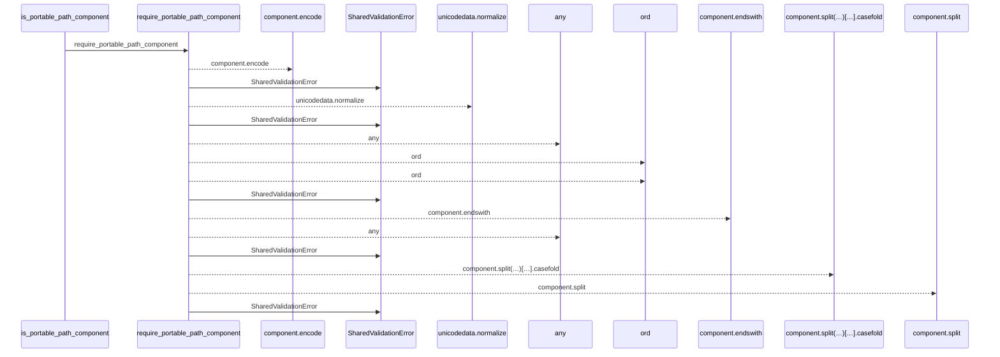
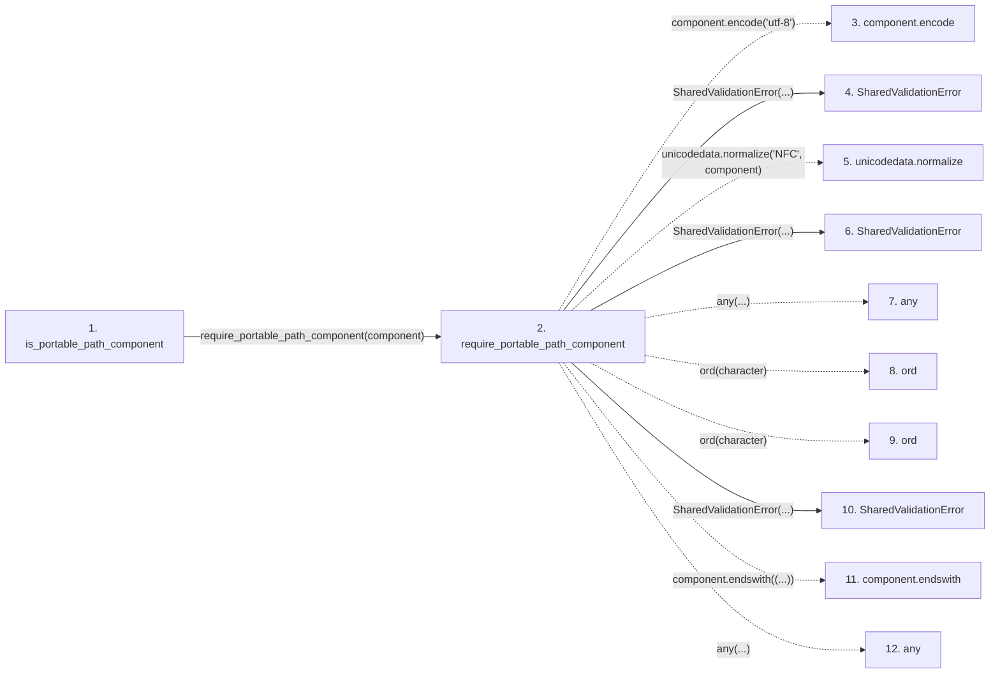

# is_portable_path_component

**Entry point:** `is_portable_path_component` (`api`)
**Source:** [validation](../modules/validation.md)
**Modules touched:** [validation](../modules/validation.md)

## Call sequence

<!-- Auto-generated from static call edges. Dashed arrows are external or unresolved calls. Reviewed runtime conditions and side effects belong in Behavior. -->

## Data flow

<!-- Auto-generated static analysis. Treat values and boundaries as best-effort hints, not runtime proof. -->

### Step data

| Step | Inputs | Reads | Writes | Returns |
|---|---|---|---|---|
| `is_portable_path_component` | `component: str` | `SharedValidationError` | - | `False`, `True` |
| `require_portable_path_component` | `component: str`, `context: str \| None`, `defer_non_nfc_error: bool`, `reject_delete_character: bool`, `utf8_error: Exception \| None`, `control_error: Exception \| None`, `non_nfc_error: Exception \| None`, `nonportable_error: Exception \| None` | `_WINDOWS_FORBIDDEN_PATH_CHARS`, `_WINDOWS_RESERVED_NAMES` | - | `component` |
| `component.encode` | - | - | - | - |
| `SharedValidationError` | - | - | - | - |
| `unicodedata.normalize` | - | - | - | - |
| `SharedValidationError` | - | - | - | - |
| `any` | - | - | - | - |
| `ord` | - | - | - | - |
| `ord` | - | - | - | - |
| `SharedValidationError` | - | - | - | - |
| `component.endswith` | - | - | - | - |
| `any` | - | - | - | - |

### Call data

| From | To | Line | Call |
|---|---|---:|---|
| is_portable_path_component | require_portable_path_component | 177 | `require_portable_path_component(component)` |
| require_portable_path_component | component.encode | 139 | `component.encode('utf-8')` |
| require_portable_path_component | SharedValidationError | 141 | `SharedValidationError(...)` |
| require_portable_path_component | unicodedata.normalize | 146 | `unicodedata.normalize('NFC', component)` |
| require_portable_path_component | SharedValidationError | 148 | `SharedValidationError(...)` |
| require_portable_path_component | any | 151 | `any(...)` |
| require_portable_path_component | ord | 152 | `ord(character)` |
| require_portable_path_component | ord | 153 | `ord(character)` |
| require_portable_path_component | SharedValidationError | 156 | `SharedValidationError(...)` |
| require_portable_path_component | component.endswith | 159 | `component.endswith((...))` |
| require_portable_path_component | any | 159 | `any(...)` |

### Boundary effects

*No boundary effects detected.*

### Static analysis gaps

| Kind | Step | Target | Line |
|---|---|---|---:|
| unresolved_call | `require_portable_path_component` | `component.encode` | 139 |
| external_call | `require_portable_path_component` | `unicodedata.normalize` | 146 |
| external_call | `require_portable_path_component` | `any` | 151 |
| external_call | `require_portable_path_component` | `ord` | 152 |
| external_call | `require_portable_path_component` | `ord` | 153 |
| unresolved_call | `require_portable_path_component` | `component.endswith` | 159 |
| external_call | `require_portable_path_component` | `any` | 159 |
| step_limit | `is_portable_path_component` | `first 12 steps` | 0 |

## Behavior

This flow starts at `is_portable_path_component` and is classified as `api`. The generated call and data-flow sections are bounded static projections; runtime conditions and side effects require source-level confirmation.
