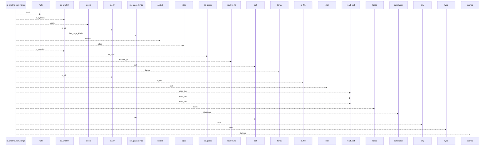
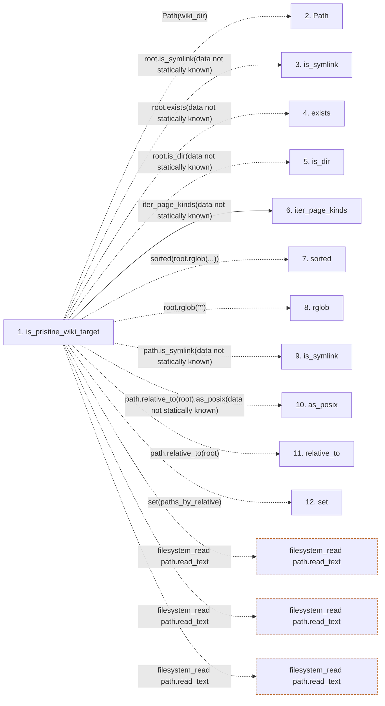

# is_pristine_wiki_target

**Entry point:** `is_pristine_wiki_target` (`api`)
**Source:** [wiki_lifecycle](../modules/wiki_lifecycle.md)
**Modules touched:** [wiki_lifecycle](../modules/wiki_lifecycle.md), [wiki_surface](../modules/wiki_surface.md)

## Call sequence

<!-- Auto-generated from static call edges. Dashed arrows are external or unresolved calls. Reviewed runtime conditions and side effects belong in Behavior. -->

## Data flow

<!-- Auto-generated static analysis. Treat values and boundaries as best-effort hints, not runtime proof. -->

### Step data

| Step | Inputs | Reads | Writes | Returns |
|---|---|---|---|---|
| `is_pristine_wiki_target` | `wiki_dir: Union[str, Path]` | `INITIAL_WIKI_INDEX_MARKDOWN`, `INITIAL_WIKI_LOG_MARKDOWN`, `AGENT_CHOICES` | `paths_by_relative[...]` | `False`, `True`, `False`, `False`, `True`, `False`, `False`, `False` |
| `Path` | - | - | - | - |
| `is_symlink` | - | - | - | - |
| `exists` | - | - | - | - |
| `is_dir` | - | - | - | - |
| `iter_page_kinds` | - | `_PAGE_KINDS` | - | `_PAGE_KINDS` |
| `sorted` | - | - | - | - |
| `rglob` | - | - | - | - |
| `is_symlink` | - | - | - | - |
| `as_posix` | - | - | - | - |
| `relative_to` | - | - | - | - |
| `set` | - | - | - | - |

### Call data

| From | To | Line | Call |
|---|---|---:|---|
| is_pristine_wiki_target | Path | 48 | `Path(wiki_dir)` |
| is_pristine_wiki_target | is_symlink | 49 | `root.is_symlink(data not statically known)` |
| is_pristine_wiki_target | exists | 51 | `root.exists(data not statically known)` |
| is_pristine_wiki_target | is_dir | 53 | `root.is_dir(data not statically known)` |
| is_pristine_wiki_target | iter_page_kinds | 58 | `iter_page_kinds(data not statically known)` |
| is_pristine_wiki_target | sorted | 71 | `sorted(root.rglob(...))` |
| is_pristine_wiki_target | rglob | 71 | `root.rglob('*')` |
| is_pristine_wiki_target | is_symlink | 79 | `path.is_symlink(data not statically known)` |
| is_pristine_wiki_target | as_posix | 82 | `path.relative_to(root).as_posix(data not statically known)` |
| is_pristine_wiki_target | relative_to | 82 | `path.relative_to(root)` |
| is_pristine_wiki_target | set | 87 | `set(paths_by_relative)` |

### Boundary effects

| Kind | Target | Step | Line |
|---|---|---|---:|
| filesystem_read | `path.read_text` | `is_pristine_wiki_target` | 106 |
| filesystem_read | `path.read_text` | `is_pristine_wiki_target` | 109 |
| filesystem_read | `path.read_text` | `is_pristine_wiki_target` | 112 |

### Static analysis gaps

| Kind | Step | Target | Line |
|---|---|---|---:|
| unresolved_call | `is_pristine_wiki_target` | `root.is_symlink` | 49 |
| unresolved_call | `is_pristine_wiki_target` | `root.exists` | 51 |
| unresolved_call | `is_pristine_wiki_target` | `root.is_dir` | 53 |
| unresolved_call | `is_pristine_wiki_target` | `sorted` | 71 |
| unresolved_call | `is_pristine_wiki_target` | `root.rglob` | 71 |
| unresolved_call | `is_pristine_wiki_target` | `path.is_symlink` | 79 |
| unresolved_call | `is_pristine_wiki_target` | `path.relative_to(root).as_posix` | 82 |
| unresolved_call | `is_pristine_wiki_target` | `path.relative_to` | 82 |
| step_limit | `is_pristine_wiki_target` | `first 12 steps` | 0 |

## Behavior

This flow starts at `is_pristine_wiki_target` and is classified as `api`. The generated call and data-flow sections are bounded static projections; runtime conditions and side effects require source-level confirmation.
