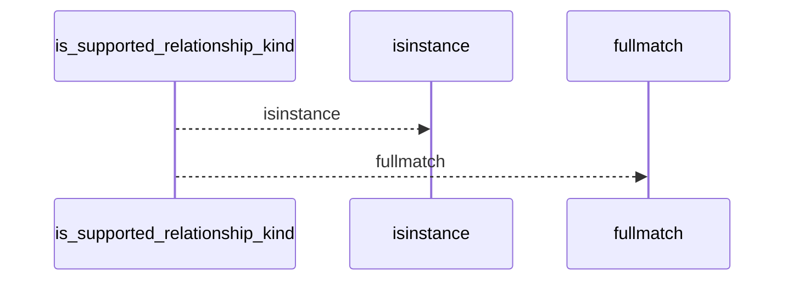
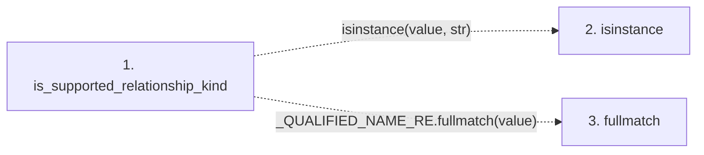

# is_supported_relationship_kind

**Entry point:** `is_supported_relationship_kind` (`api`)
**Source:** [knowledge_graph](../modules/knowledge_graph.md)
**Modules touched:** [knowledge_graph](../modules/knowledge_graph.md)

## Call sequence

<!-- Auto-generated from static call edges. Dashed arrows are external or unresolved calls. Reviewed runtime conditions and side effects belong in Behavior. -->

## Data flow

<!-- Auto-generated static analysis. Treat values and boundaries as best-effort hints, not runtime proof. -->

### Step data

| Step | Inputs | Reads | Writes | Returns |
|---|---|---|---|---|
| `is_supported_relationship_kind` | `value: object` | `CORE_RELATIONSHIP_KINDS` | - | `...` |
| `isinstance` | - | - | - | - |
| `fullmatch` | - | - | - | - |

### Call data

| From | To | Line | Call |
|---|---|---:|---|
| is_supported_relationship_kind | isinstance | 103 | `isinstance(value, str)` |
| is_supported_relationship_kind | fullmatch | 105 | `_QUALIFIED_NAME_RE.fullmatch(value)` |

### Boundary effects

*No boundary effects detected.*

### Static analysis gaps

| Kind | Step | Target | Line |
|---|---|---|---:|
| unresolved_call | `is_supported_relationship_kind` | `isinstance` | 103 |
| unresolved_call | `is_supported_relationship_kind` | `_QUALIFIED_NAME_RE.fullmatch` | 105 |

## Behavior

This flow starts at `is_supported_relationship_kind` and is classified as `api`. The generated call and data-flow sections are bounded static projections; runtime conditions and side effects require source-level confirmation.
