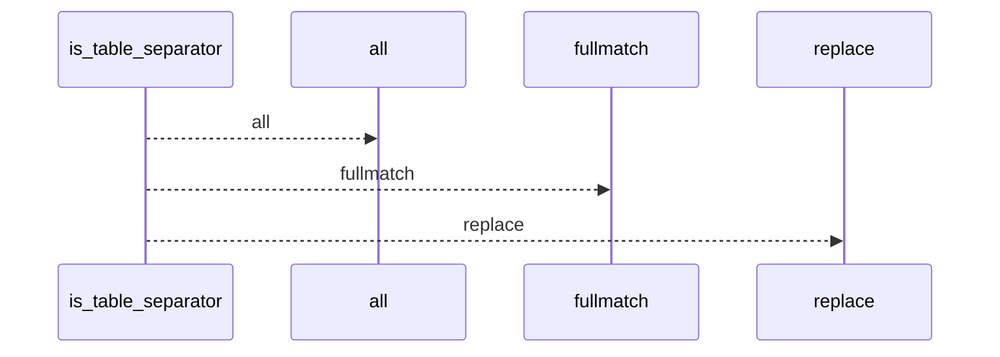
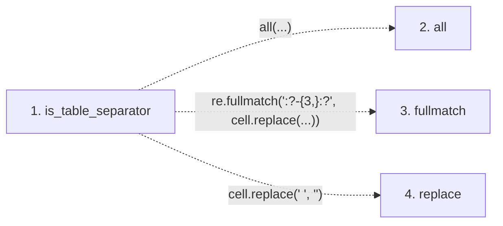

# is_table_separator

**Entry point:** `is_table_separator` (`api`)
**Source:** [markdown_sections](../modules/markdown_sections.md)
**Modules touched:** [markdown_sections](../modules/markdown_sections.md)

## Call sequence

<!-- Auto-generated from static call edges. Dashed arrows are external or unresolved calls. Reviewed runtime conditions and side effects belong in Behavior. -->

## Data flow

<!-- Auto-generated static analysis. Treat values and boundaries as best-effort hints, not runtime proof. -->

### Step data

| Step | Inputs | Reads | Writes | Returns |
|---|---|---|---|---|
| `is_table_separator` | `cells: list[str]` | - | - | `False`, `all(...)` |
| `all` | - | - | - | - |
| `fullmatch` | - | - | - | - |
| `replace` | - | - | - | - |

### Call data

| From | To | Line | Call |
|---|---|---:|---|
| is_table_separator | all | 514 | `all(...)` |
| is_table_separator | fullmatch | 514 | `re.fullmatch(':?-{3,}:?', cell.replace(...))` |
| is_table_separator | replace | 514 | `cell.replace(' ', '')` |

### Boundary effects

*No boundary effects detected.*

### Static analysis gaps

| Kind | Step | Target | Line |
|---|---|---|---:|
| unresolved_call | `is_table_separator` | `all` | 514 |
| external_call | `is_table_separator` | `re.fullmatch` | 514 |
| external_call | `is_table_separator` | `cell.replace` | 514 |

## Behavior

This flow starts at `is_table_separator` and is classified as `api`. The generated call and data-flow sections are bounded static projections; runtime conditions and side effects require source-level confirmation.
