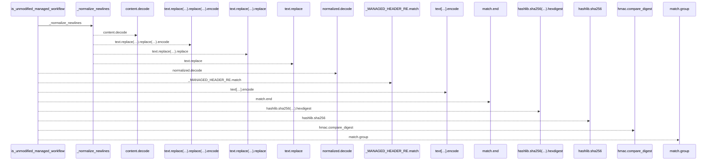
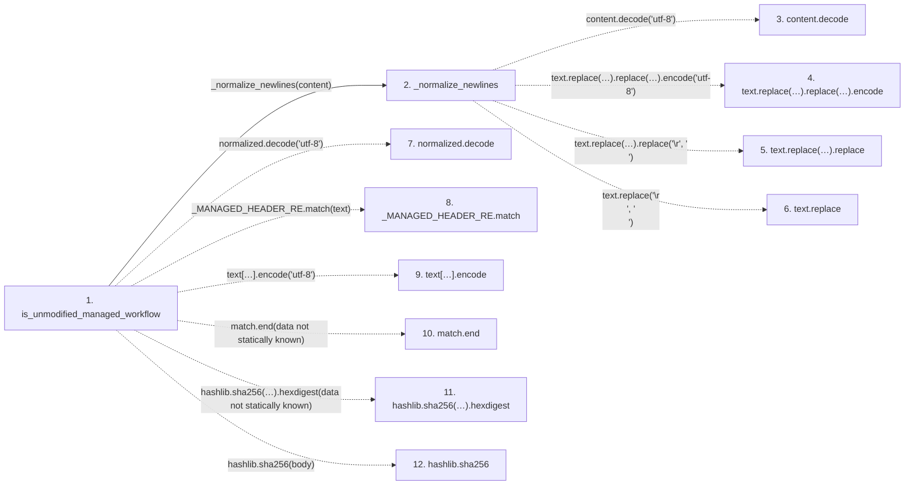

# is_unmodified_managed_workflow

**Entry point:** `is_unmodified_managed_workflow` (`api`)
**Source:** [ci_installer](../modules/ci_installer.md)
**Modules touched:** [ci_installer](../modules/ci_installer.md)

## Call sequence

<!-- Auto-generated from static call edges. Dashed arrows are external or unresolved calls. Reviewed runtime conditions and side effects belong in Behavior. -->

## Data flow

<!-- Auto-generated static analysis. Treat values and boundaries as best-effort hints, not runtime proof. -->

### Step data

| Step | Inputs | Reads | Writes | Returns |
|---|---|---|---|---|
| `is_unmodified_managed_workflow` | `content: bytes` | - | - | `False`, `False`, `hmac.compare_digest(...)` |
| `_normalize_newlines` | `content: bytes` | - | - | `None`, `...` |
| `content.decode` | - | - | - | - |
| `text.replace(…).replace(…).encode` | - | - | - | - |
| `text.replace(…).replace` | - | - | - | - |
| `text.replace` | - | - | - | - |
| `normalized.decode` | - | - | - | - |
| `_MANAGED_HEADER_RE.match` | - | - | - | - |
| `text[…].encode` | - | - | - | - |
| `match.end` | - | - | - | - |
| `hashlib.sha256(…).hexdigest` | - | - | - | - |
| `hashlib.sha256` | - | - | - | - |

### Call data

| From | To | Line | Call |
|---|---|---:|---|
| is_unmodified_managed_workflow | _normalize_newlines | 240 | `_normalize_newlines(content)` |
| _normalize_newlines | content.decode | 231 | `content.decode('utf-8')` |
| _normalize_newlines | text.replace(…).replace(…).encode | 234 | `text.replace('\r\n', '\n').replace('\r', '\n').encode('utf-8')` |
| _normalize_newlines | text.replace(…).replace | 234 | `text.replace('\r\n', '\n').replace('\r', '\n')` |
| _normalize_newlines | text.replace | 234 | `text.replace('\r\n', '\n')` |
| is_unmodified_managed_workflow | normalized.decode | 243 | `normalized.decode('utf-8')` |
| is_unmodified_managed_workflow | _MANAGED_HEADER_RE.match | 244 | `_MANAGED_HEADER_RE.match(text)` |
| is_unmodified_managed_workflow | text[…].encode | 247 | `text[match.end():].encode('utf-8')` |
| is_unmodified_managed_workflow | match.end | 247 | `match.end(data not statically known)` |
| is_unmodified_managed_workflow | hashlib.sha256(…).hexdigest | 248 | `hashlib.sha256(body).hexdigest(data not statically known)` |
| is_unmodified_managed_workflow | hashlib.sha256 | 248 | `hashlib.sha256(body)` |

### Boundary effects

*No boundary effects detected.*

### Static analysis gaps

| Kind | Step | Target | Line |
|---|---|---|---:|
| unresolved_call | `_normalize_newlines` | `content.decode` | 231 |
| unresolved_call | `_normalize_newlines` | `text.replace('\r\n', '\n').replace('\r', '\n').encode` | 234 |
| unresolved_call | `_normalize_newlines` | `text.replace('\r\n', '\n').replace` | 234 |
| unresolved_call | `_normalize_newlines` | `text.replace` | 234 |
| unresolved_call | `is_unmodified_managed_workflow` | `normalized.decode` | 243 |
| unresolved_call | `is_unmodified_managed_workflow` | `_MANAGED_HEADER_RE.match` | 244 |
| unresolved_call | `is_unmodified_managed_workflow` | `text[match.end():].encode` | 247 |
| unresolved_call | `is_unmodified_managed_workflow` | `match.end` | 247 |
| unresolved_call | `is_unmodified_managed_workflow` | `hashlib.sha256(body).hexdigest` | 248 |
| external_call | `is_unmodified_managed_workflow` | `hashlib.sha256` | 248 |
| step_limit | `is_unmodified_managed_workflow` | `first 12 steps` | 0 |

## Behavior

This flow starts at `is_unmodified_managed_workflow` and is classified as `api`. The generated call and data-flow sections are bounded static projections; runtime conditions and side effects require source-level confirmation.
