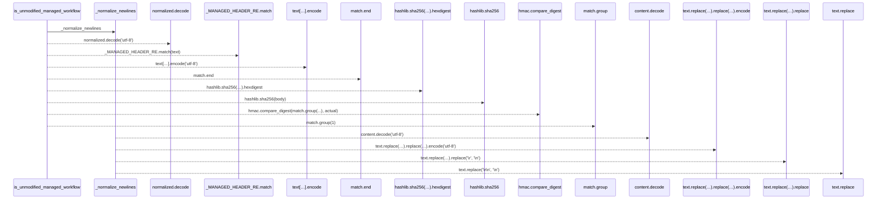
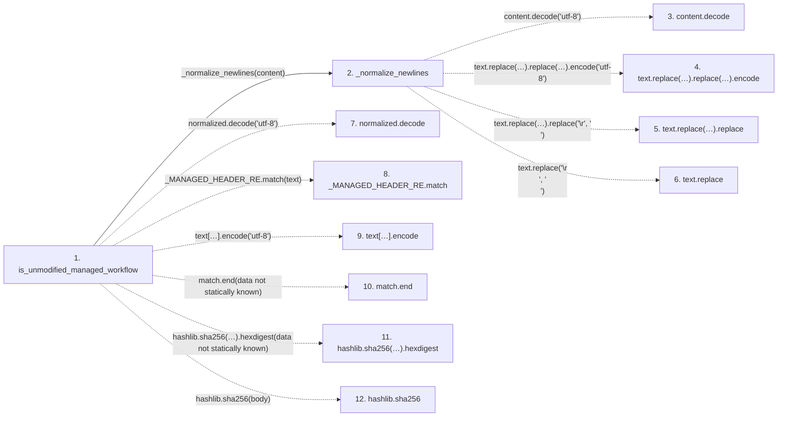

# is_unmodified_managed_workflow

**Entry point:** `is_unmodified_managed_workflow` (`api`)
**Source:** [ci_installer](../modules/ci_installer.md)
**Modules touched:** [ci_installer](../modules/ci_installer.md)

## Call sequence

> Static overview in presentation order, not runtime execution order. Arrows retain captured callers; representative internal continuations and boundary examples precede repeated helper detail.

<!-- Auto-generated from static call edges. Dashed arrows are external or unresolved calls. Reviewed runtime conditions and side effects belong in Behavior. -->

```mermaid
sequenceDiagram
    participant p0 as is_unmodified_managed_workflow
    participant p1 as _normalize_newlines
    participant p2 as normalized.decode
    participant p3 as _MANAGED_HEADER_RE.match
    participant p4 as text[…].encode
    participant p5 as match.end
    participant p6 as hashlib.sha256(…).hexdigest
    participant p7 as hashlib.sha256
    participant p8 as hmac.compare_digest
    participant p9 as match.group
    participant p10 as content.decode
    participant p11 as text.replace(…).replace(…).encode
    participant p12 as text.replace(…).replace
    participant p13 as text.replace
    p0->>p1: _normalize_newlines
    p0-->>p2: normalized.decode('utf-8')
    p0-->>p3: _MANAGED_HEADER_RE.match(text)
    p0-->>p4: text[…].encode('utf-8')
    p0-->>p5: match.end
    p0-->>p6: hashlib.sha256(…).hexdigest
    p0-->>p7: hashlib.sha256(body)
    p0-->>p8: hmac.compare_digest(match.group(...), actual)
    p0-->>p9: match.group(1)
    p1-->>p10: content.decode('utf-8')
    p1-->>p11: text.replace(…).replace(…).encode('utf-8')
    p1-->>p12: text.replace(…).replace('\r', '\n')
    p1-->>p13: text.replace('\r\n', '\n')
```

> Call sequence diagram shows 13 of 13 interactions; 0 omitted to keep the visualization within the 30-interaction and generated-diagram limits, with uncertain identities omitted rather than inferred.

> Captured boundary calls: external 2 of 2 (0 omitted); unresolved 10 of 10 (0 omitted). These counts cover the captured static trace.
> Detailed flow queries retain their own coverage and limits; omitted paths may execute at runtime.

## Data flow

<!-- Auto-generated static analysis. Treat values and boundaries as best-effort hints, not runtime proof. -->

### Analysis coverage

**Effect analysis evaluated.** Flow assembly and source effect analysis are separate; empty observations do not prove an empty handler body.

Source steps: 2; effect analysis evaluated: 2, partial: 0, unavailable: 0. Counts include steps omitted from the displayed trace.

```mermaid
flowchart LR
    s1["1. is_unmodified_managed_workflow"]
    s2["2. _normalize_newlines"]
    s3["3. content.decode"]
    s4["4. text.replace(…).replace(…).encode"]
    s5["5. text.replace(…).replace"]
    s6["6. text.replace"]
    s7["7. normalized.decode"]
    s8["8. _MANAGED_HEADER_RE.match"]
    s9["9. text[…].encode"]
    s10["10. match.end"]
    s11["11. hashlib.sha256(…).hexdigest"]
    s12["12. hashlib.sha256"]
    s1 -->|"_normalize_newlines(content)"| s2
    s2 -. "content.decode('utf-8')" .-> s3
    s2 -. "text.replace(…).replace(…).encode('utf-8')" .-> s4
    s2 -. "text.replace(…).replace('\r', '\n')" .-> s5
    s2 -. "text.replace('\r\n', '\n')" .-> s6
    s1 -. "normalized.decode('utf-8')" .-> s7
    s1 -. "_MANAGED_HEADER_RE.match(text)" .-> s8
    s1 -. "text[…].encode('utf-8')" .-> s9
    s1 -. "match.end(data not statically known)" .-> s10
    s1 -. "hashlib.sha256(…).hexdigest(data not statically known)" .-> s11
    s1 -. "hashlib.sha256(body)" .-> s12
    click s1 "../modules/ci_installer.md"
    click s2 "../modules/ci_installer.md"
```

### Step data

| Step | Inputs | Reads | Writes | Returns |
|---|---|---|---|---|
| `is_unmodified_managed_workflow` | `content: bytes` | - | - | `False`, `False`, `hmac.compare_digest(...)` |
| `_normalize_newlines` | `content: bytes` | - | - | `None`, `...` |
| `content.decode` | - | - | - | - |
| `text.replace(…).replace(…).encode` | - | - | - | - |
| `text.replace(…).replace` | - | - | - | - |
| `text.replace` | - | - | - | - |
| `normalized.decode` | - | - | - | - |
| `_MANAGED_HEADER_RE.match` | - | - | - | - |
| `text[…].encode` | - | - | - | - |
| `match.end` | - | - | - | - |
| `hashlib.sha256(…).hexdigest` | - | - | - | - |
| `hashlib.sha256` | - | - | - | - |

### Call data

| From | To | Line | Call |
|---|---|---:|---|
| is_unmodified_managed_workflow | _normalize_newlines | 245 | `_normalize_newlines(content)` |
| _normalize_newlines | content.decode | 236 | `content.decode('utf-8')` |
| _normalize_newlines | text.replace(…).replace(…).encode | 239 | `text.replace('\r\n', '\n').replace('\r', '\n').encode('utf-8')` |
| _normalize_newlines | text.replace(…).replace | 239 | `text.replace('\r\n', '\n').replace('\r', '\n')` |
| _normalize_newlines | text.replace | 239 | `text.replace('\r\n', '\n')` |
| is_unmodified_managed_workflow | normalized.decode | 248 | `normalized.decode('utf-8')` |
| is_unmodified_managed_workflow | _MANAGED_HEADER_RE.match | 249 | `_MANAGED_HEADER_RE.match(text)` |
| is_unmodified_managed_workflow | text[…].encode | 252 | `text[match.end():].encode('utf-8')` |
| is_unmodified_managed_workflow | match.end | 252 | `match.end(data not statically known)` |
| is_unmodified_managed_workflow | hashlib.sha256(…).hexdigest | 253 | `hashlib.sha256(body).hexdigest(data not statically known)` |
| is_unmodified_managed_workflow | hashlib.sha256 | 253 | `hashlib.sha256(body)` |

### Boundary effects

*No boundary-effect observations were captured in this static trace.*

### Static analysis gaps

| Kind | Step | Target | Line |
|---|---|---|---:|
| unresolved_call | `_normalize_newlines` | `content.decode` | 236 |
| unresolved_call | `_normalize_newlines` | `text.replace('\r\n', '\n').replace('\r', '\n').encode` | 239 |
| unresolved_call | `_normalize_newlines` | `text.replace('\r\n', '\n').replace` | 239 |
| unresolved_call | `_normalize_newlines` | `text.replace` | 239 |
| unresolved_call | `is_unmodified_managed_workflow` | `normalized.decode` | 248 |
| unresolved_call | `is_unmodified_managed_workflow` | `_MANAGED_HEADER_RE.match` | 249 |
| unresolved_call | `is_unmodified_managed_workflow` | `text[match.end():].encode` | 252 |
| unresolved_call | `is_unmodified_managed_workflow` | `match.end` | 252 |
| unresolved_call | `is_unmodified_managed_workflow` | `hashlib.sha256(body).hexdigest` | 253 |
| external_call | `is_unmodified_managed_workflow` | `hashlib.sha256` | 253 |
| step_limit | `is_unmodified_managed_workflow` | `first 12 steps` | 0 |

## Behavior

This flow starts at `is_unmodified_managed_workflow` and is classified as `api`. The generated call and data-flow sections are bounded static projections; runtime conditions and side effects require source-level confirmation.
