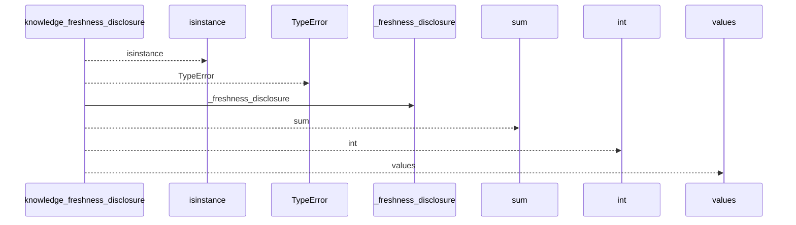
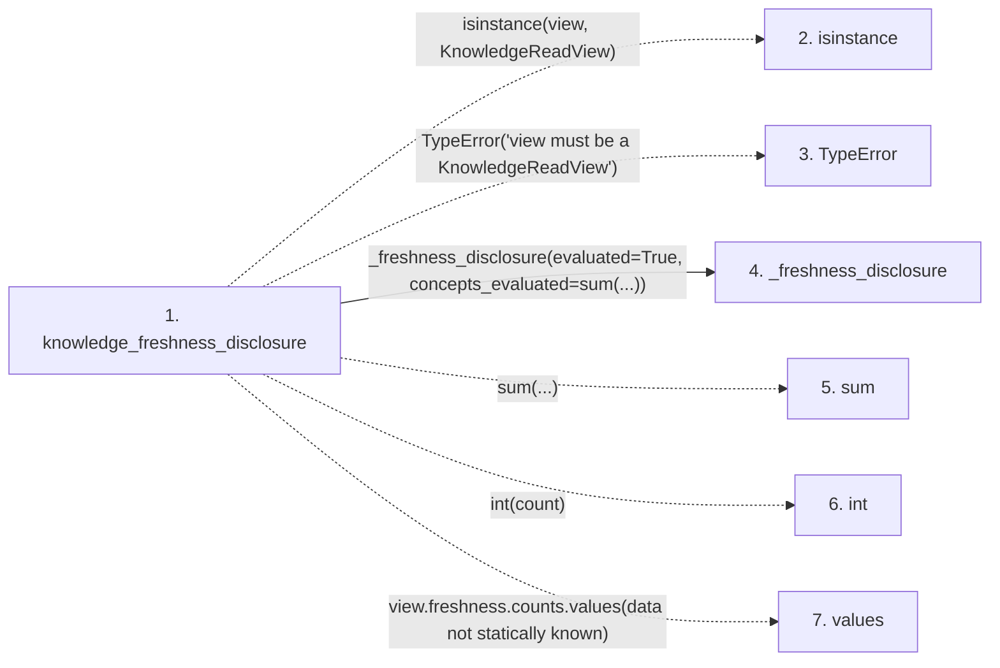

# knowledge_freshness_disclosure

**Entry point:** `knowledge_freshness_disclosure` (`api`)
**Source:** [knowledge_observability](../modules/knowledge_observability.md)
**Modules touched:** [knowledge_observability](../modules/knowledge_observability.md)

## Call sequence

<!-- Auto-generated from static call edges. Dashed arrows are external or unresolved calls. Reviewed runtime conditions and side effects belong in Behavior. -->

## Data flow

<!-- Auto-generated static analysis. Treat values and boundaries as best-effort hints, not runtime proof. -->

### Step data

| Step | Inputs | Reads | Writes | Returns |
|---|---|---|---|---|
| `knowledge_freshness_disclosure` | `view: KnowledgeReadView` | `KnowledgeReadView`, `UNEVALUATED_FRESHNESS_DISCLOSURE` | - | `UNEVALUATED_FRESHNESS_DISCLOSURE`, `_freshness_disclosure(...)` |
| `isinstance` | - | - | - | - |
| `TypeError` | - | - | - | - |
| `_freshness_disclosure` | `evaluated: bool`, `concepts_evaluated: int` | `UNEVALUATED_FRESHNESS_DISCLOSURE` | - | `UNEVALUATED_FRESHNESS_DISCLOSURE`, `...` |
| `sum` | - | - | - | - |
| `int` | - | - | - | - |
| `values` | - | - | - | - |

### Call data

| From | To | Line | Call |
|---|---|---:|---|
| knowledge_freshness_disclosure | isinstance | 448 | `isinstance(view, KnowledgeReadView)` |
| knowledge_freshness_disclosure | TypeError | 449 | `TypeError('view must be a KnowledgeReadView')` |
| knowledge_freshness_disclosure | _freshness_disclosure | 453 | `_freshness_disclosure(evaluated=True, concepts_evaluated=sum(...))` |
| knowledge_freshness_disclosure | sum | 455 | `sum(...)` |
| knowledge_freshness_disclosure | int | 455 | `int(count)` |
| knowledge_freshness_disclosure | values | 455 | `view.freshness.counts.values(data not statically known)` |

### Boundary effects

*No boundary effects detected.*

### Static analysis gaps

| Kind | Step | Target | Line |
|---|---|---|---:|
| unresolved_call | `knowledge_freshness_disclosure` | `isinstance` | 448 |
| unresolved_call | `knowledge_freshness_disclosure` | `TypeError` | 449 |
| unresolved_call | `knowledge_freshness_disclosure` | `sum` | 455 |
| unresolved_call | `knowledge_freshness_disclosure` | `view.freshness.counts.values` | 455 |

## Behavior

This flow starts at `knowledge_freshness_disclosure` and is classified as `api`. The generated call and data-flow sections are bounded static projections; runtime conditions and side effects require source-level confirmation.
