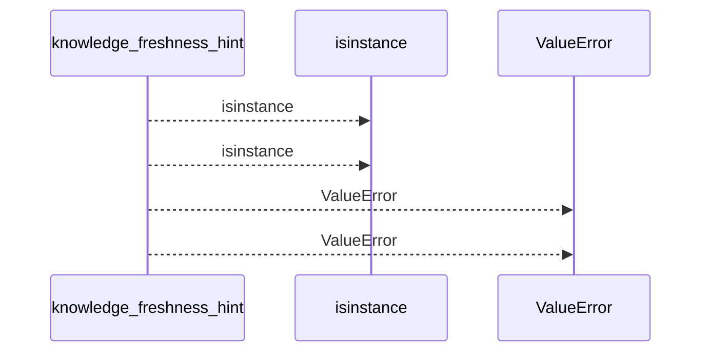
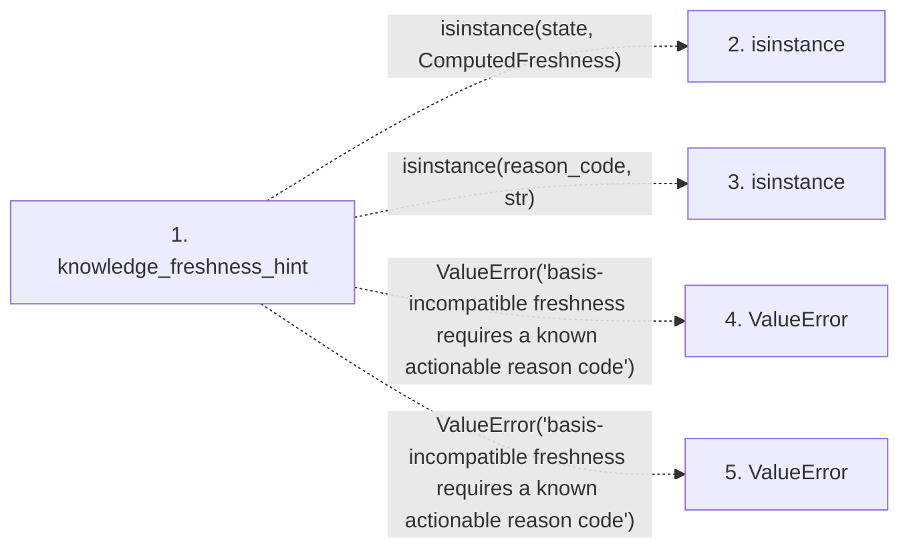

# knowledge_freshness_hint

**Entry point:** `knowledge_freshness_hint` (`api`)
**Source:** [knowledge_observability](../modules/knowledge_observability.md)
**Modules touched:** [knowledge_observability](../modules/knowledge_observability.md)

## Call sequence

<!-- Auto-generated from static call edges. Dashed arrows are external or unresolved calls. Reviewed runtime conditions and side effects belong in Behavior. -->

## Data flow

<!-- Auto-generated static analysis. Treat values and boundaries as best-effort hints, not runtime proof. -->

### Step data

| Step | Inputs | Reads | Writes | Returns |
|---|---|---|---|---|
| `knowledge_freshness_hint` | `state: ComputedFreshness \| str \| None`, `reason_code: object` | `ComputedFreshness`, `ComputedFreshness`, `BASIS_INCOMPATIBLE_HINTS` | - | `None`, `BASIS_INCOMPATIBLE_HINTS[...]` |
| `isinstance` | - | - | - | - |
| `isinstance` | - | - | - | - |
| `ValueError` | - | - | - | - |
| `ValueError` | - | - | - | - |

### Call data

| From | To | Line | Call |
|---|---|---:|---|
| knowledge_freshness_hint | isinstance | 470 | `isinstance(state, ComputedFreshness)` |
| knowledge_freshness_hint | isinstance | 473 | `isinstance(reason_code, str)` |
| knowledge_freshness_hint | ValueError | 474 | `ValueError('basis-incompatible freshness requires a known actionable reason code')` |
| knowledge_freshness_hint | ValueError | 480 | `ValueError('basis-incompatible freshness requires a known actionable reason code')` |

### Boundary effects

*No boundary effects detected.*

### Static analysis gaps

| Kind | Step | Target | Line |
|---|---|---|---:|
| unresolved_call | `knowledge_freshness_hint` | `isinstance` | 470 |
| unresolved_call | `knowledge_freshness_hint` | `isinstance` | 473 |
| unresolved_call | `knowledge_freshness_hint` | `ValueError` | 474 |
| unresolved_call | `knowledge_freshness_hint` | `ValueError` | 480 |

## Behavior

This flow starts at `knowledge_freshness_hint` and is classified as `api`. The generated call and data-flow sections are bounded static projections; runtime conditions and side effects require source-level confirmation.
