# knowledge_index_to_payload

**Entry point:** `knowledge_index_to_payload` (`api`)
**Source:** [knowledge_index](../modules/knowledge_index.md)
**Modules touched:** [concept_identity](../modules/concept_identity.md), [knowledge_envelope](../modules/knowledge_envelope.md), [knowledge_evidence](../modules/knowledge_evidence.md), and 12 more

**Complete modules touched:**

- [concept_identity](../modules/concept_identity.md)
- [knowledge_envelope](../modules/knowledge_envelope.md)
- [knowledge_evidence](../modules/knowledge_evidence.md)
- [knowledge_governance](../modules/knowledge_governance.md)
- [knowledge_graph](../modules/knowledge_graph.md)
- [knowledge_index](../modules/knowledge_index.md)
- [knowledge_links](../modules/knowledge_links.md)
- [knowledge_model](../modules/knowledge_model.md)
- [knowledge_reuse](../modules/knowledge_reuse.md)
- [markdown_sections](../modules/markdown_sections.md)
- [progress](../modules/progress.md)
- [section_ownership](../modules/section_ownership.md)
- [validation](../modules/validation.md)
- [wiki_media](../modules/wiki_media.md)
- [wiki_surface](../modules/wiki_surface.md)

## Call sequence

```mermaid
sequenceDiagram
    participant p0 as knowledge_index_to_payload
    participant p1 as _model_to_payload
    participant p2 as _knowledge_index_to_payload_unchecked
    participant p3 as _bundle_to_payload
    participant p4 as _emit_extensions
    participant p5 as isinstance (src/llm_wiki_cli/services…model.py:_emit_extensions)
    participant p6 as _parse_extensions
    participant p7 as _object (src/llm_wiki_cli/services/knowledge_model.py)
    participant p8 as sorted (src/llm_wiki_cli/services…odel.py:_parse_extensions)
    participant p9 as _QUALIFIED_NAME_RE.fullmatch (src/llm_wiki_cli/services…odel.py:_parse_extensions)
    participant p10 as KnowledgeModelError
    participant p11 as _child
    participant p12 as _normalize_json_value
    participant p13 as _wire_enum
    participant p14 as isinstance (src/llm_wiki_cli/services…ledge_model.py:_wire_enum)
    participant p15 as _component_to_payload
    participant p16 as list (src/llm_wiki_cli/services….py:_component_to_payload)
    participant p17 as sorted (src/llm_wiki_cli/services…ndex_to_payload_unchecked)
    participant p18 as _concept_to_payload
    p0->>p1: _model_to_payload
    p1->>p2: _knowledge_index_to_payload_unchecked
    p2->>p3: _bundle_to_payload
    p3->>p4: _emit_extensions
    p4-->>p5: isinstance (src/llm_wiki_cli/services…model.py:_emit_extensions)
    p4->>p6: _parse_extensions
    p6->>p7: _object (src/llm_wiki_cli/services/knowledge_model.py)
    p6-->>p8: sorted (src/llm_wiki_cli/services…odel.py:_parse_extensions)
    p6-->>p9: _QUALIFIED_NAME_RE.fullmatch (src/llm_wiki_cli/services…odel.py:_parse_extensions)
    p6->>p10: KnowledgeModelError
    p6->>p11: _child
    p6->>p12: _normalize_json_value
    p6->>p11: _child
    p6->>p10: KnowledgeModelError
    p6->>p11: _child
    p3->>p13: _wire_enum
    p13-->>p14: isinstance (src/llm_wiki_cli/services…ledge_model.py:_wire_enum)
    p3->>p4: _emit_extensions
    p3->>p4: _emit_extensions
    p3->>p15: _component_to_payload
    p15-->>p16: list (src/llm_wiki_cli/services….py:_component_to_payload)
    p15->>p4: _emit_extensions
    p3->>p15: _component_to_payload
    p3->>p15: _component_to_payload
    p3->>p4: _emit_extensions
    p2-->>p17: sorted (src/llm_wiki_cli/services…ndex_to_payload_unchecked)
    p2-->>p17: sorted (src/llm_wiki_cli/services…ndex_to_payload_unchecked)
    p2-->>p17: sorted (src/llm_wiki_cli/services…ndex_to_payload_unchecked)
    p2->>p18: _concept_to_payload
    p18->>p13: _wire_enum
```

<!-- Auto-generated from static call edges. Dashed arrows are external or unresolved calls. Reviewed runtime conditions and side effects belong in Behavior. -->

> Call sequence diagram shows 30 of 1487 interactions; 1457 omitted to keep the visualization within the 30-interaction and generated-diagram limits.

> Trace truncated at the depth limit; deeper calls are omitted.

## Data flow

```mermaid
flowchart LR
    s1["1. knowledge_index_to_payload"]
    s2["2. _model_to_payload"]
    s3["3. _knowledge_index_to_payload_unchecked"]
    s4["4. _bundle_to_payload"]
    s5["5. _emit_extensions"]
    s6["6. isinstance (src/llm_wiki_cli/services…model.py:_emit_extensions)"]
    s7["7. _parse_extensions"]
    s8["8. _object (src/llm_wiki_cli/services/knowledge_model.py)"]
    s9["9. sorted (src/llm_wiki_cli/services…odel.py:_parse_extensions)"]
    s10["10. _QUALIFIED_NAME_RE.fullmatch (src/llm_wiki_cli/services…odel.py:_parse_extensions)"]
    s11["11. KnowledgeModelError"]
    s12["12. _child"]
    s1 -->|"_model_to_payload(validate_knowledge_index(...))"| s2
    s2 -->|"_knowledge_index_to_payload_unchecked(model)"| s3
    s3 -->|"_bundle_to_payload(model.bundle)"| s4
    s4 -->|"_emit_extensions({...}, bundle.repository.extensions, 'bundle.repository.extensions')"| s5
    s5 -. "isinstance (src/llm_wiki_cli/services…model.py:_emit_extensions)(extensions, FrozenDict)" .-> s6
    s5 -->|"_parse_extensions(extensions, path)"| s7
    s7 -->|"_object (src/llm_wiki_cli/services/knowledge_model.py)(value, path)"| s8
    s7 -. "sorted (src/llm_wiki_cli/services…odel.py:_parse_extensions)(data)" .-> s9
    s7 -. "_QUALIFIED_NAME_RE.fullmatch (src/llm_wiki_cli/services…odel.py:_parse_extensions)(key)" .-> s10
    s7 -->|"KnowledgeModelError(_child(...), 'extension key must use namespace/name syntax')"| s11
    s7 -->|"_child(path, key)"| s12
    click s1 "../modules/knowledge_index.md"
    click s2 "../modules/knowledge_index.md"
    click s3 "../modules/knowledge_model.md"
    click s4 "../modules/knowledge_model.md"
    click s5 "../modules/knowledge_model.md"
    click s7 "../modules/knowledge_model.md"
    click s8 "../modules/knowledge_model.md"
    click s11 "../modules/knowledge_model.md"
    click s12 "../modules/knowledge_model.md"
```

<!-- Auto-generated static analysis. Treat values and boundaries as best-effort hints, not runtime proof. -->

### Step data

| Step | Inputs | Reads | Writes | Returns |
|---|---|---|---|---|
| `knowledge_index_to_payload` | `value: KnowledgeIndex \| object` | - | - | `_model_to_payload(...)` |
| `_model_to_payload` | `model: KnowledgeIndex` | `KnowledgeModelError` | - | `_knowledge_index_to_payload_unchecked(...)` |
| `_knowledge_index_to_payload_unchecked` | `model: KnowledgeIndex` | `_canonical_relationship_key` | `producer[...]`, `producer[...]` | `_emit_extensions(...)` |
| `_bundle_to_payload` | `bundle: BundleRecord` | - | - | `_emit_extensions(...)` |
| `_emit_extensions` | `payload: dict[str, Any]`, `extensions: Extensions`, `path: str` | - | `payload[...]` | `payload` |
| `isinstance (src/llm_wiki_cli/services…model.py:_emit_extensions)` | - | - | - | - |
| `_parse_extensions` | `value: object`, `path: str` | - | `result[...]` | `result` |
| `_object (src/llm_wiki_cli/services/knowledge_model.py)` | `value: object`, `path: str` | - | - | `dict(...)` |
| `sorted (src/llm_wiki_cli/services…odel.py:_parse_extensions)` | - | - | - | - |
| `_QUALIFIED_NAME_RE.fullmatch (src/llm_wiki_cli/services…odel.py:_parse_extensions)` | - | - | - | - |
| `KnowledgeModelError` | - | - | - | - |
| `_child` | `path: str`, `name: str` | - | - | `...` |

### Call data

| From | To | Line | Call |
|---|---|---:|---|
| knowledge_index_to_payload | _model_to_payload | 277 | `_model_to_payload(validate_knowledge_index(...))` |
| _model_to_payload | _knowledge_index_to_payload_unchecked | 283 | `_knowledge_index_to_payload_unchecked(model)` |
| _knowledge_index_to_payload_unchecked | _bundle_to_payload | 2197 | `_bundle_to_payload(model.bundle)` |
| _bundle_to_payload | _emit_extensions | 2016 | `_emit_extensions({...}, bundle.repository.extensions, 'bundle.repository.extensions')` |
| _emit_extensions | isinstance (src/llm_wiki_cli/services…model.py:_emit_extensions) | 1976 | `isinstance(extensions, FrozenDict)` |
| _emit_extensions | _parse_extensions | 1977 | `_parse_extensions(extensions, path)` |
| _parse_extensions | _object (src/llm_wiki_cli/services/knowledge_model.py) | 1600 | `_object(value, path)` |
| _parse_extensions | sorted (src/llm_wiki_cli/services…odel.py:_parse_extensions) | 1602 | `sorted(data)` |
| _parse_extensions | _QUALIFIED_NAME_RE.fullmatch (src/llm_wiki_cli/services…odel.py:_parse_extensions) | 1603 | `_QUALIFIED_NAME_RE.fullmatch(key)` |
| _parse_extensions | KnowledgeModelError | 1604 | `KnowledgeModelError(_child(...), 'extension key must use namespace/name syntax')` |
| _parse_extensions | _child | 1605 | `_child(path, key)` |

### Boundary effects

*No boundary effects detected.*

### Static analysis gaps

| Kind | Step | Target | Line |
|---|---|---|---:|
| external_call | `_emit_extensions` | `isinstance` | 1976 |
| external_call | `_parse_extensions` | `sorted` | 1602 |
| unresolved_call | `_parse_extensions` | `_QUALIFIED_NAME_RE.fullmatch` | 1603 |
| step_limit | `knowledge_index_to_payload` | `first 12 steps` | 0 |
| truncated_flow | `knowledge_index_to_payload` | `depth limit` | 0 |

## Behavior

This flow starts at `knowledge_index_to_payload` and is classified as `api`. The generated call and data-flow sections are bounded static projections; runtime conditions and side effects require source-level confirmation.
