# knowledge_index_to_payload

**Entry point:** `knowledge_index_to_payload` (`api`)
**Source:** [knowledge_model](../modules/knowledge_model.md)
**Modules touched:** [concept_identity](../modules/concept_identity.md), [knowledge_evidence](../modules/knowledge_evidence.md), [knowledge_governance](../modules/knowledge_governance.md), and 8 more

**Complete modules touched:**

- [concept_identity](../modules/concept_identity.md)
- [knowledge_evidence](../modules/knowledge_evidence.md)
- [knowledge_governance](../modules/knowledge_governance.md)
- [knowledge_graph](../modules/knowledge_graph.md)
- [knowledge_model](../modules/knowledge_model.md)
- [knowledge_reuse](../modules/knowledge_reuse.md)
- [markdown_sections](../modules/markdown_sections.md)
- [section_ownership](../modules/section_ownership.md)
- [validation](../modules/validation.md)
- [wiki_media](../modules/wiki_media.md)
- [wiki_surface](../modules/wiki_surface.md)

## Call sequence

```mermaid
sequenceDiagram
    participant p0 as knowledge_index_to_payload
    participant p1 as isinstance (src/llm_wiki_cli/services…nowledge_index_to_payload)
    participant p2 as TypeError (src/llm_wiki_cli/services…nowledge_index_to_payload)
    participant p3 as _emit_extensions
    participant p4 as isinstance (src/llm_wiki_cli/services…model.py:_emit_extensions)
    participant p5 as _parse_extensions
    participant p6 as _object (src/llm_wiki_cli/services/knowledge_model.py)
    participant p7 as dict (src/llm_wiki_cli/services…nowledge_model.py:_object)
    participant p8 as require_mapping
    participant p9 as isinstance (src/llm_wiki_cli/services…dation.py:require_mapping)
    participant p10 as key.encode
    participant p11 as KnowledgeModelError
    participant p12 as sorted (src/llm_wiki_cli/services…odel.py:_parse_extensions)
    participant p13 as _QUALIFIED_NAME_RE.fullmatch (src/llm_wiki_cli/services…odel.py:_parse_extensions)
    participant p14 as _child
    participant p15 as _normalize_json_value
    participant p16 as _normalize_json_value_inner
    participant p17 as isinstance (src/llm_wiki_cli/services…ormalize_json_value_inner)
    participant p18 as _string
    participant p19 as require_string
    participant p20 as math.isfinite
    p0-->>p1: isinstance (src/llm_wiki_cli/services…nowledge_index_to_payload)
    p0-->>p2: TypeError (src/llm_wiki_cli/services…nowledge_index_to_payload)
    p0->>p3: _emit_extensions
    p3-->>p4: isinstance (src/llm_wiki_cli/services…model.py:_emit_extensions)
    p3->>p5: _parse_extensions
    p5->>p6: _object (src/llm_wiki_cli/services/knowledge_model.py)
    p6-->>p7: dict (src/llm_wiki_cli/services…nowledge_model.py:_object)
    p6->>p8: require_mapping
    p8-->>p9: isinstance (src/llm_wiki_cli/services…dation.py:require_mapping)
    p8-->>p9: isinstance (src/llm_wiki_cli/services…dation.py:require_mapping)
    p8-->>p10: key.encode
    p6->>p11: KnowledgeModelError
    p6->>p11: KnowledgeModelError
    p6->>p11: KnowledgeModelError
    p5-->>p12: sorted (src/llm_wiki_cli/services…odel.py:_parse_extensions)
    p5-->>p13: _QUALIFIED_NAME_RE.fullmatch (src/llm_wiki_cli/services…odel.py:_parse_extensions)
    p5->>p11: KnowledgeModelError
    p5->>p14: _child
    p5->>p15: _normalize_json_value
    p15->>p16: _normalize_json_value_inner
    p16-->>p17: isinstance (src/llm_wiki_cli/services…ormalize_json_value_inner)
    p16->>p18: _string
    p18->>p19: require_string
    p18->>p11: KnowledgeModelError
    p18->>p11: KnowledgeModelError
    p16-->>p17: isinstance (src/llm_wiki_cli/services…ormalize_json_value_inner)
    p16-->>p17: isinstance (src/llm_wiki_cli/services…ormalize_json_value_inner)
    p16-->>p20: math.isfinite
    p16->>p11: KnowledgeModelError
    p16-->>p17: isinstance (src/llm_wiki_cli/services…ormalize_json_value_inner)
```

<!-- Auto-generated from static call edges. Dashed arrows are external or unresolved calls. Reviewed runtime conditions and side effects belong in Behavior. -->

> Call sequence diagram shows 30 of 1538 interactions; 1508 omitted to keep the visualization within the 30-interaction and generated-diagram limits.

> Trace truncated at the depth limit; deeper calls are omitted.

## Data flow

```mermaid
flowchart LR
    s1["1. knowledge_index_to_payload"]
    s2["2. isinstance (src/llm_wiki_cli/services…nowledge_index_to_payload)"]
    s3["3. TypeError (src/llm_wiki_cli/services…nowledge_index_to_payload)"]
    s4["4. _emit_extensions"]
    s5["5. isinstance (src/llm_wiki_cli/services…model.py:_emit_extensions)"]
    s6["6. _parse_extensions"]
    s7["7. _object (src/llm_wiki_cli/services/knowledge_model.py)"]
    s8["8. dict (src/llm_wiki_cli/services…nowledge_model.py:_object)"]
    s9["9. require_mapping"]
    s10["10. isinstance (src/llm_wiki_cli/services…dation.py:require_mapping)"]
    s11["11. isinstance (src/llm_wiki_cli/services…dation.py:require_mapping)"]
    s12["12. key.encode"]
    s1 -. "isinstance (src/llm_wiki_cli/services…nowledge_index_to_payload)(model, KnowledgeIndex)" .-> s2
    s1 -. "TypeError (src/llm_wiki_cli/services…nowledge_index_to_payload)('model must be a KnowledgeIndex')" .-> s3
    s1 -->|"_emit_extensions({...}, model.extensions, 'extensions')"| s4
    s4 -. "isinstance (src/llm_wiki_cli/services…model.py:_emit_extensions)(extensions, FrozenDict)" .-> s5
    s4 -->|"_parse_extensions(extensions, path)"| s6
    s6 -->|"_object (src/llm_wiki_cli/services/knowledge_model.py)(value, path)"| s7
    s7 -. "dict (src/llm_wiki_cli/services…nowledge_model.py:_object)(require_mapping(...))" .-> s8
    s7 -->|"require_mapping(…)"| s9
    s9 -. "isinstance (src/llm_wiki_cli/services…dation.py:require_mapping)(value, Mapping)" .-> s10
    s9 -. "isinstance (src/llm_wiki_cli/services…dation.py:require_mapping)(key, str)" .-> s11
    s9 -. "key.encode('utf-8')" .-> s12
    click s1 "../modules/knowledge_model.md"
    click s4 "../modules/knowledge_model.md"
    click s6 "../modules/knowledge_model.md"
    click s7 "../modules/knowledge_model.md"
    click s9 "../modules/validation.md"
```

<!-- Auto-generated static analysis. Treat values and boundaries as best-effort hints, not runtime proof. -->

### Step data

| Step | Inputs | Reads | Writes | Returns |
|---|---|---|---|---|
| `knowledge_index_to_payload` | `model: KnowledgeIndex` | `KnowledgeIndex`, `KnowledgeModelError` | - | `_knowledge_index_to_payload_unchecked(...)` |
| `isinstance (src/llm_wiki_cli/services…nowledge_index_to_payload)` | - | - | - | - |
| `TypeError (src/llm_wiki_cli/services…nowledge_index_to_payload)` | - | - | - | - |
| `_emit_extensions` | `payload: dict[str, Any]`, `extensions: Extensions`, `path: str` | - | `payload[...]` | `payload` |
| `isinstance (src/llm_wiki_cli/services…model.py:_emit_extensions)` | - | - | - | - |
| `_parse_extensions` | `value: object`, `path: str` | - | `result[...]` | `result` |
| `_object (src/llm_wiki_cli/services/knowledge_model.py)` | `value: object`, `path: str` | - | - | `dict(...)` |
| `dict (src/llm_wiki_cli/services…nowledge_model.py:_object)` | - | - | - | - |
| `require_mapping` | `value: object`, `error: Exception`, `require_string_keys: bool`, `key_error: Exception \| None`, `require_utf8_keys: bool`, `utf8_key_error: Exception \| None` | `Mapping` | - | `value` |
| `isinstance (src/llm_wiki_cli/services…dation.py:require_mapping)` | - | - | - | - |
| `isinstance (src/llm_wiki_cli/services…dation.py:require_mapping)` | - | - | - | - |
| `key.encode` | - | - | - | - |

### Call data

| From | To | Line | Call |
|---|---|---:|---|
| knowledge_index_to_payload | isinstance (src/llm_wiki_cli/services…nowledge_index_to_payload) | 651 | `isinstance(model, KnowledgeIndex)` |
| knowledge_index_to_payload | TypeError (src/llm_wiki_cli/services…nowledge_index_to_payload) | 652 | `TypeError('model must be a KnowledgeIndex')` |
| knowledge_index_to_payload | _emit_extensions | 655 | `_emit_extensions({...}, model.extensions, 'extensions')` |
| _emit_extensions | isinstance (src/llm_wiki_cli/services…model.py:_emit_extensions) | 1976 | `isinstance(extensions, FrozenDict)` |
| _emit_extensions | _parse_extensions | 1977 | `_parse_extensions(extensions, path)` |
| _parse_extensions | _object (src/llm_wiki_cli/services/knowledge_model.py) | 1600 | `_object(value, path)` |
| _object (src/llm_wiki_cli/services/knowledge_model.py) | dict (src/llm_wiki_cli/services…nowledge_model.py:_object) | 1667 | `dict(require_mapping(...))` |
| _object (src/llm_wiki_cli/services/knowledge_model.py) | require_mapping | 1668 | `require_mapping(value, error=KnowledgeModelError(...), require_string_keys=True, key_error=KnowledgeModelError(...), require_utf8_keys=True, utf8_key_error=KnowledgeModelError(...))` |
| require_mapping | isinstance (src/llm_wiki_cli/services…dation.py:require_mapping) | 727 | `isinstance(value, Mapping)` |
| require_mapping | isinstance (src/llm_wiki_cli/services…dation.py:require_mapping) | 731 | `isinstance(key, str)` |
| require_mapping | key.encode | 736 | `key.encode('utf-8')` |

### Boundary effects

*No boundary effects detected.*

### Static analysis gaps

| Kind | Step | Target | Line |
|---|---|---|---:|
| external_call | `knowledge_index_to_payload` | `isinstance` | 651 |
| external_call | `knowledge_index_to_payload` | `TypeError` | 652 |
| external_call | `_emit_extensions` | `isinstance` | 1976 |
| external_call | `require_mapping` | `isinstance` | 727 |
| external_call | `require_mapping` | `isinstance` | 731 |
| unresolved_call | `require_mapping` | `key.encode` | 736 |
| step_limit | `knowledge_index_to_payload` | `first 12 steps` | 0 |
| truncated_flow | `knowledge_index_to_payload` | `depth limit` | 0 |

## Behavior

This flow starts at `knowledge_index_to_payload` and is classified as `api`. The generated call and data-flow sections are bounded static projections; runtime conditions and side effects require source-level confirmation.
