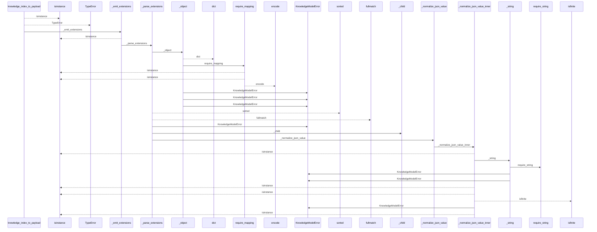
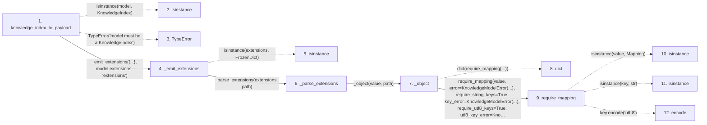

# knowledge_index_to_payload

**Entry point:** `knowledge_index_to_payload` (`api`)
**Source:** [knowledge_model](../modules/knowledge_model.md)
**Modules touched:** [concept_identity](../modules/concept_identity.md), [knowledge_evidence](../modules/knowledge_evidence.md), [knowledge_governance](../modules/knowledge_governance.md), and 8 more

**Complete modules touched:**

- [concept_identity](../modules/concept_identity.md)
- [knowledge_evidence](../modules/knowledge_evidence.md)
- [knowledge_governance](../modules/knowledge_governance.md)
- [knowledge_graph](../modules/knowledge_graph.md)
- [knowledge_model](../modules/knowledge_model.md)
- [knowledge_reuse](../modules/knowledge_reuse.md)
- [markdown_sections](../modules/markdown_sections.md)
- [section_ownership](../modules/section_ownership.md)
- [validation](../modules/validation.md)
- [wiki_media](../modules/wiki_media.md)
- [wiki_surface](../modules/wiki_surface.md)

## Call sequence

<!-- Auto-generated from static call edges. Dashed arrows are external or unresolved calls. Reviewed runtime conditions and side effects belong in Behavior. -->

> Call sequence diagram shows 30 of 1523 interactions; 1493 omitted to keep the visualization within the 30-interaction and generated-diagram limits.

> Trace truncated at the depth limit; deeper calls are omitted.

## Data flow

<!-- Auto-generated static analysis. Treat values and boundaries as best-effort hints, not runtime proof. -->

### Step data

| Step | Inputs | Reads | Writes | Returns |
|---|---|---|---|---|
| `knowledge_index_to_payload` | `model: KnowledgeIndex` | `KnowledgeIndex`, `KnowledgeModelError` | - | `_knowledge_index_to_payload_unchecked(...)` |
| `isinstance` | - | - | - | - |
| `TypeError` | - | - | - | - |
| `_emit_extensions` | `payload: dict[str, Any]`, `extensions: Extensions`, `path: str` | - | `payload[...]` | `payload` |
| `isinstance` | - | - | - | - |
| `_parse_extensions` | `value: object`, `path: str` | - | `result[...]` | `result` |
| `_object` | `value: object`, `path: str` | - | - | `dict(...)` |
| `dict` | - | - | - | - |
| `require_mapping` | `value: object`, `error: Exception`, `require_string_keys: bool`, `key_error: Exception \| None`, `require_utf8_keys: bool`, `utf8_key_error: Exception \| None` | `Mapping` | - | `value` |
| `isinstance` | - | - | - | - |
| `isinstance` | - | - | - | - |
| `encode` | - | - | - | - |

### Call data

| From | To | Line | Call |
|---|---|---:|---|
| knowledge_index_to_payload | isinstance | 651 | `isinstance(model, KnowledgeIndex)` |
| knowledge_index_to_payload | TypeError | 652 | `TypeError('model must be a KnowledgeIndex')` |
| knowledge_index_to_payload | _emit_extensions | 655 | `_emit_extensions({...}, model.extensions, 'extensions')` |
| _emit_extensions | isinstance | 1976 | `isinstance(extensions, FrozenDict)` |
| _emit_extensions | _parse_extensions | 1977 | `_parse_extensions(extensions, path)` |
| _parse_extensions | _object | 1600 | `_object(value, path)` |
| _object | dict | 1667 | `dict(require_mapping(...))` |
| _object | require_mapping | 1668 | `require_mapping(value, error=KnowledgeModelError(...), require_string_keys=True, key_error=KnowledgeModelError(...), require_utf8_keys=True, utf8_key_error=KnowledgeModelError(...))` |
| require_mapping | isinstance | 727 | `isinstance(value, Mapping)` |
| require_mapping | isinstance | 731 | `isinstance(key, str)` |
| require_mapping | encode | 736 | `key.encode('utf-8')` |

### Boundary effects

*No boundary effects detected.*

### Static analysis gaps

| Kind | Step | Target | Line |
|---|---|---|---:|
| unresolved_call | `knowledge_index_to_payload` | `isinstance` | 651 |
| unresolved_call | `knowledge_index_to_payload` | `TypeError` | 652 |
| unresolved_call | `_emit_extensions` | `isinstance` | 1976 |
| unresolved_call | `require_mapping` | `isinstance` | 727 |
| unresolved_call | `require_mapping` | `isinstance` | 731 |
| unresolved_call | `require_mapping` | `key.encode` | 736 |
| step_limit | `knowledge_index_to_payload` | `first 12 steps` | 0 |
| truncated_flow | `knowledge_index_to_payload` | `depth limit` | 0 |

## Behavior

This flow starts at `knowledge_index_to_payload` and is classified as `api`. The generated call and data-flow sections are bounded static projections; runtime conditions and side effects require source-level confirmation.
