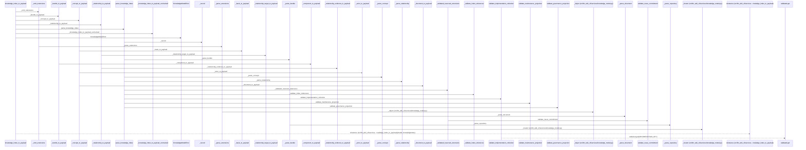
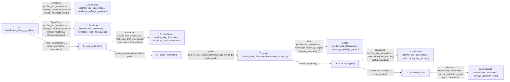

# knowledge_index_to_payload

**Entry point:** `knowledge_index_to_payload` (`api`)
**Source:** [knowledge_model](../modules/knowledge_model.md)
**Modules touched:** [analysis_compatibility](../modules/analysis_compatibility.md), [concept_identity](../modules/concept_identity.md), [implementation_evidence](../modules/implementation_evidence.md), and 17 more

**Complete modules touched:**

- [analysis_compatibility](../modules/analysis_compatibility.md)
- [concept_identity](../modules/concept_identity.md)
- [implementation_evidence](../modules/implementation_evidence.md)
- [knowledge_artifacts](../modules/knowledge_artifacts.md)
- [knowledge_evidence](../modules/knowledge_evidence.md)
- [knowledge_governance](../modules/knowledge_governance.md)
- [knowledge_graph](../modules/knowledge_graph.md)
- [knowledge_model](../modules/knowledge_model.md)
- [knowledge_reuse](../modules/knowledge_reuse.md)
- [knowledge_storage](../modules/knowledge_storage.md)
- [maintenance_evidence](../modules/maintenance_evidence.md)
- [maintenance_projection](../modules/maintenance_projection.md)
- [maintenance_shapes](../modules/maintenance_shapes.md)
- [maintenance_state](../modules/maintenance_state.md)
- [markdown_sections](../modules/markdown_sections.md)
- [python_implementation](../modules/python_implementation.md)
- [section_ownership](../modules/section_ownership.md)
- [validation](../modules/validation.md)
- [wiki_media](../modules/wiki_media.md)
- [wiki_surface](../modules/wiki_surface.md)

## Call sequence

> Static overview in presentation order, not runtime execution order. Arrows retain captured callers; representative internal continuations and boundary examples precede repeated helper detail.

<!-- Auto-generated from static call edges. Dashed arrows are external or unresolved calls. Reviewed runtime conditions and side effects belong in Behavior. -->

```mermaid
sequenceDiagram
    participant p0 as knowledge_index_to_payload
    participant p1 as _emit_extensions
    participant p2 as _bundle_to_payload
    participant p3 as _concept_to_payload
    participant p4 as _relationship_to_payload
    participant p5 as parse_knowledge_index
    participant p6 as _knowledge_index_to_payload_unchecked
    participant p7 as KnowledgeModelError
    participant p8 as _record
    participant p9 as _parse_extensions
    participant p10 as _basis_to_payload
    participant p11 as _relationship_target_to_payload
    participant p12 as _parse_bundle
    participant p13 as _component_to_payload
    participant p14 as _relationship_evidence_to_payload
    participant p15 as _actor_to_payload
    participant p16 as _parse_concept
    participant p17 as _parse_relationship
    participant p18 as _document_to_payload
    participant p19 as _validated_reserved_extensions
    participant p20 as _validate_index_references
    participant p21 as validate_implementation_collection
    participant p22 as validate_maintenance_projection
    participant p23 as validate_governance_projection
    participant p24 as _object (src/llm_wiki_cli/services/knowledge_model.py)
    participant p25 as _parse_document
    participant p26 as validate_reuse_commitment
    participant p27 as _parse_repository
    participant p28 as _locator (src/llm_wiki_cli/services/knowledge_model.py)
    participant p29 as isinstance (src/llm_wiki_cli/services…nowledge_index_to_payload)
    participant p30 as validated.get
    p0->>p1: _emit_extensions
    p0->>p2: _bundle_to_payload
    p0->>p3: _concept_to_payload
    p0->>p4: _relationship_to_payload
    p0->>p5: parse_knowledge_index
    p0->>p6: _knowledge_index_to_payload_unchecked
    p0->>p7: KnowledgeModelError
    p5->>p8: _record
    p1->>p9: _parse_extensions
    p3->>p10: _basis_to_payload
    p4->>p11: _relationship_target_to_payload
    p5->>p12: _parse_bundle
    p2->>p13: _component_to_payload
    p4->>p14: _relationship_evidence_to_payload
    p3->>p15: _actor_to_payload
    p5->>p16: _parse_concept
    p5->>p17: _parse_relationship
    p3->>p18: _document_to_payload
    p5->>p19: _validated_reserved_extensions
    p5->>p20: _validate_index_references
    p5->>p21: validate_implementation_collection
    p5->>p22: validate_maintenance_projection
    p5->>p23: validate_governance_projection
    p9->>p24: _object (src/llm_wiki_cli/services/knowledge_model.py)
    p16->>p25: _parse_document
    p19->>p26: validate_reuse_commitment
    p12->>p27: _parse_repository
    p16->>p28: _locator (src/llm_wiki_cli/services/knowledge_model.py)
    p0-->>p29: isinstance (src/llm_wiki_cli/services…nowledge_index_to_payload)(model, KnowledgeIndex)
    p21-->>p30: validated.get(IMPLEMENTATION_KEY)
```

> Call sequence diagram shows 30 of 1766 interactions; 1736 omitted to keep the visualization within the 30-interaction and generated-diagram limits, with uncertain identities omitted rather than inferred.

> Captured boundary calls: external 1 of 472 (471 omitted); unresolved 1 of 303 (302 omitted). These counts cover the captured static trace.

Omitted captured detail, grouped by actual caller occurrence and target module:

| Caller | Parent step | Target module | Kind | Omitted interactions |
| --- | --- | --- | --- | --- |
| `src/llm_wiki_cli/services/knowledge_model.py:knowledge_index_to_payload` | 1 | - | external | 1 |
| `src/llm_wiki_cli/services/knowledge_model.py:_emit_extensions` | 4 | - | external | 1 |
| `src/llm_wiki_cli/services/knowledge_model.py:_object` | 7 | - | external | 1 |
| `src/llm_wiki_cli/services/knowledge_model.py:_object` | 7 | [src/llm_wiki_cli/services/validation.py](../modules/validation.md) | internal | 1 |
| `src/llm_wiki_cli/services/validation.py:require_mapping` | 9 | - | external | 2 |
| `src/llm_wiki_cli/services/validation.py:require_mapping` | 9 | [src/llm_wiki_cli/services/validation.py](../modules/validation.md) | internal | 3 |
| `src/llm_wiki_cli/services/validation.py:_validation_error` | 11 | - | external | 1 |
| `src/llm_wiki_cli/services/validation.py:_validation_error` | 11 | - | unresolved | 1 |
> Omission summary shows 8 of 438 groups; 430 further groups are not expanded here. Counts above include all omitted interactions.
> Detailed flow queries retain their own coverage and limits; omitted paths may execute at runtime.

> Trace truncated at the depth limit; deeper calls are omitted.

## Data flow

<!-- Auto-generated static analysis. Treat values and boundaries as best-effort hints, not runtime proof. -->

### Analysis coverage

**Effect analysis partially available.** Flow assembly and source effect analysis are separate; empty observations do not prove an empty handler body.

Source steps: 992; effect analysis evaluated: 659, partial: 15, unavailable: 318. Counts include steps omitted from the displayed trace.

Collector observations for 674 source steps with known totals: observed: 3277, emitted: 3112, omitted: 165. Unavailable totals are excluded.

- Callable record unavailable for one or more source steps; those steps have no represented callable body.
- Effect collector omitted observations before flow assembly; displayed effects are partial.
- Effect collector totals unavailable; observed counts cover captured records only.

| Step | Callable record | Effect analysis | Collector totals | Observed | Emitted | Omitted |
|---|---|---|---|---:|---:|---:|
| `knowledge_index_to_payload` | `available` | `evaluated` | `available` | `4` | `4` | `0` |
| `isinstance (src/llm_wiki_cli/services…nowledge_index_to_payload)` | `not_applicable` | `not_applicable` | `not_applicable` | — | — | — |
| `TypeError (src/llm_wiki_cli/services…nowledge_index_to_payload)` | `not_applicable` | `not_applicable` | `not_applicable` | — | — | — |
| `_emit_extensions` | `available` | `evaluated` | `available` | `5` | `5` | `0` |
| `isinstance (src/llm_wiki_cli/services…model.py:_emit_extensions)` | `not_applicable` | `not_applicable` | `not_applicable` | — | — | — |
| `_parse_extensions` | `available` | `evaluated` | `available` | `4` | `4` | `0` |
| `_object (src/llm_wiki_cli/services/knowledge_model.py)` | `available` | `evaluated` | `available` | `6` | `6` | `0` |
| `dict (src/llm_wiki_cli/services…nowledge_model.py:_object)` | `not_applicable` | `not_applicable` | `not_applicable` | — | — | — |
| `require_mapping` | `available` | `evaluated` | `available` | `9` | `9` | `0` |
| `isinstance (src/llm_wiki_cli/services…dation.py:require_mapping)` | `not_applicable` | `not_applicable` | `not_applicable` | — | — | — |
| `_validation_error` | `available` | `evaluated` | `available` | `3` | `3` | `0` |
| `isinstance (src/llm_wiki_cli/services…tion.py:_validation_error)` | `not_applicable` | `not_applicable` | `not_applicable` | — | — | — |

```mermaid
flowchart LR
    s1["1. knowledge_index_to_payload"]
    s2["2. isinstance (src/llm_wiki_cli/services…nowledge_index_to_payload)"]
    s3["3. TypeError (src/llm_wiki_cli/services…nowledge_index_to_payload)"]
    s4["4. _emit_extensions"]
    s5["5. isinstance (src/llm_wiki_cli/services…model.py:_emit_extensions)"]
    s6["6. _parse_extensions"]
    s7["7. _object (src/llm_wiki_cli/services/knowledge_model.py)"]
    s8["8. dict (src/llm_wiki_cli/services…nowledge_model.py:_object)"]
    s9["9. require_mapping"]
    s10["10. isinstance (src/llm_wiki_cli/services…dation.py:require_mapping)"]
    s11["11. _validation_error"]
    s12["12. isinstance (src/llm_wiki_cli/services…tion.py:_validation_error)"]
    s1 -. "isinstance (src/llm_wiki_cli/services…nowledge_index_to_payload)(model, KnowledgeIndex)" .-> s2
    s1 -. "TypeError (src/llm_wiki_cli/services…nowledge_index_to_payload)('model must be a KnowledgeIndex')" .-> s3
    s1 -->|"_emit_extensions({...}, model.extensions, 'extensions')"| s4
    s4 -. "isinstance (src/llm_wiki_cli/services…model.py:_emit_extensions)(extensions, FrozenDict)" .-> s5
    s4 -->|"_parse_extensions(extensions, path)"| s6
    s6 -->|"_object (src/llm_wiki_cli/services/knowledge_model.py)(value, path)"| s7
    s7 -. "dict (src/llm_wiki_cli/services…nowledge_model.py:_object)(require_mapping(...))" .-> s8
    s7 -->|"require_mapping(…)"| s9
    s9 -. "isinstance (src/llm_wiki_cli/services…dation.py:require_mapping)(value, Mapping)" .-> s10
    s9 -->|"_validation_error(error, error_context)"| s11
    s11 -. "isinstance (src/llm_wiki_cli/services…tion.py:_validation_error)(error, Exception)" .-> s12
    click s1 "../modules/knowledge_model.md"
    click s4 "../modules/knowledge_model.md"
    click s6 "../modules/knowledge_model.md"
    click s7 "../modules/knowledge_model.md"
    click s9 "../modules/validation.md"
    click s11 "../modules/validation.md"
```

### Step data

| Step | Inputs | Reads | Writes | Returns |
|---|---|---|---|---|
| `knowledge_index_to_payload` | `model: KnowledgeIndex` | `KnowledgeIndex`, `KnowledgeModelError` | - | `_knowledge_index_to_payload_unchecked(...)` |
| `isinstance (src/llm_wiki_cli/services…nowledge_index_to_payload)` | - | - | - | - |
| `TypeError (src/llm_wiki_cli/services…nowledge_index_to_payload)` | - | - | - | - |
| `_emit_extensions` | `payload: dict[str, Any]`, `extensions: Extensions`, `path: str` | - | `payload[...]` | `payload` |
| `isinstance (src/llm_wiki_cli/services…model.py:_emit_extensions)` | - | - | - | - |
| `_parse_extensions` | `value: object`, `path: str` | - | `result[...]` | `result` |
| `_object (src/llm_wiki_cli/services/knowledge_model.py)` | `value: object`, `path: str` | `_OBJECT_ERROR`, `_OBJECT_KEYS_ERROR`, `_UTF8_ERROR` | - | `dict(...)` |
| `dict (src/llm_wiki_cli/services…nowledge_model.py:_object)` | - | - | - | - |
| `require_mapping` | `value: object`, `error: _ValidationError`, `error_context: str`, `require_string_keys: bool`, `key_error: _ValidationError \| None`, `require_utf8_keys: bool`, `utf8_key_error: _ValidationError \| None` | `Mapping` | - | `value` |
| `isinstance (src/llm_wiki_cli/services…dation.py:require_mapping)` | - | - | - | - |
| `_validation_error` | `error: _ValidationError`, `context: str` | - | - | `...` |
| `isinstance (src/llm_wiki_cli/services…tion.py:_validation_error)` | - | - | - | - |

### Call data

| From | To | Line | Call |
|---|---|---:|---|
| knowledge_index_to_payload | isinstance (src/llm_wiki_cli/services…nowledge_index_to_payload) | 688 | `isinstance(model, KnowledgeIndex)` |
| knowledge_index_to_payload | TypeError (src/llm_wiki_cli/services…nowledge_index_to_payload) | 689 | `TypeError('model must be a KnowledgeIndex')` |
| knowledge_index_to_payload | _emit_extensions | 692 | `_emit_extensions({...}, model.extensions, 'extensions')` |
| _emit_extensions | isinstance (src/llm_wiki_cli/services…model.py:_emit_extensions) | 2011 | `isinstance(extensions, FrozenDict)` |
| _emit_extensions | _parse_extensions | 2012 | `_parse_extensions(extensions, path)` |
| _parse_extensions | _object (src/llm_wiki_cli/services/knowledge_model.py) | 1652 | `_object(value, path)` |
| _object (src/llm_wiki_cli/services/knowledge_model.py) | dict (src/llm_wiki_cli/services…nowledge_model.py:_object) | 1719 | `dict(require_mapping(...))` |
| _object (src/llm_wiki_cli/services/knowledge_model.py) | require_mapping | 1720 | `require_mapping(value, error=_OBJECT_ERROR, error_context=path, require_string_keys=True, key_error=_OBJECT_KEYS_ERROR, require_utf8_keys=True, utf8_key_error=_UTF8_ERROR)` |
| require_mapping | isinstance (src/llm_wiki_cli/services…dation.py:require_mapping) | 783 | `isinstance(value, Mapping)` |
| require_mapping | _validation_error | 784 | `_validation_error(error, error_context)` |
| _validation_error | isinstance (src/llm_wiki_cli/services…tion.py:_validation_error) | 95 | `isinstance(error, Exception)` |

### Boundary effects

*No boundary-effect observations were captured in this static trace.*

### Static analysis gaps

| Kind | Step | Target | Line |
|---|---|---|---:|
| external_call | `knowledge_index_to_payload` | `isinstance` | 688 |
| external_call | `knowledge_index_to_payload` | `TypeError` | 689 |
| external_call | `_emit_extensions` | `isinstance` | 2011 |
| external_call | `require_mapping` | `isinstance` | 783 |
| external_call | `_validation_error` | `isinstance` | 95 |
| step_limit | `knowledge_index_to_payload` | `first 12 steps` | 0 |
| truncated_flow | `knowledge_index_to_payload` | `depth limit` | 0 |

## Behavior

This flow starts at `knowledge_index_to_payload` and is classified as `api`. The generated call and data-flow sections are bounded static projections; runtime conditions and side effects require source-level confirmation.
