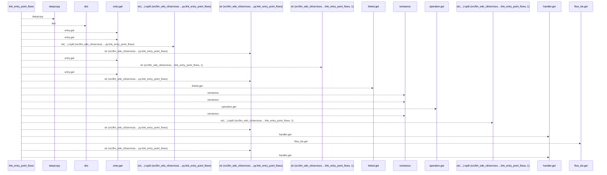
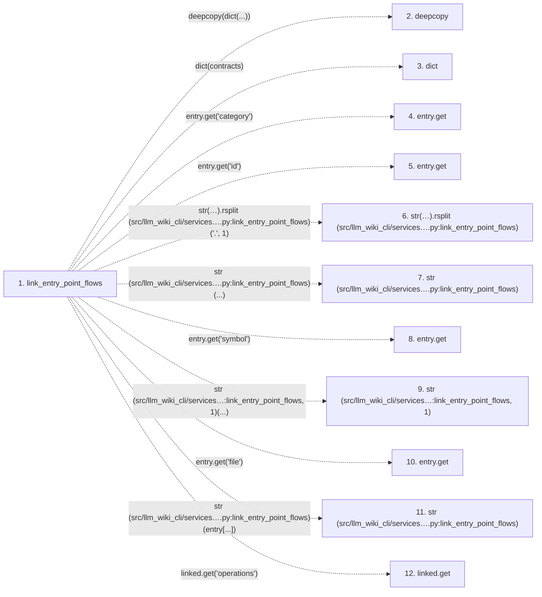

# link_entry_point_flows

**Entry point:** `link_entry_point_flows` (`api`)
**Source:** [api_contracts](../modules/api_contracts.md)
**Modules touched:** [api_contracts](../modules/api_contracts.md)

## Call sequence

<!-- Auto-generated from static call edges. Dashed arrows are external or unresolved calls. Reviewed runtime conditions and side effects belong in Behavior. -->

## Data flow

<!-- Auto-generated static analysis. Treat values and boundaries as best-effort hints, not runtime proof. -->

### Step data

| Step | Inputs | Reads | Writes | Returns |
|---|---|---|---|---|
| `link_entry_point_flows` | `contracts: Mapping[str, object]`, `entry_points: Iterable[Mapping[str, object]]` | `Mapping` | `operation[...]` | `linked` |
| `deepcopy` | - | - | - | - |
| `dict` | - | - | - | - |
| `entry.get` | - | - | - | - |
| `entry.get` | - | - | - | - |
| `str(…).rsplit (src/llm_wiki_cli/services….py:link_entry_point_flows)` | - | - | - | - |
| `str (src/llm_wiki_cli/services….py:link_entry_point_flows)` | - | - | - | - |
| `entry.get` | - | - | - | - |
| `str (src/llm_wiki_cli/services…:link_entry_point_flows, 1)` | - | - | - | - |
| `entry.get` | - | - | - | - |
| `str (src/llm_wiki_cli/services….py:link_entry_point_flows)` | - | - | - | - |
| `linked.get` | - | - | - | - |

### Call data

| From | To | Line | Call |
|---|---|---:|---|
| link_entry_point_flows | deepcopy | 1837 | `deepcopy(dict(...))` |
| link_entry_point_flows | dict | 1837 | `dict(contracts)` |
| link_entry_point_flows | entry.get | 1840 | `entry.get('category')` |
| link_entry_point_flows | entry.get | 1840 | `entry.get('id')` |
| link_entry_point_flows | str(…).rsplit (src/llm_wiki_cli/services….py:link_entry_point_flows) | 1842 | `str(entry.get('symbol') or '').rsplit('.', 1)` |
| link_entry_point_flows | str (src/llm_wiki_cli/services….py:link_entry_point_flows) | 1842 | `str(...)` |
| link_entry_point_flows | entry.get | 1842 | `entry.get('symbol')` |
| link_entry_point_flows | str (src/llm_wiki_cli/services…:link_entry_point_flows, 1) | 1843 | `str(...)` |
| link_entry_point_flows | entry.get | 1843 | `entry.get('file')` |
| link_entry_point_flows | str (src/llm_wiki_cli/services….py:link_entry_point_flows) | 1843 | `str(entry[...])` |
| link_entry_point_flows | linked.get | 1844 | `linked.get('operations')` |

### Boundary effects

*No boundary effects detected.*

### Static analysis gaps

| Kind | Step | Target | Line |
|---|---|---|---:|
| external_call | `link_entry_point_flows` | `deepcopy` | 1837 |
| unresolved_call | `link_entry_point_flows` | `entry.get` | 1840 |
| unresolved_call | `link_entry_point_flows` | `str(entry.get('symbol') or '').rsplit` | 1842 |
| unresolved_call | `link_entry_point_flows` | `entry.get` | 1842 |
| unresolved_call | `link_entry_point_flows` | `entry.get` | 1843 |
| unresolved_call | `link_entry_point_flows` | `linked.get` | 1844 |
| step_limit | `link_entry_point_flows` | `first 12 steps` | 0 |

## Behavior

This flow starts at `link_entry_point_flows` and is classified as `api`. The generated call and data-flow sections are bounded static projections; runtime conditions and side effects require source-level confirmation.
