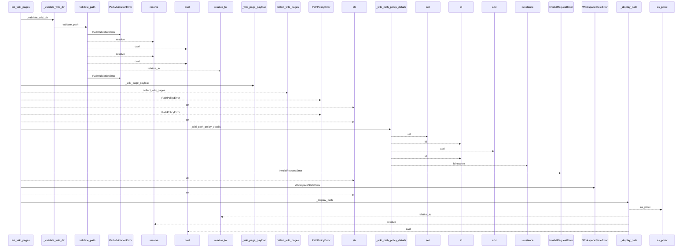
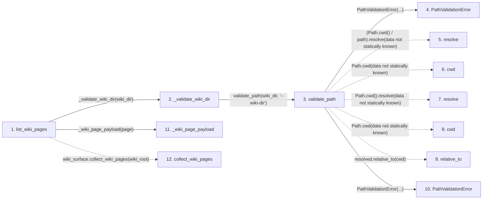

# list_wiki_pages

**Entry point:** `list_wiki_pages` (`api`)
**Source:** [api](../modules/api.md)
**Modules touched:** [api](../modules/api.md), [config](../modules/config.md)

## Call sequence

<!-- Auto-generated from static call edges. Dashed arrows are external or unresolved calls. Reviewed runtime conditions and side effects belong in Behavior. -->

> Call sequence diagram shows 30 of 35 interactions; 5 omitted to keep the visualization within the 30-interaction and generated-diagram limits.

## Data flow

<!-- Auto-generated static analysis. Treat values and boundaries as best-effort hints, not runtime proof. -->

### Step data

| Step | Inputs | Reads | Writes | Returns |
|---|---|---|---|---|
| `list_wiki_pages` | `wiki_dir: str` | `PathValidationError`, `wiki_surface`, `wiki_surface` | - | `{...}` |
| `_validate_wiki_dir` | `wiki_dir: str` | - | - | `validate_path(...)` |
| `validate_path` | `path: str`, `label: str` | - | - | `resolved` |
| `PathValidationError` | - | - | - | - |
| `resolve` | - | - | - | - |
| `cwd` | - | - | - | - |
| `resolve` | - | - | - | - |
| `cwd` | - | - | - | - |
| `relative_to` | - | - | - | - |
| `PathValidationError` | - | - | - | - |
| `_wiki_page_payload` | `page: wiki_surface.WikiSurfacePage` | - | - | `{...}` |
| `collect_wiki_pages` | - | - | - | - |

### Call data

| From | To | Line | Call |
|---|---|---:|---|
| list_wiki_pages | _validate_wiki_dir | 1018 | `_validate_wiki_dir(wiki_dir)` |
| _validate_wiki_dir | validate_path | 2326 | `validate_path(wiki_dir, '--wiki-dir')` |
| validate_path | PathValidationError | 132 | `PathValidationError(...)` |
| validate_path | resolve | 133 | `(Path.cwd() / path).resolve(data not statically known)` |
| validate_path | cwd | 133 | `Path.cwd(data not statically known)` |
| validate_path | resolve | 134 | `Path.cwd().resolve(data not statically known)` |
| validate_path | cwd | 134 | `Path.cwd(data not statically known)` |
| validate_path | relative_to | 136 | `resolved.relative_to(cwd)` |
| validate_path | PathValidationError | 138 | `PathValidationError(...)` |
| list_wiki_pages | _wiki_page_payload | 1020 | `_wiki_page_payload(page)` |
| list_wiki_pages | collect_wiki_pages | 1021 | `wiki_surface.collect_wiki_pages(wiki_root)` |

### Boundary effects

*No boundary effects detected.*

### Static analysis gaps

| Kind | Step | Target | Line |
|---|---|---|---:|
| unresolved_call | `validate_path` | `(Path.cwd() / path).resolve` | 133 |
| external_call | `validate_path` | `Path.cwd` | 133 |
| external_call | `validate_path` | `Path.cwd().resolve` | 134 |
| external_call | `validate_path` | `Path.cwd` | 134 |
| unresolved_call | `validate_path` | `resolved.relative_to` | 136 |
| external_call | `list_wiki_pages` | `wiki_surface.collect_wiki_pages` | 1021 |
| step_limit | `list_wiki_pages` | `first 12 steps` | 0 |

## Behavior

This flow starts at `list_wiki_pages` and is classified as `api`. The generated call and data-flow sections are bounded static projections; runtime conditions and side effects require source-level confirmation.
