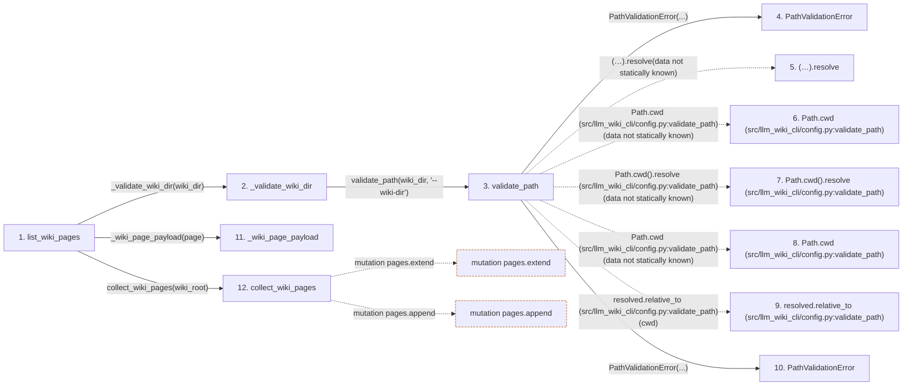

# list_wiki_pages

**Entry point:** `list_wiki_pages` (`api`)
**Source:** [api](../modules/api.md)
**Modules touched:** [api](../modules/api.md), [config](../modules/config.md), [validation](../modules/validation.md), [wiki_surface](../modules/wiki_surface.md)

## Call sequence

```mermaid
sequenceDiagram
    participant p0 as list_wiki_pages
    participant p1 as _validate_wiki_dir
    participant p2 as validate_path
    participant p3 as PathValidationError
    participant p4 as (…).resolve
    participant p5 as Path.cwd (src/llm_wiki_cli/config.py:validate_path)
    participant p6 as Path.cwd().resolve (src/llm_wiki_cli/config.py:validate_path)
    participant p7 as resolved.relative_to (src/llm_wiki_cli/config.py:validate_path)
    participant p8 as _wiki_page_payload
    participant p9 as collect_wiki_pages
    participant p10 as Path (src/llm_wiki_cli/services…ace.py:collect_wiki_pages)
    participant p11 as pages.extend
    participant p12 as _collect_directory_pages
    participant p13 as root.is_symlink
    participant p14 as WikiSurfacePathError
    participant p15 as root.is_dir
    participant p16 as sorted
    participant p17 as root.glob
    participant p18 as candidate.name.casefold
    participant p19 as path.is_symlink (src/llm_wiki_cli/services…:_collect_directory_pages)
    participant p20 as resolve_wiki_page_path
    participant p21 as Path (src/llm_wiki_cli/services…py:resolve_wiki_page_path)
    participant p22 as candidate.relative_to
    participant p23 as candidate.as_posix
    participant p24 as relative.as_posix
    participant p25 as current.is_symlink
    p0->>p1: _validate_wiki_dir
    p1->>p2: validate_path
    p2->>p3: PathValidationError
    p2-->>p4: (…).resolve
    p2-->>p5: Path.cwd (src/llm_wiki_cli/config.py:validate_path)
    p2-->>p6: Path.cwd().resolve (src/llm_wiki_cli/config.py:validate_path)
    p2-->>p5: Path.cwd (src/llm_wiki_cli/config.py:validate_path)
    p2-->>p7: resolved.relative_to (src/llm_wiki_cli/config.py:validate_path)
    p2->>p3: PathValidationError
    p0->>p8: _wiki_page_payload
    p0->>p9: collect_wiki_pages
    p9-->>p10: Path (src/llm_wiki_cli/services…ace.py:collect_wiki_pages)
    p9-->>p11: pages.extend
    p9->>p12: _collect_directory_pages
    p12-->>p13: root.is_symlink
    p12->>p14: WikiSurfacePathError
    p12-->>p15: root.is_dir
    p12-->>p16: sorted
    p12-->>p17: root.glob
    p12-->>p18: candidate.name.casefold
    p12-->>p19: path.is_symlink (src/llm_wiki_cli/services…:_collect_directory_pages)
    p12->>p20: resolve_wiki_page_path
    p20-->>p21: Path (src/llm_wiki_cli/services…py:resolve_wiki_page_path)
    p20-->>p21: Path (src/llm_wiki_cli/services…py:resolve_wiki_page_path)
    p20-->>p22: candidate.relative_to
    p20->>p14: WikiSurfacePathError
    p20-->>p23: candidate.as_posix
    p20-->>p24: relative.as_posix
    p20-->>p25: current.is_symlink
    p20->>p14: WikiSurfacePathError
```

<!-- Auto-generated from static call edges. Dashed arrows are external or unresolved calls. Reviewed runtime conditions and side effects belong in Behavior. -->

> Call sequence diagram shows 30 of 112 interactions; 82 omitted to keep the visualization within the 30-interaction and generated-diagram limits.

## Data flow

<!-- Auto-generated static analysis. Treat values and boundaries as best-effort hints, not runtime proof. -->

### Step data

| Step | Inputs | Reads | Writes | Returns |
|---|---|---|---|---|
| `list_wiki_pages` | `wiki_dir: str` | `PathValidationError`, `wiki_surface`, `wiki_surface` | - | `{...}` |
| `_validate_wiki_dir` | `wiki_dir: str` | - | - | `validate_path(...)` |
| `validate_path` | `path: str`, `label: str` | - | - | `resolved` |
| `PathValidationError` | - | - | - | - |
| `(…).resolve` | - | - | - | - |
| `Path.cwd (src/llm_wiki_cli/config.py:validate_path)` | - | - | - | - |
| `Path.cwd().resolve (src/llm_wiki_cli/config.py:validate_path)` | - | - | - | - |
| `Path.cwd (src/llm_wiki_cli/config.py:validate_path)` | - | - | - | - |
| `resolved.relative_to (src/llm_wiki_cli/config.py:validate_path)` | - | - | - | - |
| `PathValidationError` | - | - | - | - |
| `_wiki_page_payload` | `page: wiki_surface.WikiSurfacePage` | - | - | `{...}` |
| `collect_wiki_pages` | `wiki_dir: Union[str, Path]` | `_PAGE_KINDS` | - | `pages` |

### Call data

| From | To | Line | Call |
|---|---|---:|---|
| list_wiki_pages | _validate_wiki_dir | 1078 | `_validate_wiki_dir(wiki_dir)` |
| _validate_wiki_dir | validate_path | 2386 | `validate_path(wiki_dir, '--wiki-dir')` |
| validate_path | PathValidationError | 132 | `PathValidationError(...)` |
| validate_path | (…).resolve | 133 | `(Path.cwd() / path).resolve(data not statically known)` |
| validate_path | Path.cwd (src/llm_wiki_cli/config.py:validate_path) | 133 | `Path.cwd(data not statically known)` |
| validate_path | Path.cwd().resolve (src/llm_wiki_cli/config.py:validate_path) | 134 | `Path.cwd().resolve(data not statically known)` |
| validate_path | Path.cwd (src/llm_wiki_cli/config.py:validate_path) | 134 | `Path.cwd(data not statically known)` |
| validate_path | resolved.relative_to (src/llm_wiki_cli/config.py:validate_path) | 136 | `resolved.relative_to(cwd)` |
| validate_path | PathValidationError | 138 | `PathValidationError(...)` |
| list_wiki_pages | _wiki_page_payload | 1080 | `_wiki_page_payload(page)` |
| list_wiki_pages | collect_wiki_pages | 1081 | `wiki_surface.collect_wiki_pages(wiki_root)` |

### Boundary effects

| Kind | Target | Step | Line |
|---|---|---|---:|
| mutation | `pages.extend` | `collect_wiki_pages` | 293 |
| mutation | `pages.append` | `collect_wiki_pages` | 301 |

### Static analysis gaps

| Kind | Step | Target | Line |
|---|---|---|---:|
| unresolved_call | `validate_path` | `(Path.cwd() / path).resolve` | 133 |
| external_call | `validate_path` | `Path.cwd` | 133 |
| unresolved_call | `validate_path` | `Path.cwd().resolve` | 134 |
| external_call | `validate_path` | `Path.cwd` | 134 |
| unresolved_call | `validate_path` | `resolved.relative_to` | 136 |
| step_limit | `list_wiki_pages` | `first 12 steps` | 0 |

## Behavior

This flow starts at `list_wiki_pages` and is classified as `api`. The generated call and data-flow sections are bounded static projections; runtime conditions and side effects require source-level confirmation.
