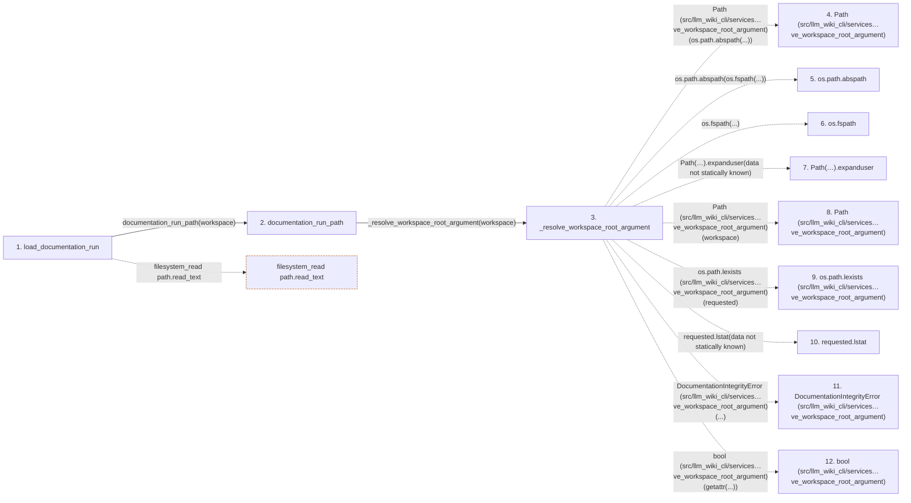

# load_documentation_run

**Entry point:** `load_documentation_run` (`api`)
**Source:** [workspace](../modules/workspace.md)
**Modules touched:** [workspace](../modules/workspace.md)

## Call sequence

```mermaid
sequenceDiagram
    participant p0 as load_documentation_run
    participant p1 as documentation_run_path
    participant p2 as _resolve_workspace_root_argument
    participant p3 as Path (src/llm_wiki_cli/services…ve_workspace_root_argument)
    participant p4 as os.path.abspath
    participant p5 as os.fspath
    participant p6 as Path(…).expanduser
    participant p7 as os.path.lexists (src/llm_wiki_cli/services…ve_workspace_root_argument)
    participant p8 as requested.lstat
    participant p9 as DocumentationIntegrityError (src/llm_wiki_cli/services…ve_workspace_root_argument)
    participant p10 as bool (src/llm_wiki_cli/services…ve_workspace_root_argument)
    participant p11 as getattr (src/llm_wiki_cli/services…ve_workspace_root_argument)
    participant p12 as stat.S_ISLNK (src/llm_wiki_cli/services…ve_workspace_root_argument)
    participant p13 as stat.S_ISDIR (src/llm_wiki_cli/services…ve_workspace_root_argument)
    participant p14 as requested.resolve
    participant p15 as _assert_existing_workspace_layout_safe
    participant p16 as os.path.lexists (src/llm_wiki_cli/services…ting_workspace_layout_safe)
    participant p17 as _assert_safe_workspace_directory
    participant p18 as directory.lstat
    participant p19 as DocumentationIntegrityError (src/llm_wiki_cli/services…t_safe_workspace_directory)
    participant p20 as bool (src/llm_wiki_cli/services…t_safe_workspace_directory)
    participant p21 as getattr (src/llm_wiki_cli/services…t_safe_workspace_directory)
    participant p22 as stat.S_ISLNK (src/llm_wiki_cli/services…t_safe_workspace_directory)
    p0->>p1: documentation_run_path
    p1->>p2: _resolve_workspace_root_argument
    p2-->>p3: Path (src/llm_wiki_cli/services…ve_workspace_root_argument)
    p2-->>p4: os.path.abspath
    p2-->>p5: os.fspath
    p2-->>p6: Path(…).expanduser
    p2-->>p3: Path (src/llm_wiki_cli/services…ve_workspace_root_argument)
    p2-->>p7: os.path.lexists (src/llm_wiki_cli/services…ve_workspace_root_argument)
    p2-->>p8: requested.lstat
    p2-->>p9: DocumentationIntegrityError (src/llm_wiki_cli/services…ve_workspace_root_argument)
    p2-->>p10: bool (src/llm_wiki_cli/services…ve_workspace_root_argument)
    p2-->>p11: getattr (src/llm_wiki_cli/services…ve_workspace_root_argument)
    p2-->>p10: bool (src/llm_wiki_cli/services…ve_workspace_root_argument)
    p2-->>p11: getattr (src/llm_wiki_cli/services…ve_workspace_root_argument)
    p2-->>p12: stat.S_ISLNK (src/llm_wiki_cli/services…ve_workspace_root_argument)
    p2-->>p9: DocumentationIntegrityError (src/llm_wiki_cli/services…ve_workspace_root_argument)
    p2-->>p13: stat.S_ISDIR (src/llm_wiki_cli/services…ve_workspace_root_argument)
    p2-->>p9: DocumentationIntegrityError (src/llm_wiki_cli/services…ve_workspace_root_argument)
    p2-->>p14: requested.resolve
    p2-->>p7: os.path.lexists (src/llm_wiki_cli/services…ve_workspace_root_argument)
    p2->>p15: _assert_existing_workspace_layout_safe
    p15-->>p16: os.path.lexists (src/llm_wiki_cli/services…ting_workspace_layout_safe)
    p15->>p17: _assert_safe_workspace_directory
    p17-->>p18: directory.lstat
    p17-->>p19: DocumentationIntegrityError (src/llm_wiki_cli/services…t_safe_workspace_directory)
    p17-->>p20: bool (src/llm_wiki_cli/services…t_safe_workspace_directory)
    p17-->>p21: getattr (src/llm_wiki_cli/services…t_safe_workspace_directory)
    p17-->>p20: bool (src/llm_wiki_cli/services…t_safe_workspace_directory)
    p17-->>p21: getattr (src/llm_wiki_cli/services…t_safe_workspace_directory)
    p17-->>p22: stat.S_ISLNK (src/llm_wiki_cli/services…t_safe_workspace_directory)
```

<!-- Auto-generated from static call edges. Dashed arrows are external or unresolved calls. Reviewed runtime conditions and side effects belong in Behavior. -->

> Call sequence diagram shows 30 of 92 interactions; 62 omitted to keep the visualization within the 30-interaction and generated-diagram limits.

## Data flow

<!-- Auto-generated static analysis. Treat values and boundaries as best-effort hints, not runtime proof. -->

### Step data

| Step | Inputs | Reads | Writes | Returns |
|---|---|---|---|---|
| `load_documentation_run` | `workspace: str \| Path` | - | - | `DocumentationRun.from_dict(...)` |
| `documentation_run_path` | `workspace: str \| Path` | - | - | `...` |
| `_resolve_workspace_root_argument` | `workspace: str \| Path` | - | - | `resolved` |
| `Path (src/llm_wiki_cli/services…ve_workspace_root_argument)` | - | - | - | - |
| `os.path.abspath` | - | - | - | - |
| `os.fspath` | - | - | - | - |
| `Path(…).expanduser` | - | - | - | - |
| `Path (src/llm_wiki_cli/services…ve_workspace_root_argument)` | - | - | - | - |
| `os.path.lexists (src/llm_wiki_cli/services…ve_workspace_root_argument)` | - | - | - | - |
| `requested.lstat` | - | - | - | - |
| `DocumentationIntegrityError (src/llm_wiki_cli/services…ve_workspace_root_argument)` | - | - | - | - |
| `bool (src/llm_wiki_cli/services…ve_workspace_root_argument)` | - | - | - | - |

### Call data

| From | To | Line | Call |
|---|---|---:|---|
| load_documentation_run | documentation_run_path | 14 | `documentation_run_path(workspace)` |
| documentation_run_path | _resolve_workspace_root_argument | 10 | `_resolve_workspace_root_argument(workspace)` |
| _resolve_workspace_root_argument | Path (src/llm_wiki_cli/services…ve_workspace_root_argument) | 102 | `Path(os.path.abspath(...))` |
| _resolve_workspace_root_argument | os.path.abspath | 102 | `os.path.abspath(os.fspath(...))` |
| _resolve_workspace_root_argument | os.fspath | 102 | `os.fspath(...)` |
| _resolve_workspace_root_argument | Path(…).expanduser | 102 | `Path(workspace).expanduser(data not statically known)` |
| _resolve_workspace_root_argument | Path (src/llm_wiki_cli/services…ve_workspace_root_argument) | 102 | `Path(workspace)` |
| _resolve_workspace_root_argument | os.path.lexists (src/llm_wiki_cli/services…ve_workspace_root_argument) | 103 | `os.path.lexists(requested)` |
| _resolve_workspace_root_argument | requested.lstat | 105 | `requested.lstat(data not statically known)` |
| _resolve_workspace_root_argument | DocumentationIntegrityError (src/llm_wiki_cli/services…ve_workspace_root_argument) | 107 | `DocumentationIntegrityError(...)` |
| _resolve_workspace_root_argument | bool (src/llm_wiki_cli/services…ve_workspace_root_argument) | 110 | `bool(getattr(...))` |

### Boundary effects

| Kind | Target | Step | Line |
|---|---|---|---:|
| filesystem_read | `path.read_text` | `load_documentation_run` | 16 |

### Static analysis gaps

| Kind | Step | Target | Line |
|---|---|---|---:|
| unresolved_call | `_resolve_workspace_root_argument` | `os.path.abspath` | 102 |
| unresolved_call | `_resolve_workspace_root_argument` | `os.fspath` | 102 |
| unresolved_call | `_resolve_workspace_root_argument` | `Path(workspace).expanduser` | 102 |
| unresolved_call | `_resolve_workspace_root_argument` | `os.path.lexists` | 103 |
| unresolved_call | `_resolve_workspace_root_argument` | `requested.lstat` | 105 |
| unresolved_call | `_resolve_workspace_root_argument` | `DocumentationIntegrityError` | 107 |
| step_limit | `load_documentation_run` | `first 12 steps` | 0 |

## Behavior

This flow starts at `load_documentation_run` and is classified as `api`. The generated call and data-flow sections are bounded static projections; runtime conditions and side effects require source-level confirmation.
