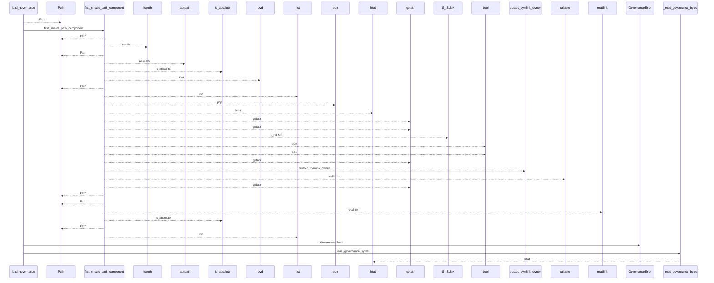
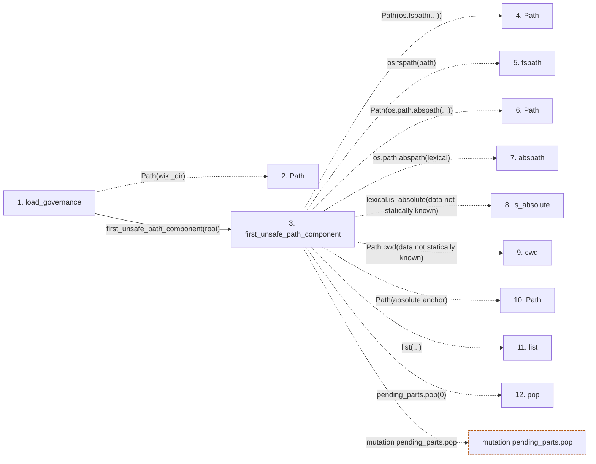

# load_governance

**Entry point:** `load_governance` (`api`)
**Source:** [knowledge_governance](../modules/knowledge_governance.md)
**Modules touched:** [concept_identity](../modules/concept_identity.md), [io](../modules/io.md), [knowledge_evidence](../modules/knowledge_evidence.md), [knowledge_governance](../modules/knowledge_governance.md), and 3 more

**Complete modules touched:**

- [concept_identity](../modules/concept_identity.md)
- [io](../modules/io.md)
- [knowledge_evidence](../modules/knowledge_evidence.md)
- [knowledge_governance](../modules/knowledge_governance.md)
- [knowledge_model](../modules/knowledge_model.md)
- [validation](../modules/validation.md)
- [wiki_surface](../modules/wiki_surface.md)

## Call sequence

<!-- Auto-generated from static call edges. Dashed arrows are external or unresolved calls. Reviewed runtime conditions and side effects belong in Behavior. -->

> Call sequence diagram shows 30 of 472 interactions; 442 omitted to keep the visualization within the 30-interaction and generated-diagram limits.

> Trace truncated at the depth limit; deeper calls are omitted.

## Data flow

<!-- Auto-generated static analysis. Treat values and boundaries as best-effort hints, not runtime proof. -->

### Step data

| Step | Inputs | Reads | Writes | Returns |
|---|---|---|---|---|
| `load_governance` | `wiki_dir: str \| Path`, `expected_bundle_id: str \| None` | `GOVERNANCE_FILENAME`, `GOVERNANCE_FILENAME` | - | `GovernanceLoadResult(...)` |
| `Path` | - | - | - | - |
| `first_unsafe_path_component` | `path: str \| Path`, `trusted_symlink_uids: Set[int] \| None`, `trusted_symlink_owner: Callable[[Path], bool] \| None` | `stat`, `os` | - | `lexical`, `None`, `current`, `current`, `current`, `current`, `current`, `None` |
| `Path` | - | - | - | - |
| `fspath` | - | - | - | - |
| `Path` | - | - | - | - |
| `abspath` | - | - | - | - |
| `is_absolute` | - | - | - | - |
| `cwd` | - | - | - | - |
| `Path` | - | - | - | - |
| `list` | - | - | - | - |
| `pop` | - | - | - | - |

### Call data

| From | To | Line | Call |
|---|---|---:|---|
| load_governance | Path | 765 | `Path(wiki_dir)` |
| load_governance | first_unsafe_path_component | 766 | `first_unsafe_path_component(root)` |
| first_unsafe_path_component | Path | 50 | `Path(os.fspath(...))` |
| first_unsafe_path_component | fspath | 50 | `os.fspath(path)` |
| first_unsafe_path_component | Path | 58 | `Path(os.path.abspath(...))` |
| first_unsafe_path_component | abspath | 58 | `os.path.abspath(lexical)` |
| first_unsafe_path_component | is_absolute | 59 | `lexical.is_absolute(data not statically known)` |
| first_unsafe_path_component | cwd | 65 | `Path.cwd(data not statically known)` |
| first_unsafe_path_component | Path | 66 | `Path(absolute.anchor)` |
| first_unsafe_path_component | list | 67 | `list(...)` |
| first_unsafe_path_component | pop | 70 | `pending_parts.pop(0)` |

### Boundary effects

| Kind | Target | Step | Line |
|---|---|---|---:|
| mutation | `pending_parts.pop` | `first_unsafe_path_component` | 70 |

### Static analysis gaps

| Kind | Step | Target | Line |
|---|---|---|---:|
| external_call | `first_unsafe_path_component` | `os.fspath` | 50 |
| external_call | `first_unsafe_path_component` | `os.path.abspath` | 58 |
| unresolved_call | `first_unsafe_path_component` | `lexical.is_absolute` | 59 |
| external_call | `first_unsafe_path_component` | `Path.cwd` | 65 |
| step_limit | `load_governance` | `first 12 steps` | 0 |
| truncated_flow | `load_governance` | `depth limit` | 0 |

## Behavior

This flow starts at `load_governance` and is classified as `api`. The generated call and data-flow sections are bounded static projections; runtime conditions and side effects require source-level confirmation.
