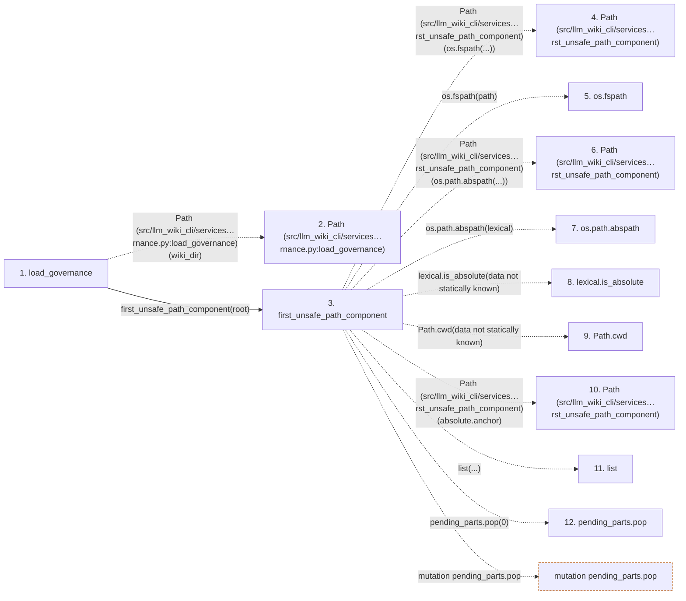

# load_governance

**Entry point:** `load_governance` (`api`)
**Source:** [knowledge_governance](../modules/knowledge_governance.md)
**Modules touched:** [concept_identity](../modules/concept_identity.md), [io](../modules/io.md), [knowledge_evidence](../modules/knowledge_evidence.md), [knowledge_governance](../modules/knowledge_governance.md), and 4 more

**Complete modules touched:**

- [concept_identity](../modules/concept_identity.md)
- [io](../modules/io.md)
- [knowledge_evidence](../modules/knowledge_evidence.md)
- [knowledge_governance](../modules/knowledge_governance.md)
- [knowledge_model](../modules/knowledge_model.md)
- [validation](../modules/validation.md)
- [wiki_media](../modules/wiki_media.md)
- [wiki_surface](../modules/wiki_surface.md)

## Call sequence

> Static overview in presentation order, not runtime execution order. Arrows retain captured callers; representative internal continuations and boundary examples precede repeated helper detail.

<!-- Auto-generated from static call edges. Dashed arrows are external or unresolved calls. Reviewed runtime conditions and side effects belong in Behavior. -->

```mermaid
sequenceDiagram
    participant p0 as load_governance
    participant p1 as _read_governance_bytes
    participant p2 as _decode_unique_json
    participant p3 as parse_governance_ledger
    participant p4 as first_unsafe_path_component
    participant p5 as GovernanceError
    participant p6 as GovernanceLoadResult
    participant p7 as sha256_bytes
    participant p8 as _object
    participant p9 as _exact_fields
    participant p10 as _bundle_id
    participant p11 as _concept_uid
    participant p12 as _concept_kind
    participant p13 as _identity_value
    participant p14 as _parse_lifecycle_event
    participant p15 as _parse_review_event
    participant p16 as validate_governance_ledger
    participant p17 as validate_bundle_id
    participant p18 as validate_concept_uid
    participant p19 as validate_concept_kind
    participant p20 as _alias_type
    participant p21 as _event_id
    participant p22 as validate_alias_value
    participant p23 as _section_locator
    participant p24 as _hash
    participant p25 as _parse_review_evidence
    participant p26 as _parse_actor
    participant p27 as authored_event_time
    participant p28 as _machine_code
    participant p29 as Path (src/llm_wiki_cli/services…rnance.py:load_governance)
    participant p30 as ledger.to_bytes
    p0->>p1: _read_governance_bytes
    p0->>p2: _decode_unique_json
    p0->>p3: parse_governance_ledger
    p0->>p4: first_unsafe_path_component
    p0->>p5: GovernanceError
    p0->>p6: GovernanceLoadResult
    p0->>p7: sha256_bytes
    p3->>p8: _object
    p3->>p9: _exact_fields
    p3->>p10: _bundle_id
    p3->>p11: _concept_uid
    p3->>p12: _concept_kind
    p3->>p13: _identity_value
    p3->>p14: _parse_lifecycle_event
    p3->>p15: _parse_review_event
    p3->>p16: validate_governance_ledger
    p10->>p17: validate_bundle_id
    p11->>p18: validate_concept_uid
    p12->>p19: validate_concept_kind
    p13->>p20: _alias_type
    p14->>p21: _event_id
    p13->>p22: validate_alias_value
    p15->>p23: _section_locator
    p15->>p24: _hash
    p15->>p25: _parse_review_evidence
    p14->>p26: _parse_actor
    p14->>p27: authored_event_time
    p14->>p28: _machine_code
    p0-->>p29: Path (src/llm_wiki_cli/services…rnance.py:load_governance)(wiki_dir)
    p0-->>p30: ledger.to_bytes
```

> Call sequence diagram shows 30 of 503 interactions; 473 omitted to keep the visualization within the 30-interaction and generated-diagram limits, with uncertain identities omitted rather than inferred.

> Captured boundary calls: external 1 of 127 (126 omitted); unresolved 1 of 106 (105 omitted). These counts cover the captured static trace.

Omitted captured detail, grouped by actual caller occurrence and target module:

| Caller | Parent step | Target module | Kind | Omitted interactions |
| --- | --- | --- | --- | --- |
| `src/llm_wiki_cli/services/io.py:first_unsafe_path_component` | 3 | - | external | 20 |
| `src/llm_wiki_cli/services/io.py:first_unsafe_path_component` | 3 | - | unresolved | 5 |
| `src/llm_wiki_cli/services/knowledge_governance.py:_read_governance_bytes` | 30 | - | unresolved | 3 |
| `src/llm_wiki_cli/services/knowledge_governance.py:_read_governance_bytes` | 30 | [src/llm_wiki_cli/services/knowledge_governance.py](../modules/knowledge_governance.md) | internal | 7 |
| `src/llm_wiki_cli/services/knowledge_governance.py:_read_governance_bytes` | 30 | - | external | 16 |
| `src/llm_wiki_cli/services/knowledge_governance.py:_decode_unique_json` | 57 | - | external | 1 |
| `src/llm_wiki_cli/services/knowledge_governance.py:_decode_unique_json` | 57 | - | unresolved | 1 |
| `src/llm_wiki_cli/services/knowledge_governance.py:_decode_unique_json` | 57 | [src/llm_wiki_cli/services/knowledge_governance.py](../modules/knowledge_governance.md) | internal | 1 |
> Omission summary shows 8 of 127 groups; 119 further groups are not expanded here. Counts above include all omitted interactions.
> Detailed flow queries retain their own coverage and limits; omitted paths may execute at runtime.

> Trace truncated at the depth limit; deeper calls are omitted.

## Data flow

<!-- Auto-generated static analysis. Treat values and boundaries as best-effort hints, not runtime proof. -->

### Analysis coverage

**Effect analysis partially available.** Flow assembly and source effect analysis are separate; empty observations do not prove an empty handler body.

Source steps: 271; effect analysis evaluated: 146, partial: 0, unavailable: 125. Counts include steps omitted from the displayed trace.

- Callable record unavailable; the selected entry symbol has no represented callable body.
- Effect collector totals unavailable; observed counts cover captured records only.

| Step | Callable record | Effect analysis | Collector totals |
|---|---|---|---|
| `load_governance` | `available` | `evaluated` | `available` |
| `Path (src/llm_wiki_cli/services…rnance.py:load_governance)` | `not_applicable` | `not_applicable` | `not_applicable` |
| `first_unsafe_path_component` | `available` | `evaluated` | `available` |
| `Path (src/llm_wiki_cli/services…rst_unsafe_path_component)` | `not_applicable` | `not_applicable` | `not_applicable` |
| `os.fspath` | `not_applicable` | `not_applicable` | `not_applicable` |
| `Path (src/llm_wiki_cli/services…rst_unsafe_path_component)` | `not_applicable` | `not_applicable` | `not_applicable` |
| `os.path.abspath` | `not_applicable` | `not_applicable` | `not_applicable` |
| `lexical.is_absolute` | `not_applicable` | `not_applicable` | `not_applicable` |
| `Path.cwd` | `not_applicable` | `not_applicable` | `not_applicable` |
| `Path (src/llm_wiki_cli/services…rst_unsafe_path_component)` | `not_applicable` | `not_applicable` | `not_applicable` |
| `list` | `not_applicable` | `not_applicable` | `not_applicable` |
| `pending_parts.pop` | `not_applicable` | `not_applicable` | `not_applicable` |

```mermaid
flowchart LR
    s1["1. load_governance"]
    s2["2. Path (src/llm_wiki_cli/services…rnance.py:load_governance)"]
    s3["3. first_unsafe_path_component"]
    s4["4. Path (src/llm_wiki_cli/services…rst_unsafe_path_component)"]
    s5["5. os.fspath"]
    s6["6. Path (src/llm_wiki_cli/services…rst_unsafe_path_component)"]
    s7["7. os.path.abspath"]
    s8["8. lexical.is_absolute"]
    s9["9. Path.cwd"]
    s10["10. Path (src/llm_wiki_cli/services…rst_unsafe_path_component)"]
    s11["11. list"]
    s12["12. pending_parts.pop"]
    s1 -. "Path (src/llm_wiki_cli/services…rnance.py:load_governance)(wiki_dir)" .-> s2
    s1 -->|"first_unsafe_path_component(root)"| s3
    s3 -. "Path (src/llm_wiki_cli/services…rst_unsafe_path_component)(os.fspath(...))" .-> s4
    s3 -. "os.fspath(path)" .-> s5
    s3 -. "Path (src/llm_wiki_cli/services…rst_unsafe_path_component)(os.path.abspath(...))" .-> s6
    s3 -. "os.path.abspath(lexical)" .-> s7
    s3 -. "lexical.is_absolute(data not statically known)" .-> s8
    s3 -. "Path.cwd(data not statically known)" .-> s9
    s3 -. "Path (src/llm_wiki_cli/services…rst_unsafe_path_component)(absolute.anchor)" .-> s10
    s3 -. "list(...)" .-> s11
    s3 -. "pending_parts.pop(0)" .-> s12
    b0["mutation pending_parts.pop"]
    s3 -. "mutation pending_parts.pop" .-> b0
    click s1 "../modules/knowledge_governance.md"
    click s3 "../modules/io.md"
    classDef boundary stroke:#b45309,stroke-dasharray: 4 2
    class b0 boundary
```

### Step data

| Step | Inputs | Reads | Writes | Returns |
|---|---|---|---|---|
| `load_governance` | `wiki_dir: str \| Path`, `expected_bundle_id: str \| None` | `GOVERNANCE_FILENAME`, `GOVERNANCE_FILENAME` | - | `GovernanceLoadResult(...)` |
| `Path (src/llm_wiki_cli/services…rnance.py:load_governance)` | - | - | - | - |
| `first_unsafe_path_component` | `path: str \| Path`, `trusted_symlink_uids: Set[int] \| None`, `trusted_symlink_owner: Callable[[Path], bool] \| None` | `stat`, `os` | - | `lexical`, `None`, `current`, `current`, `current`, `current`, `current`, `None` |
| `Path (src/llm_wiki_cli/services…rst_unsafe_path_component)` | - | - | - | - |
| `os.fspath` | - | - | - | - |
| `Path (src/llm_wiki_cli/services…rst_unsafe_path_component)` | - | - | - | - |
| `os.path.abspath` | - | - | - | - |
| `lexical.is_absolute` | - | - | - | - |
| `Path.cwd` | - | - | - | - |
| `Path (src/llm_wiki_cli/services…rst_unsafe_path_component)` | - | - | - | - |
| `list` | - | - | - | - |
| `pending_parts.pop` | - | - | - | - |

### Call data

| From | To | Line | Call |
|---|---|---:|---|
| load_governance | Path (src/llm_wiki_cli/services…rnance.py:load_governance) | 768 | `Path(wiki_dir)` |
| load_governance | first_unsafe_path_component | 769 | `first_unsafe_path_component(root)` |
| first_unsafe_path_component | Path (src/llm_wiki_cli/services…rst_unsafe_path_component) | 51 | `Path(os.fspath(...))` |
| first_unsafe_path_component | os.fspath | 51 | `os.fspath(path)` |
| first_unsafe_path_component | Path (src/llm_wiki_cli/services…rst_unsafe_path_component) | 59 | `Path(os.path.abspath(...))` |
| first_unsafe_path_component | os.path.abspath | 59 | `os.path.abspath(lexical)` |
| first_unsafe_path_component | lexical.is_absolute | 60 | `lexical.is_absolute(data not statically known)` |
| first_unsafe_path_component | Path.cwd | 66 | `Path.cwd(data not statically known)` |
| first_unsafe_path_component | Path (src/llm_wiki_cli/services…rst_unsafe_path_component) | 67 | `Path(absolute.anchor)` |
| first_unsafe_path_component | list | 68 | `list(...)` |
| first_unsafe_path_component | pending_parts.pop | 71 | `pending_parts.pop(0)` |

### Boundary effects

| Kind | Target | Step | Line |
|---|---|---|---:|
| mutation | `pending_parts.pop` | `first_unsafe_path_component` | 71 |

### Static analysis gaps

| Kind | Step | Target | Line |
|---|---|---|---:|
| external_call | `first_unsafe_path_component` | `os.fspath` | 51 |
| external_call | `first_unsafe_path_component` | `os.path.abspath` | 59 |
| unresolved_call | `first_unsafe_path_component` | `lexical.is_absolute` | 60 |
| external_call | `first_unsafe_path_component` | `Path.cwd` | 66 |
| step_limit | `load_governance` | `first 12 steps` | 0 |
| truncated_flow | `load_governance` | `depth limit` | 0 |

## Behavior

This flow starts at `load_governance` and is classified as `api`. The generated call and data-flow sections are bounded static projections; runtime conditions and side effects require source-level confirmation.
