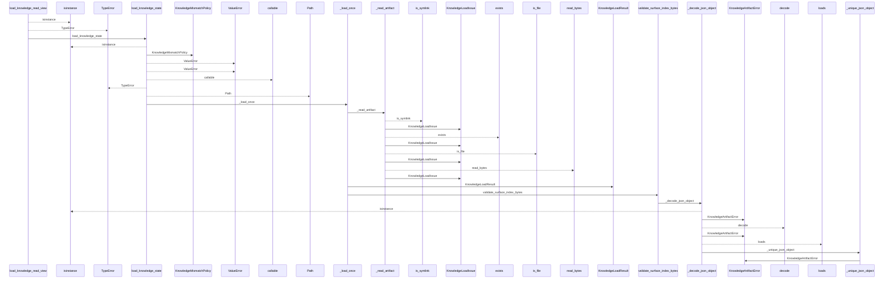
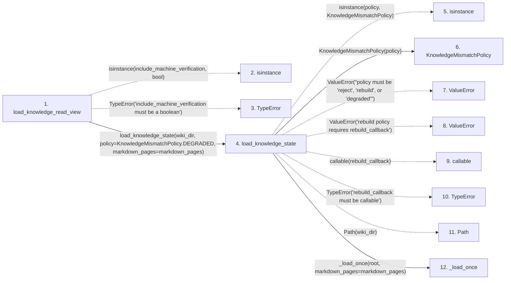

# load_knowledge_read_view

**Entry point:** `load_knowledge_read_view` (`api`)
**Source:** [knowledge_consumption](../modules/knowledge_consumption.md)
**Modules touched:** [infrastructure_sync](../modules/infrastructure_sync.md), [io](../modules/io.md), [knowledge_artifacts](../modules/knowledge_artifacts.md), [knowledge_consumption](../modules/knowledge_consumption.md), and 14 more

**Complete modules touched:**

- [infrastructure_sync](../modules/infrastructure_sync.md)
- [io](../modules/io.md)
- [knowledge_artifacts](../modules/knowledge_artifacts.md)
- [knowledge_consumption](../modules/knowledge_consumption.md)
- [knowledge_envelope](../modules/knowledge_envelope.md)
- [knowledge_evidence](../modules/knowledge_evidence.md)
- [knowledge_freshness](../modules/knowledge_freshness.md)
- [knowledge_governance](../modules/knowledge_governance.md)
- [knowledge_graph](../modules/knowledge_graph.md)
- [knowledge_index](../modules/knowledge_index.md)
- [knowledge_loader](../modules/knowledge_loader.md)
- [knowledge_model](../modules/knowledge_model.md)
- [knowledge_verification](../modules/knowledge_verification.md)
- [markdown_sections](../modules/markdown_sections.md)
- [section_ownership](../modules/section_ownership.md)
- [validation](../modules/validation.md)
- [verification_contracts](../modules/verification_contracts.md)
- [wiki_surface](../modules/wiki_surface.md)

## Call sequence

<!-- Auto-generated from static call edges. Dashed arrows are external or unresolved calls. Reviewed runtime conditions and side effects belong in Behavior. -->

> Call sequence diagram shows 30 of 1117 interactions; 1087 omitted to keep the visualization within the 30-interaction and generated-diagram limits.

> Trace truncated at the depth limit; deeper calls are omitted.

## Data flow

<!-- Auto-generated static analysis. Treat values and boundaries as best-effort hints, not runtime proof. -->

### Step data

| Step | Inputs | Reads | Writes | Returns |
|---|---|---|---|---|
| `load_knowledge_read_view` | `wiki_dir: str \| Path`, `live_evaluation: LiveKnowledgeEvaluation \| None`, `snapshot_only: bool`, `mode: KnowledgeReadMode \| str \| None`, `markdown_pages: Mapping[str, str \| bytes] \| None`, `include_machine_verification: bool` | `KnowledgeMismatchPolicy`, `KnowledgeStateLoadError`, `KnowledgeLoadState` | - | `view`, `attach_machine_verification_read_view(...)` |
| `isinstance` | - | - | - | - |
| `TypeError` | - | - | - | - |
| `load_knowledge_state` | `wiki_dir: str \| Path`, `policy: KnowledgeMismatchPolicy \| str`, `rebuild_callback: RebuildCallback \| None`, `markdown_pages: Mapping[str, str \| bytes] \| None` | `KnowledgeMismatchPolicy`, `KnowledgeMismatchPolicy`, `KnowledgeLoadState`, `KnowledgeMismatchPolicy`, `KnowledgeLoadState`, `KnowledgeMismatchPolicy`, `KnowledgeLoadState` | - | `result`, `replace(...)`, `KnowledgeLoadResult(...)` |
| `isinstance` | - | - | - | - |
| `KnowledgeMismatchPolicy` | - | - | - | - |
| `ValueError` | - | - | - | - |
| `ValueError` | - | - | - | - |
| `callable` | - | - | - | - |
| `TypeError` | - | - | - | - |
| `Path` | - | - | - | - |
| `_load_once` | `root: Path`, `markdown_pages: Mapping[str, str \| bytes] \| None` | `SURFACE_INDEX_FILENAME`, `KnowledgeLoadState`, `KnowledgeArtifactError`, `SURFACE_INDEX_FILENAME`, `KnowledgeLoadState`, `KnowledgeEnvelopeError`, `SURFACE_INDEX_FILENAME`, `KnowledgeLoadState` | - | `(...)`, `(...)`, `(...)`, `(...)`, `(...)`, `(...)`, `(...)`, `(...)` |

### Call data

| From | To | Line | Call |
|---|---|---:|---|
| load_knowledge_read_view | isinstance | 677 | `isinstance(include_machine_verification, bool)` |
| load_knowledge_read_view | TypeError | 678 | `TypeError('include_machine_verification must be a boolean')` |
| load_knowledge_read_view | load_knowledge_state | 680 | `load_knowledge_state(wiki_dir, policy=KnowledgeMismatchPolicy.DEGRADED, markdown_pages=markdown_pages)` |
| load_knowledge_state | isinstance | 105 | `isinstance(policy, KnowledgeMismatchPolicy)` |
| load_knowledge_state | KnowledgeMismatchPolicy | 106 | `KnowledgeMismatchPolicy(policy)` |
| load_knowledge_state | ValueError | 109 | `ValueError("policy must be 'reject', 'rebuild', or 'degraded'")` |
| load_knowledge_state | ValueError | 111 | `ValueError('rebuild policy requires rebuild_callback')` |
| load_knowledge_state | callable | 112 | `callable(rebuild_callback)` |
| load_knowledge_state | TypeError | 113 | `TypeError('rebuild_callback must be callable')` |
| load_knowledge_state | Path | 115 | `Path(wiki_dir)` |
| load_knowledge_state | _load_once | 116 | `_load_once(root, markdown_pages=markdown_pages)` |

### Boundary effects

*No boundary effects detected.*

### Static analysis gaps

| Kind | Step | Target | Line |
|---|---|---|---:|
| unresolved_call | `load_knowledge_read_view` | `isinstance` | 677 |
| unresolved_call | `load_knowledge_read_view` | `TypeError` | 678 |
| unresolved_call | `load_knowledge_state` | `isinstance` | 105 |
| unresolved_call | `load_knowledge_state` | `ValueError` | 109 |
| unresolved_call | `load_knowledge_state` | `ValueError` | 111 |
| unresolved_call | `load_knowledge_state` | `callable` | 112 |
| unresolved_call | `load_knowledge_state` | `TypeError` | 113 |
| step_limit | `load_knowledge_read_view` | `first 12 steps` | 0 |
| truncated_flow | `load_knowledge_read_view` | `depth limit` | 0 |

## Behavior

This flow starts at `load_knowledge_read_view` and is classified as `api`. The generated call and data-flow sections are bounded static projections; runtime conditions and side effects require source-level confirmation.
