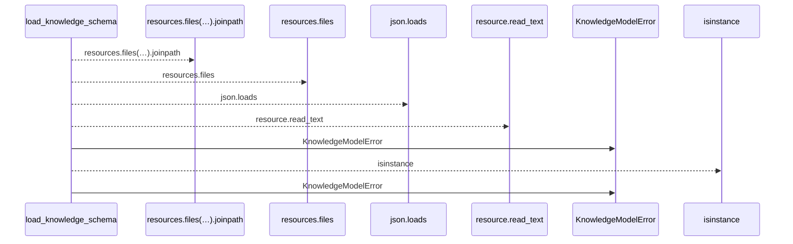
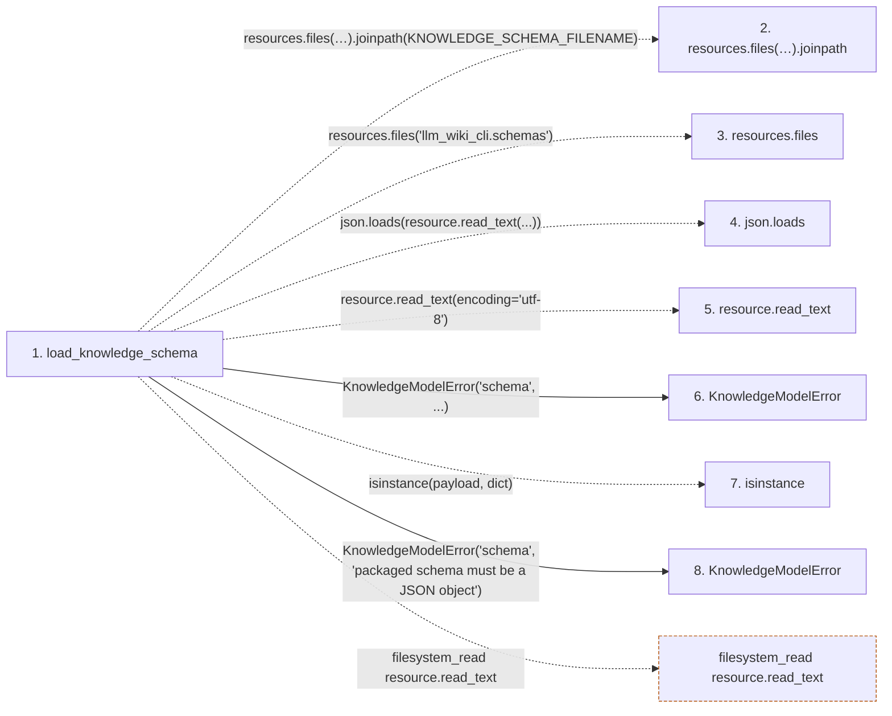

# load_knowledge_schema

**Entry point:** `load_knowledge_schema` (`api`)
**Source:** [knowledge_model](../modules/knowledge_model.md)
**Modules touched:** [knowledge_model](../modules/knowledge_model.md)

## Call sequence

<!-- Auto-generated from static call edges. Dashed arrows are external or unresolved calls. Reviewed runtime conditions and side effects belong in Behavior. -->

## Data flow

<!-- Auto-generated static analysis. Treat values and boundaries as best-effort hints, not runtime proof. -->

### Step data

| Step | Inputs | Reads | Writes | Returns |
|---|---|---|---|---|
| `load_knowledge_schema` | - | `KNOWLEDGE_SCHEMA_FILENAME`, `json`, `KNOWLEDGE_SCHEMA_FILENAME` | - | `payload` |
| `resources.files(…).joinpath` | - | - | - | - |
| `resources.files` | - | - | - | - |
| `json.loads` | - | - | - | - |
| `resource.read_text` | - | - | - | - |
| `KnowledgeModelError` | - | - | - | - |
| `isinstance` | - | - | - | - |
| `KnowledgeModelError` | - | - | - | - |

### Call data

| From | To | Line | Call |
|---|---|---:|---|
| load_knowledge_schema | resources.files(…).joinpath | 706 | `resources.files('llm_wiki_cli.schemas').joinpath(KNOWLEDGE_SCHEMA_FILENAME)` |
| load_knowledge_schema | resources.files | 706 | `resources.files('llm_wiki_cli.schemas')` |
| load_knowledge_schema | json.loads | 709 | `json.loads(resource.read_text(...))` |
| load_knowledge_schema | resource.read_text | 709 | `resource.read_text(encoding='utf-8')` |
| load_knowledge_schema | KnowledgeModelError | 717 | `KnowledgeModelError('schema', ...)` |
| load_knowledge_schema | isinstance | 720 | `isinstance(payload, dict)` |
| load_knowledge_schema | KnowledgeModelError | 721 | `KnowledgeModelError('schema', 'packaged schema must be a JSON object')` |

### Boundary effects

| Kind | Target | Step | Line |
|---|---|---|---:|
| filesystem_read | `resource.read_text` | `load_knowledge_schema` | 709 |

### Static analysis gaps

| Kind | Step | Target | Line |
|---|---|---|---:|
| unresolved_call | `load_knowledge_schema` | `resources.files('llm_wiki_cli.schemas').joinpath` | 706 |
| external_call | `load_knowledge_schema` | `resources.files` | 706 |
| external_call | `load_knowledge_schema` | `isinstance` | 720 |

## Behavior

This flow starts at `load_knowledge_schema` and is classified as `api`. The generated call and data-flow sections are bounded static projections; runtime conditions and side effects require source-level confirmation.
