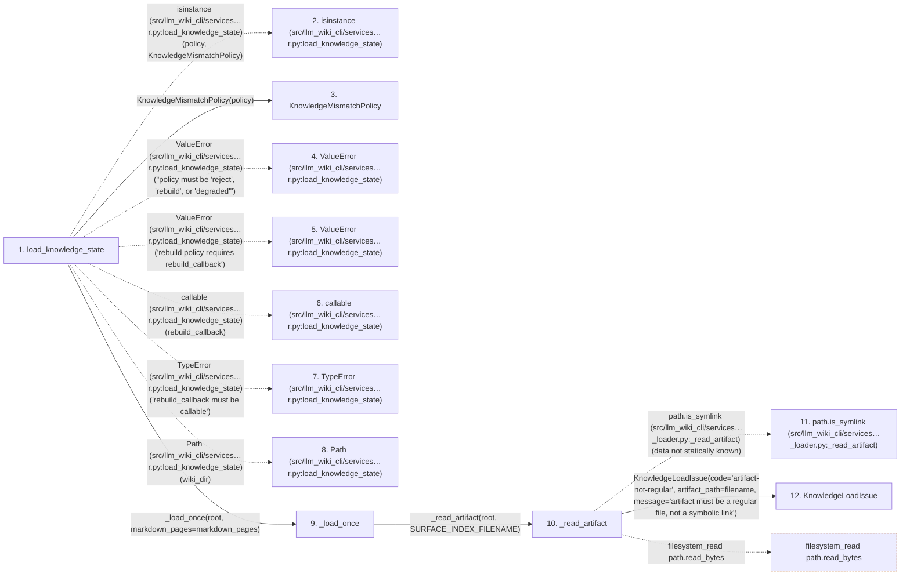

# load_knowledge_state

**Entry point:** `load_knowledge_state` (`api`)
**Source:** [knowledge_loader](../modules/knowledge_loader.md)
**Modules touched:** [concept_identity](../modules/concept_identity.md), [immutable](../modules/immutable.md), [infrastructure_sync](../modules/infrastructure_sync.md), [io](../modules/io.md), and 15 more

**Complete modules touched:**

- [concept_identity](../modules/concept_identity.md)
- [immutable](../modules/immutable.md)
- [infrastructure_sync](../modules/infrastructure_sync.md)
- [io](../modules/io.md)
- [knowledge_artifacts](../modules/knowledge_artifacts.md)
- [knowledge_envelope](../modules/knowledge_envelope.md)
- [knowledge_evidence](../modules/knowledge_evidence.md)
- [knowledge_governance](../modules/knowledge_governance.md)
- [knowledge_graph](../modules/knowledge_graph.md)
- [knowledge_index](../modules/knowledge_index.md)
- [knowledge_loader](../modules/knowledge_loader.md)
- [knowledge_model](../modules/knowledge_model.md)
- [knowledge_reuse](../modules/knowledge_reuse.md)
- [markdown_sections](../modules/markdown_sections.md)
- [progress](../modules/progress.md)
- [section_ownership](../modules/section_ownership.md)
- [sync_manifest](../modules/sync_manifest.md)
- [validation](../modules/validation.md)
- [wiki_surface](../modules/wiki_surface.md)

## Call sequence

```mermaid
sequenceDiagram
    participant p0 as load_knowledge_state
    participant p1 as isinstance (src/llm_wiki_cli/services…r.py:load_knowledge_state)
    participant p2 as KnowledgeMismatchPolicy
    participant p3 as ValueError (src/llm_wiki_cli/services…r.py:load_knowledge_state)
    participant p4 as callable (src/llm_wiki_cli/services…r.py:load_knowledge_state)
    participant p5 as TypeError (src/llm_wiki_cli/services…r.py:load_knowledge_state)
    participant p6 as Path (src/llm_wiki_cli/services…r.py:load_knowledge_state)
    participant p7 as _load_once
    participant p8 as _read_artifact
    participant p9 as path.is_symlink (src/llm_wiki_cli/services…_loader.py:_read_artifact)
    participant p10 as KnowledgeLoadIssue
    participant p11 as path.exists (src/llm_wiki_cli/services…_loader.py:_read_artifact)
    participant p12 as path.is_file (src/llm_wiki_cli/services…_loader.py:_read_artifact)
    participant p13 as path.read_bytes (src/llm_wiki_cli/services…_loader.py:_read_artifact)
    participant p14 as KnowledgeLoadResult
    participant p15 as validate_surface_index_bytes
    participant p16 as _decode_json_object
    participant p17 as isinstance (src/llm_wiki_cli/services…ts.py:_decode_json_object)
    participant p18 as KnowledgeArtifactError
    participant p19 as content.decode (src/llm_wiki_cli/services…ts.py:_decode_json_object)
    participant p20 as json.loads (src/llm_wiki_cli/services…ts.py:_decode_json_object)
    participant p21 as _unique_json_object
    participant p22 as _reject_json_constant
    p0-->>p1: isinstance (src/llm_wiki_cli/services…r.py:load_knowledge_state)
    p0->>p2: KnowledgeMismatchPolicy
    p0-->>p3: ValueError (src/llm_wiki_cli/services…r.py:load_knowledge_state)
    p0-->>p3: ValueError (src/llm_wiki_cli/services…r.py:load_knowledge_state)
    p0-->>p4: callable (src/llm_wiki_cli/services…r.py:load_knowledge_state)
    p0-->>p5: TypeError (src/llm_wiki_cli/services…r.py:load_knowledge_state)
    p0-->>p6: Path (src/llm_wiki_cli/services…r.py:load_knowledge_state)
    p0->>p7: _load_once
    p7->>p8: _read_artifact
    p8-->>p9: path.is_symlink (src/llm_wiki_cli/services…_loader.py:_read_artifact)
    p8->>p10: KnowledgeLoadIssue
    p8-->>p11: path.exists (src/llm_wiki_cli/services…_loader.py:_read_artifact)
    p8->>p10: KnowledgeLoadIssue
    p8-->>p12: path.is_file (src/llm_wiki_cli/services…_loader.py:_read_artifact)
    p8->>p10: KnowledgeLoadIssue
    p8-->>p13: path.read_bytes (src/llm_wiki_cli/services…_loader.py:_read_artifact)
    p8->>p10: KnowledgeLoadIssue
    p7->>p14: KnowledgeLoadResult
    p7->>p15: validate_surface_index_bytes
    p15->>p16: _decode_json_object
    p16-->>p17: isinstance (src/llm_wiki_cli/services…ts.py:_decode_json_object)
    p16->>p18: KnowledgeArtifactError
    p16-->>p19: content.decode (src/llm_wiki_cli/services…ts.py:_decode_json_object)
    p16->>p18: KnowledgeArtifactError
    p16-->>p20: json.loads (src/llm_wiki_cli/services…ts.py:_decode_json_object)
    p16->>p21: _unique_json_object
    p21->>p18: KnowledgeArtifactError
    p16->>p22: _reject_json_constant
    p22->>p18: KnowledgeArtifactError
    p16-->>p17: isinstance (src/llm_wiki_cli/services…ts.py:_decode_json_object)
```

<!-- Auto-generated from static call edges. Dashed arrows are external or unresolved calls. Reviewed runtime conditions and side effects belong in Behavior. -->

> Call sequence diagram shows 30 of 1372 interactions; 1342 omitted to keep the visualization within the 30-interaction and generated-diagram limits.

> Trace truncated at the depth limit; deeper calls are omitted.

## Data flow

<!-- Auto-generated static analysis. Treat values and boundaries as best-effort hints, not runtime proof. -->

### Step data

| Step | Inputs | Reads | Writes | Returns |
|---|---|---|---|---|
| `load_knowledge_state` | `wiki_dir: str \| Path`, `policy: KnowledgeMismatchPolicy \| str`, `rebuild_callback: RebuildCallback \| None`, `markdown_pages: Mapping[str, str \| bytes] \| None` | `KnowledgeMismatchPolicy`, `KnowledgeMismatchPolicy`, `KnowledgeLoadState`, `KnowledgeMismatchPolicy`, `KnowledgeLoadState`, `KnowledgeMismatchPolicy`, `KnowledgeLoadState` | - | `result`, `replace(...)`, `KnowledgeLoadResult(...)` |
| `isinstance (src/llm_wiki_cli/services…r.py:load_knowledge_state)` | - | - | - | - |
| `KnowledgeMismatchPolicy` | - | - | - | - |
| `ValueError (src/llm_wiki_cli/services…r.py:load_knowledge_state)` | - | - | - | - |
| `ValueError (src/llm_wiki_cli/services…r.py:load_knowledge_state)` | - | - | - | - |
| `callable (src/llm_wiki_cli/services…r.py:load_knowledge_state)` | - | - | - | - |
| `TypeError (src/llm_wiki_cli/services…r.py:load_knowledge_state)` | - | - | - | - |
| `Path (src/llm_wiki_cli/services…r.py:load_knowledge_state)` | - | - | - | - |
| `_load_once` | `root: Path`, `markdown_pages: Mapping[str, str \| bytes] \| None` | `SURFACE_INDEX_FILENAME`, `KnowledgeLoadState`, `KnowledgeArtifactError`, `SURFACE_INDEX_FILENAME`, `KnowledgeLoadState`, `WikiSurfacePathError`, `KnowledgeEnvelopeError`, `SURFACE_INDEX_FILENAME` | - | `(...)`, `(...)`, `(...)`, `(...)`, `(...)`, `(...)`, `(...)`, `(...)` |
| `_read_artifact` | `root: Path`, `filename: str`, `absent_is_issue: bool` | - | - | `(...)`, `(...)`, `(...)`, `(...)`, `(...)`, `(...)` |
| `path.is_symlink (src/llm_wiki_cli/services…_loader.py:_read_artifact)` | - | - | - | - |
| `KnowledgeLoadIssue` | - | - | - | - |

### Call data

| From | To | Line | Call |
|---|---|---:|---|
| load_knowledge_state | isinstance (src/llm_wiki_cli/services…r.py:load_knowledge_state) | 112 | `isinstance(policy, KnowledgeMismatchPolicy)` |
| load_knowledge_state | KnowledgeMismatchPolicy | 113 | `KnowledgeMismatchPolicy(policy)` |
| load_knowledge_state | ValueError (src/llm_wiki_cli/services…r.py:load_knowledge_state) | 116 | `ValueError("policy must be 'reject', 'rebuild', or 'degraded'")` |
| load_knowledge_state | ValueError (src/llm_wiki_cli/services…r.py:load_knowledge_state) | 118 | `ValueError('rebuild policy requires rebuild_callback')` |
| load_knowledge_state | callable (src/llm_wiki_cli/services…r.py:load_knowledge_state) | 119 | `callable(rebuild_callback)` |
| load_knowledge_state | TypeError (src/llm_wiki_cli/services…r.py:load_knowledge_state) | 120 | `TypeError('rebuild_callback must be callable')` |
| load_knowledge_state | Path (src/llm_wiki_cli/services…r.py:load_knowledge_state) | 122 | `Path(wiki_dir)` |
| load_knowledge_state | _load_once | 123 | `_load_once(root, markdown_pages=markdown_pages)` |
| _load_once | _read_artifact | 156 | `_read_artifact(root, SURFACE_INDEX_FILENAME)` |
| _read_artifact | path.is_symlink (src/llm_wiki_cli/services…_loader.py:_read_artifact) | 483 | `path.is_symlink(data not statically known)` |
| _read_artifact | KnowledgeLoadIssue | 484 | `KnowledgeLoadIssue(code='artifact-not-regular', artifact_path=filename, message='artifact must be a regular file, not a symbolic link')` |

### Boundary effects

| Kind | Target | Step | Line |
|---|---|---|---:|
| filesystem_read | `path.read_bytes` | `_read_artifact` | 504 |

### Static analysis gaps

| Kind | Step | Target | Line |
|---|---|---|---:|
| external_call | `load_knowledge_state` | `isinstance` | 112 |
| external_call | `load_knowledge_state` | `ValueError` | 116 |
| external_call | `load_knowledge_state` | `ValueError` | 118 |
| external_call | `load_knowledge_state` | `callable` | 119 |
| external_call | `load_knowledge_state` | `TypeError` | 120 |
| unresolved_call | `_read_artifact` | `path.is_symlink` | 483 |
| step_limit | `load_knowledge_state` | `first 12 steps` | 0 |
| truncated_flow | `load_knowledge_state` | `depth limit` | 0 |

## Behavior

This flow starts at `load_knowledge_state` and is classified as `api`. The generated call and data-flow sections are bounded static projections; runtime conditions and side effects require source-level confirmation.
