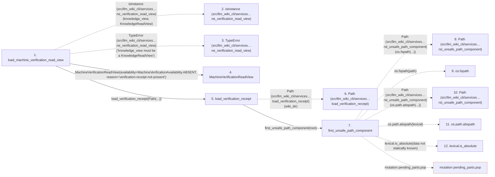

# load_machine_verification_read_view

**Entry point:** `load_machine_verification_read_view` (`api`)
**Source:** [knowledge_verification](../modules/knowledge_verification.md)
**Modules touched:** [io](../modules/io.md), [knowledge_consumption](../modules/knowledge_consumption.md), [knowledge_evidence](../modules/knowledge_evidence.md), [knowledge_verification](../modules/knowledge_verification.md), and 2 more

**Complete modules touched:**

- [io](../modules/io.md)
- [knowledge_consumption](../modules/knowledge_consumption.md)
- [knowledge_evidence](../modules/knowledge_evidence.md)
- [knowledge_verification](../modules/knowledge_verification.md)
- [validation](../modules/validation.md)
- [verification_contracts](../modules/verification_contracts.md)

## Call sequence

```mermaid
sequenceDiagram
    participant p0 as load_machine_verification_read_view
    participant p1 as isinstance (src/llm_wiki_cli/services…ne_verification_read_view)
    participant p2 as TypeError (src/llm_wiki_cli/services…ne_verification_read_view)
    participant p3 as MachineVerificationReadView
    participant p4 as load_verification_receipt
    participant p5 as Path (src/llm_wiki_cli/services…load_verification_receipt)
    participant p6 as first_unsafe_path_component
    participant p7 as Path (src/llm_wiki_cli/services…rst_unsafe_path_component)
    participant p8 as os.fspath
    participant p9 as os.path.abspath
    participant p10 as lexical.is_absolute
    participant p11 as Path.cwd
    participant p12 as list (src/llm_wiki_cli/services…rst_unsafe_path_component)
    participant p13 as pending_parts.pop
    participant p14 as current.lstat
    participant p15 as getattr (src/llm_wiki_cli/services…rst_unsafe_path_component)
    participant p16 as stat.S_ISLNK (src/llm_wiki_cli/services…rst_unsafe_path_component)
    participant p17 as bool (src/llm_wiki_cli/services…rst_unsafe_path_component)
    participant p18 as trusted_symlink_owner
    participant p19 as callable
    participant p20 as os.readlink
    participant p21 as link_target.is_absolute
    p0-->>p1: isinstance (src/llm_wiki_cli/services…ne_verification_read_view)
    p0-->>p2: TypeError (src/llm_wiki_cli/services…ne_verification_read_view)
    p0->>p3: MachineVerificationReadView
    p0->>p4: load_verification_receipt
    p4-->>p5: Path (src/llm_wiki_cli/services…load_verification_receipt)
    p4->>p6: first_unsafe_path_component
    p6-->>p7: Path (src/llm_wiki_cli/services…rst_unsafe_path_component)
    p6-->>p8: os.fspath
    p6-->>p7: Path (src/llm_wiki_cli/services…rst_unsafe_path_component)
    p6-->>p9: os.path.abspath
    p6-->>p10: lexical.is_absolute
    p6-->>p11: Path.cwd
    p6-->>p7: Path (src/llm_wiki_cli/services…rst_unsafe_path_component)
    p6-->>p12: list (src/llm_wiki_cli/services…rst_unsafe_path_component)
    p6-->>p13: pending_parts.pop
    p6-->>p14: current.lstat
    p6-->>p15: getattr (src/llm_wiki_cli/services…rst_unsafe_path_component)
    p6-->>p15: getattr (src/llm_wiki_cli/services…rst_unsafe_path_component)
    p6-->>p16: stat.S_ISLNK (src/llm_wiki_cli/services…rst_unsafe_path_component)
    p6-->>p17: bool (src/llm_wiki_cli/services…rst_unsafe_path_component)
    p6-->>p17: bool (src/llm_wiki_cli/services…rst_unsafe_path_component)
    p6-->>p15: getattr (src/llm_wiki_cli/services…rst_unsafe_path_component)
    p6-->>p18: trusted_symlink_owner
    p6-->>p19: callable
    p6-->>p15: getattr (src/llm_wiki_cli/services…rst_unsafe_path_component)
    p6-->>p7: Path (src/llm_wiki_cli/services…rst_unsafe_path_component)
    p6-->>p7: Path (src/llm_wiki_cli/services…rst_unsafe_path_component)
    p6-->>p20: os.readlink
    p6-->>p21: link_target.is_absolute
    p6-->>p7: Path (src/llm_wiki_cli/services…rst_unsafe_path_component)
```

<!-- Auto-generated from static call edges. Dashed arrows are external or unresolved calls. Reviewed runtime conditions and side effects belong in Behavior. -->

> Call sequence diagram shows 30 of 272 interactions; 242 omitted to keep the visualization within the 30-interaction and generated-diagram limits.

> Trace truncated at the depth limit; deeper calls are omitted.

## Data flow

<!-- Auto-generated static analysis. Treat values and boundaries as best-effort hints, not runtime proof. -->

### Step data

| Step | Inputs | Reads | Writes | Returns |
|---|---|---|---|---|
| `load_machine_verification_read_view` | `wiki_dir: str \| Path`, `knowledge_view: KnowledgeReadView` | `KnowledgeReadView`, `MachineVerificationAvailability`, `MachineVerificationAvailability`, `MachineVerificationAvailability`, `GOVERNANCE_EXTENSION_KEY`, `Mapping`, `MachineVerificationAvailability` | - | `MachineVerificationReadView(...)`, `MachineVerificationReadView(...)`, `MachineVerificationReadView(...)`, `MachineVerificationReadView(...)` |
| `isinstance (src/llm_wiki_cli/services…ne_verification_read_view)` | - | - | - | - |
| `TypeError (src/llm_wiki_cli/services…ne_verification_read_view)` | - | - | - | - |
| `MachineVerificationReadView` | - | - | - | - |
| `load_verification_receipt` | `wiki_dir: str \| Path`, `missing_ok: bool` | - | - | `None`, `deserialize_verification_receipt(...)` |
| `Path (src/llm_wiki_cli/services…load_verification_receipt)` | - | - | - | - |
| `first_unsafe_path_component` | `path: str \| Path`, `trusted_symlink_uids: Set[int] \| None`, `trusted_symlink_owner: Callable[[Path], bool] \| None` | `stat`, `os` | - | `lexical`, `None`, `current`, `current`, `current`, `current`, `current`, `None` |
| `Path (src/llm_wiki_cli/services…rst_unsafe_path_component)` | - | - | - | - |
| `os.fspath` | - | - | - | - |
| `Path (src/llm_wiki_cli/services…rst_unsafe_path_component)` | - | - | - | - |
| `os.path.abspath` | - | - | - | - |
| `lexical.is_absolute` | - | - | - | - |

### Call data

| From | To | Line | Call |
|---|---|---:|---|
| load_machine_verification_read_view | isinstance (src/llm_wiki_cli/services…ne_verification_read_view) | 75 | `isinstance(knowledge_view, KnowledgeReadView)` |
| load_machine_verification_read_view | TypeError (src/llm_wiki_cli/services…ne_verification_read_view) | 76 | `TypeError('knowledge_view must be a KnowledgeReadView')` |
| load_machine_verification_read_view | MachineVerificationReadView | 80 | `MachineVerificationReadView(availability=MachineVerificationAvailability.ABSENT, reason='verification-receipt-not-present')` |
| load_machine_verification_read_view | load_verification_receipt | 86 | `load_verification_receipt(Path(...))` |
| load_verification_receipt | Path (src/llm_wiki_cli/services…load_verification_receipt) | 956 | `Path(wiki_dir)` |
| load_verification_receipt | first_unsafe_path_component | 957 | `first_unsafe_path_component(root)` |
| first_unsafe_path_component | Path (src/llm_wiki_cli/services…rst_unsafe_path_component) | 50 | `Path(os.fspath(...))` |
| first_unsafe_path_component | os.fspath | 50 | `os.fspath(path)` |
| first_unsafe_path_component | Path (src/llm_wiki_cli/services…rst_unsafe_path_component) | 58 | `Path(os.path.abspath(...))` |
| first_unsafe_path_component | os.path.abspath | 58 | `os.path.abspath(lexical)` |
| first_unsafe_path_component | lexical.is_absolute | 59 | `lexical.is_absolute(data not statically known)` |

### Boundary effects

| Kind | Target | Step | Line |
|---|---|---|---:|
| mutation | `pending_parts.pop` | `first_unsafe_path_component` | 70 |

### Static analysis gaps

| Kind | Step | Target | Line |
|---|---|---|---:|
| external_call | `load_machine_verification_read_view` | `isinstance` | 75 |
| external_call | `load_machine_verification_read_view` | `TypeError` | 76 |
| external_call | `first_unsafe_path_component` | `os.fspath` | 50 |
| external_call | `first_unsafe_path_component` | `os.path.abspath` | 58 |
| unresolved_call | `first_unsafe_path_component` | `lexical.is_absolute` | 59 |
| step_limit | `load_machine_verification_read_view` | `first 12 steps` | 0 |
| truncated_flow | `load_machine_verification_read_view` | `depth limit` | 0 |

## Behavior

This flow starts at `load_machine_verification_read_view` and is classified as `api`. The generated call and data-flow sections are bounded static projections; runtime conditions and side effects require source-level confirmation.
