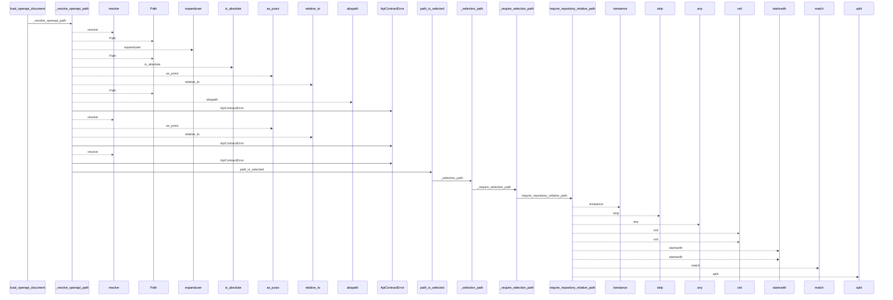
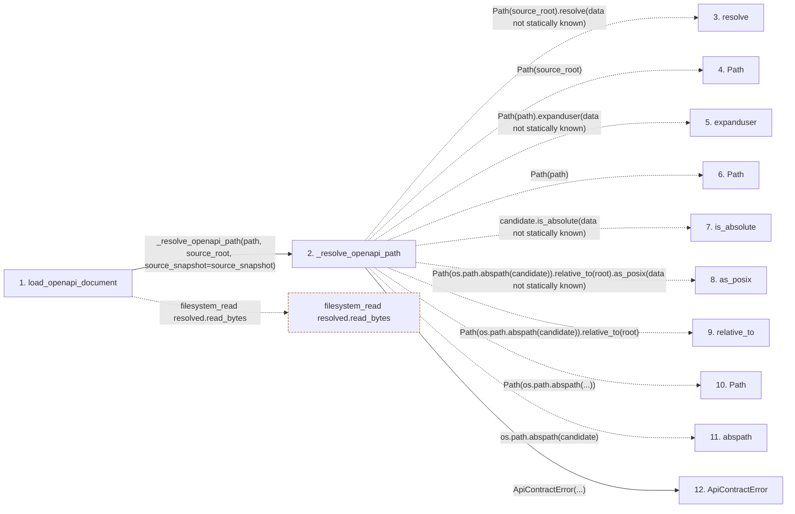

# load_openapi_document

**Entry point:** `load_openapi_document` (`api`)
**Source:** [api_contracts](../modules/api_contracts.md)
**Modules touched:** [api_contracts](../modules/api_contracts.md), [source_selection](../modules/source_selection.md), [validation](../modules/validation.md)

## Call sequence

<!-- Auto-generated from static call edges. Dashed arrows are external or unresolved calls. Reviewed runtime conditions and side effects belong in Behavior. -->

> Call sequence diagram shows 30 of 95 interactions; 65 omitted to keep the visualization within the 30-interaction and generated-diagram limits.

> Trace truncated at the depth limit; deeper calls are omitted.

## Data flow

<!-- Auto-generated static analysis. Treat values and boundaries as best-effort hints, not runtime proof. -->

### Step data

| Step | Inputs | Reads | Writes | Returns |
|---|---|---|---|---|
| `load_openapi_document` | `path: str \| Path`, `source_root: str \| Path`, `source_snapshot: SourceSnapshot \| None` | `_OPENAPI_INPUT_LIMIT`, `json`, `json`, `yaml`, `Mapping`, `Mapping` | - | `{...}` |
| `_resolve_openapi_path` | `path: str \| Path`, `source_root: str \| Path`, `source_snapshot: SourceSnapshot \| None` | `SourceSelectionError` | - | `(...)` |
| `resolve` | - | - | - | - |
| `Path` | - | - | - | - |
| `expanduser` | - | - | - | - |
| `Path` | - | - | - | - |
| `is_absolute` | - | - | - | - |
| `as_posix` | - | - | - | - |
| `relative_to` | - | - | - | - |
| `Path` | - | - | - | - |
| `abspath` | - | - | - | - |
| `ApiContractError` | - | - | - | - |

### Call data

| From | To | Line | Call |
|---|---|---:|---|
| load_openapi_document | _resolve_openapi_path | 1258 | `_resolve_openapi_path(path, source_root, source_snapshot=source_snapshot)` |
| _resolve_openapi_path | resolve | 1186 | `Path(source_root).resolve(data not statically known)` |
| _resolve_openapi_path | Path | 1186 | `Path(source_root)` |
| _resolve_openapi_path | expanduser | 1187 | `Path(path).expanduser(data not statically known)` |
| _resolve_openapi_path | Path | 1187 | `Path(path)` |
| _resolve_openapi_path | is_absolute | 1188 | `candidate.is_absolute(data not statically known)` |
| _resolve_openapi_path | as_posix | 1191 | `Path(os.path.abspath(candidate)).relative_to(root).as_posix(data not statically known)` |
| _resolve_openapi_path | relative_to | 1191 | `Path(os.path.abspath(candidate)).relative_to(root)` |
| _resolve_openapi_path | Path | 1191 | `Path(os.path.abspath(...))` |
| _resolve_openapi_path | abspath | 1191 | `os.path.abspath(candidate)` |
| _resolve_openapi_path | ApiContractError | 1193 | `ApiContractError(...)` |

### Boundary effects

| Kind | Target | Step | Line |
|---|---|---|---:|
| filesystem_read | `resolved.read_bytes` | `load_openapi_document` | 1265 |

### Static analysis gaps

| Kind | Step | Target | Line |
|---|---|---|---:|
| unresolved_call | `_resolve_openapi_path` | `Path(source_root).resolve` | 1186 |
| unresolved_call | `_resolve_openapi_path` | `Path(path).expanduser` | 1187 |
| unresolved_call | `_resolve_openapi_path` | `candidate.is_absolute` | 1188 |
| unresolved_call | `_resolve_openapi_path` | `Path(os.path.abspath(candidate)).relative_to(root).as_posix` | 1191 |
| unresolved_call | `_resolve_openapi_path` | `Path(os.path.abspath(candidate)).relative_to` | 1191 |
| external_call | `_resolve_openapi_path` | `os.path.abspath` | 1191 |
| step_limit | `load_openapi_document` | `first 12 steps` | 0 |
| truncated_flow | `load_openapi_document` | `depth limit` | 0 |

## Behavior

This flow starts at `load_openapi_document` and is classified as `api`. The generated call and data-flow sections are bounded static projections; runtime conditions and side effects require source-level confirmation.
