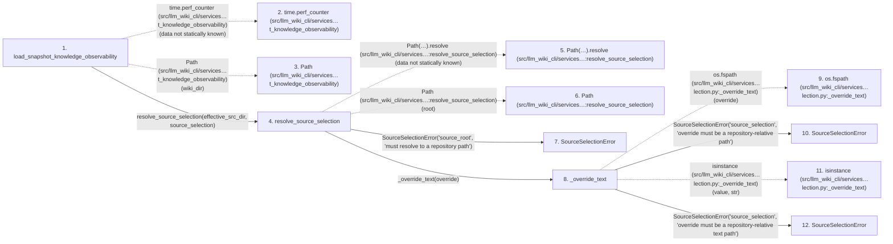

# load_snapshot_knowledge_observability

**Entry point:** `load_snapshot_knowledge_observability` (`api`)
**Source:** [knowledge_observability](../modules/knowledge_observability.md)
**Modules touched:** [common](../modules/common.md), [config](../modules/config.md), [immutable](../modules/immutable.md), [infrastructure_sync](../modules/infrastructure_sync.md), and 23 more

**Complete modules touched:**

- [common](../modules/common.md)
- [config](../modules/config.md)
- [immutable](../modules/immutable.md)
- [infrastructure_sync](../modules/infrastructure_sync.md)
- [io](../modules/io.md)
- [knowledge_artifacts](../modules/knowledge_artifacts.md)
- [knowledge_consumption](../modules/knowledge_consumption.md)
- [knowledge_envelope](../modules/knowledge_envelope.md)
- [knowledge_evidence](../modules/knowledge_evidence.md)
- [knowledge_freshness](../modules/knowledge_freshness.md)
- [knowledge_governance](../modules/knowledge_governance.md)
- [knowledge_graph](../modules/knowledge_graph.md)
- [knowledge_index](../modules/knowledge_index.md)
- [knowledge_loader](../modules/knowledge_loader.md)
- [knowledge_model](../modules/knowledge_model.md)
- [knowledge_observability](../modules/knowledge_observability.md)
- [knowledge_reuse](../modules/knowledge_reuse.md)
- [markdown_sections](../modules/markdown_sections.md)
- [paths](../modules/paths.md)
- [section_ownership](../modules/section_ownership.md)
- [source_selection](../modules/source_selection.md)
- [source_snapshot](../modules/source_snapshot.md)
- [sync_manifest](../modules/sync_manifest.md)
- [validation](../modules/validation.md)
- [wiki_media](../modules/wiki_media.md)
- [wiki_surface](../modules/wiki_surface.md)
- [wiki_surface_index](../modules/wiki_surface_index.md)

## Call sequence

```mermaid
sequenceDiagram
    participant p0 as load_snapshot_knowledge_observability
    participant p1 as time.perf_counter (src/llm_wiki_cli/services…t_knowledge_observability)
    participant p2 as Path (src/llm_wiki_cli/services…t_knowledge_observability)
    participant p3 as resolve_source_selection
    participant p4 as Path(…).resolve (src/llm_wiki_cli/services…:resolve_source_selection)
    participant p5 as Path (src/llm_wiki_cli/services…:resolve_source_selection)
    participant p6 as SourceSelectionError
    participant p7 as _override_text
    participant p8 as os.fspath (src/llm_wiki_cli/services…lection.py:_override_text)
    participant p9 as isinstance (src/llm_wiki_cli/services…lection.py:_override_text)
    participant p10 as _selection_path
    participant p11 as _require_selection_path
    participant p12 as require_repository_relative_path
    participant p13 as isinstance (src/llm_wiki_cli/services…_repository_relative_path)
    participant p14 as value.strip (src/llm_wiki_cli/services…_repository_relative_path)
    participant p15 as any (src/llm_wiki_cli/services…_repository_relative_path)
    participant p16 as ord
    participant p17 as value.startswith
    participant p18 as _WINDOWS_DRIVE_PREFIX_RE.match
    participant p19 as value.split
    participant p20 as PurePosixPath
    participant p21 as posixpath.normpath (src/llm_wiki_cli/services…_repository_relative_path)
    participant p22 as require_portable_relative_path
    p0-->>p1: time.perf_counter (src/llm_wiki_cli/services…t_knowledge_observability)
    p0-->>p2: Path (src/llm_wiki_cli/services…t_knowledge_observability)
    p0->>p3: resolve_source_selection
    p3-->>p4: Path(…).resolve (src/llm_wiki_cli/services…:resolve_source_selection)
    p3-->>p5: Path (src/llm_wiki_cli/services…:resolve_source_selection)
    p3->>p6: SourceSelectionError
    p3->>p7: _override_text
    p7-->>p8: os.fspath (src/llm_wiki_cli/services…lection.py:_override_text)
    p7->>p6: SourceSelectionError
    p7-->>p9: isinstance (src/llm_wiki_cli/services…lection.py:_override_text)
    p7->>p6: SourceSelectionError
    p7->>p10: _selection_path
    p10->>p11: _require_selection_path
    p11->>p12: require_repository_relative_path
    p12-->>p13: isinstance (src/llm_wiki_cli/services…_repository_relative_path)
    p12-->>p14: value.strip (src/llm_wiki_cli/services…_repository_relative_path)
    p12-->>p15: any (src/llm_wiki_cli/services…_repository_relative_path)
    p12-->>p16: ord
    p12-->>p16: ord
    p12-->>p17: value.startswith
    p12-->>p17: value.startswith
    p12-->>p18: _WINDOWS_DRIVE_PREFIX_RE.match
    p12-->>p19: value.split
    p12-->>p20: PurePosixPath
    p12-->>p15: any (src/llm_wiki_cli/services…_repository_relative_path)
    p12-->>p21: posixpath.normpath (src/llm_wiki_cli/services…_repository_relative_path)
    p12->>p22: require_portable_relative_path
    p11->>p6: SourceSelectionError
    p11->>p6: SourceSelectionError
    p11->>p6: SourceSelectionError
```

<!-- Auto-generated from static call edges. Dashed arrows are external or unresolved calls. Reviewed runtime conditions and side effects belong in Behavior. -->

> Call sequence diagram shows 30 of 1997 interactions; 1967 omitted to keep the visualization within the 30-interaction and generated-diagram limits.

> Trace truncated at the depth limit; deeper calls are omitted.

## Data flow

<!-- Auto-generated static analysis. Treat values and boundaries as best-effort hints, not runtime proof. -->

### Step data

| Step | Inputs | Reads | Writes | Returns |
|---|---|---|---|---|
| `load_snapshot_knowledge_observability` | `wiki_dir: str \| Path`, `src_dir: str \| Path \| None`, `source_selection: str \| Path \| None` | `SourceSelectionError`, `KnowledgeLoadState`, `KnowledgeMismatchPolicy`, `KnowledgeStateLoadError` | - | `_snapshot_result(...)`, `_snapshot_result(...)`, `_snapshot_result(...)`, `_snapshot_result(...)`, `_snapshot_result(...)` |
| `time.perf_counter (src/llm_wiki_cli/services…t_knowledge_observability)` | - | - | - | - |
| `Path (src/llm_wiki_cli/services…t_knowledge_observability)` | - | - | - | - |
| `resolve_source_selection` | `root: str \| Path`, `override: str \| Path \| None` | `SOURCE_SELECTION_PATH` | - | `None`, `None`, `policy` |
| `Path(…).resolve (src/llm_wiki_cli/services…:resolve_source_selection)` | - | - | - | - |
| `Path (src/llm_wiki_cli/services…:resolve_source_selection)` | - | - | - | - |
| `SourceSelectionError` | - | - | - | - |
| `_override_text` | `override: str \| Path` | - | - | `_selection_path(...)` |
| `os.fspath (src/llm_wiki_cli/services…lection.py:_override_text)` | - | - | - | - |
| `SourceSelectionError` | - | - | - | - |
| `isinstance (src/llm_wiki_cli/services…lection.py:_override_text)` | - | - | - | - |
| `SourceSelectionError` | - | - | - | - |

### Call data

| From | To | Line | Call |
|---|---|---:|---|
| load_snapshot_knowledge_observability | time.perf_counter (src/llm_wiki_cli/services…t_knowledge_observability) | 525 | `time.perf_counter(data not statically known)` |
| load_snapshot_knowledge_observability | Path (src/llm_wiki_cli/services…t_knowledge_observability) | 526 | `Path(wiki_dir)` |
| load_snapshot_knowledge_observability | resolve_source_selection | 531 | `resolve_source_selection(effective_src_dir, source_selection)` |
| resolve_source_selection | Path(…).resolve (src/llm_wiki_cli/services…:resolve_source_selection) | 606 | `Path(root).resolve(data not statically known)` |
| resolve_source_selection | Path (src/llm_wiki_cli/services…:resolve_source_selection) | 606 | `Path(root)` |
| resolve_source_selection | SourceSelectionError | 608 | `SourceSelectionError('source_root', 'must resolve to a repository path')` |
| resolve_source_selection | _override_text | 615 | `_override_text(override)` |
| _override_text | os.fspath (src/llm_wiki_cli/services…lection.py:_override_text) | 583 | `os.fspath(override)` |
| _override_text | SourceSelectionError | 585 | `SourceSelectionError('source_selection', 'override must be a repository-relative path')` |
| _override_text | isinstance (src/llm_wiki_cli/services…lection.py:_override_text) | 588 | `isinstance(value, str)` |
| _override_text | SourceSelectionError | 589 | `SourceSelectionError('source_selection', 'override must be a repository-relative text path')` |

### Boundary effects

*No boundary effects detected.*

### Static analysis gaps

| Kind | Step | Target | Line |
|---|---|---|---:|
| external_call | `load_snapshot_knowledge_observability` | `time.perf_counter` | 525 |
| unresolved_call | `resolve_source_selection` | `Path(root).resolve` | 606 |
| external_call | `_override_text` | `os.fspath` | 583 |
| external_call | `_override_text` | `isinstance` | 588 |
| step_limit | `load_snapshot_knowledge_observability` | `first 12 steps` | 0 |
| truncated_flow | `load_snapshot_knowledge_observability` | `depth limit` | 0 |

## Behavior

This flow starts at `load_snapshot_knowledge_observability` and is classified as `api`. The generated call and data-flow sections are bounded static projections; runtime conditions and side effects require source-level confirmation.
