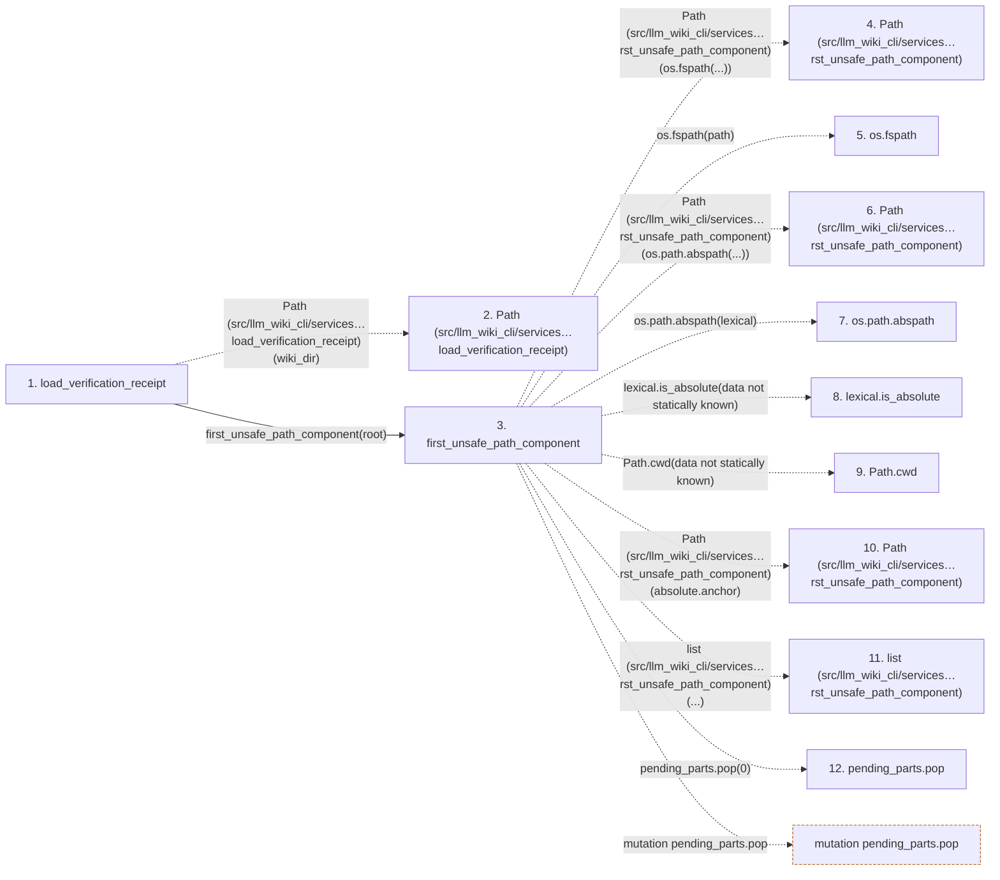

# load_verification_receipt

**Entry point:** `load_verification_receipt` (`api`)
**Source:** [verification_contracts](../modules/verification_contracts.md)
**Modules touched:** [io](../modules/io.md), [knowledge_evidence](../modules/knowledge_evidence.md), [validation](../modules/validation.md), [verification_contracts](../modules/verification_contracts.md)

## Call sequence

```mermaid
sequenceDiagram
    participant p0 as load_verification_receipt
    participant p1 as Path (src/llm_wiki_cli/services…load_verification_receipt)
    participant p2 as first_unsafe_path_component
    participant p3 as Path (src/llm_wiki_cli/services…rst_unsafe_path_component)
    participant p4 as os.fspath
    participant p5 as os.path.abspath
    participant p6 as lexical.is_absolute
    participant p7 as Path.cwd
    participant p8 as list (src/llm_wiki_cli/services…rst_unsafe_path_component)
    participant p9 as pending_parts.pop
    participant p10 as current.lstat
    participant p11 as getattr (src/llm_wiki_cli/services…rst_unsafe_path_component)
    participant p12 as stat.S_ISLNK (src/llm_wiki_cli/services…rst_unsafe_path_component)
    participant p13 as bool
    participant p14 as trusted_symlink_owner
    participant p15 as callable
    participant p16 as os.readlink
    participant p17 as link_target.is_absolute
    participant p18 as VerificationReceiptError
    participant p19 as root.is_symlink
    p0-->>p1: Path (src/llm_wiki_cli/services…load_verification_receipt)
    p0->>p2: first_unsafe_path_component
    p2-->>p3: Path (src/llm_wiki_cli/services…rst_unsafe_path_component)
    p2-->>p4: os.fspath
    p2-->>p3: Path (src/llm_wiki_cli/services…rst_unsafe_path_component)
    p2-->>p5: os.path.abspath
    p2-->>p6: lexical.is_absolute
    p2-->>p7: Path.cwd
    p2-->>p3: Path (src/llm_wiki_cli/services…rst_unsafe_path_component)
    p2-->>p8: list (src/llm_wiki_cli/services…rst_unsafe_path_component)
    p2-->>p9: pending_parts.pop
    p2-->>p10: current.lstat
    p2-->>p11: getattr (src/llm_wiki_cli/services…rst_unsafe_path_component)
    p2-->>p11: getattr (src/llm_wiki_cli/services…rst_unsafe_path_component)
    p2-->>p12: stat.S_ISLNK (src/llm_wiki_cli/services…rst_unsafe_path_component)
    p2-->>p13: bool
    p2-->>p13: bool
    p2-->>p11: getattr (src/llm_wiki_cli/services…rst_unsafe_path_component)
    p2-->>p14: trusted_symlink_owner
    p2-->>p15: callable
    p2-->>p11: getattr (src/llm_wiki_cli/services…rst_unsafe_path_component)
    p2-->>p3: Path (src/llm_wiki_cli/services…rst_unsafe_path_component)
    p2-->>p3: Path (src/llm_wiki_cli/services…rst_unsafe_path_component)
    p2-->>p16: os.readlink
    p2-->>p17: link_target.is_absolute
    p2-->>p3: Path (src/llm_wiki_cli/services…rst_unsafe_path_component)
    p2-->>p8: list (src/llm_wiki_cli/services…rst_unsafe_path_component)
    p0->>p18: VerificationReceiptError
    p0-->>p19: root.is_symlink
    p0->>p18: VerificationReceiptError
```

<!-- Auto-generated from static call edges. Dashed arrows are external or unresolved calls. Reviewed runtime conditions and side effects belong in Behavior. -->

> Call sequence diagram shows 30 of 236 interactions; 206 omitted to keep the visualization within the 30-interaction and generated-diagram limits.

> Trace truncated at the depth limit; deeper calls are omitted.

## Data flow

<!-- Auto-generated static analysis. Treat values and boundaries as best-effort hints, not runtime proof. -->

### Step data

| Step | Inputs | Reads | Writes | Returns |
|---|---|---|---|---|
| `load_verification_receipt` | `wiki_dir: str \| Path`, `missing_ok: bool` | - | - | `None`, `deserialize_verification_receipt(...)` |
| `Path (src/llm_wiki_cli/services…load_verification_receipt)` | - | - | - | - |
| `first_unsafe_path_component` | `path: str \| Path`, `trusted_symlink_uids: Set[int] \| None`, `trusted_symlink_owner: Callable[[Path], bool] \| None` | `stat`, `os` | - | `lexical`, `None`, `current`, `current`, `current`, `current`, `current`, `None` |
| `Path (src/llm_wiki_cli/services…rst_unsafe_path_component)` | - | - | - | - |
| `os.fspath` | - | - | - | - |
| `Path (src/llm_wiki_cli/services…rst_unsafe_path_component)` | - | - | - | - |
| `os.path.abspath` | - | - | - | - |
| `lexical.is_absolute` | - | - | - | - |
| `Path.cwd` | - | - | - | - |
| `Path (src/llm_wiki_cli/services…rst_unsafe_path_component)` | - | - | - | - |
| `list (src/llm_wiki_cli/services…rst_unsafe_path_component)` | - | - | - | - |
| `pending_parts.pop` | - | - | - | - |

### Call data

| From | To | Line | Call |
|---|---|---:|---|
| load_verification_receipt | Path (src/llm_wiki_cli/services…load_verification_receipt) | 956 | `Path(wiki_dir)` |
| load_verification_receipt | first_unsafe_path_component | 957 | `first_unsafe_path_component(root)` |
| first_unsafe_path_component | Path (src/llm_wiki_cli/services…rst_unsafe_path_component) | 50 | `Path(os.fspath(...))` |
| first_unsafe_path_component | os.fspath | 50 | `os.fspath(path)` |
| first_unsafe_path_component | Path (src/llm_wiki_cli/services…rst_unsafe_path_component) | 58 | `Path(os.path.abspath(...))` |
| first_unsafe_path_component | os.path.abspath | 58 | `os.path.abspath(lexical)` |
| first_unsafe_path_component | lexical.is_absolute | 59 | `lexical.is_absolute(data not statically known)` |
| first_unsafe_path_component | Path.cwd | 65 | `Path.cwd(data not statically known)` |
| first_unsafe_path_component | Path (src/llm_wiki_cli/services…rst_unsafe_path_component) | 66 | `Path(absolute.anchor)` |
| first_unsafe_path_component | list (src/llm_wiki_cli/services…rst_unsafe_path_component) | 67 | `list(...)` |
| first_unsafe_path_component | pending_parts.pop | 70 | `pending_parts.pop(0)` |

### Boundary effects

| Kind | Target | Step | Line |
|---|---|---|---:|
| mutation | `pending_parts.pop` | `first_unsafe_path_component` | 70 |

### Static analysis gaps

| Kind | Step | Target | Line |
|---|---|---|---:|
| external_call | `first_unsafe_path_component` | `os.fspath` | 50 |
| external_call | `first_unsafe_path_component` | `os.path.abspath` | 58 |
| unresolved_call | `first_unsafe_path_component` | `lexical.is_absolute` | 59 |
| external_call | `first_unsafe_path_component` | `Path.cwd` | 65 |
| step_limit | `load_verification_receipt` | `first 12 steps` | 0 |
| truncated_flow | `load_verification_receipt` | `depth limit` | 0 |

## Behavior

This flow starts at `load_verification_receipt` and is classified as `api`. The generated call and data-flow sections are bounded static projections; runtime conditions and side effects require source-level confirmation.
