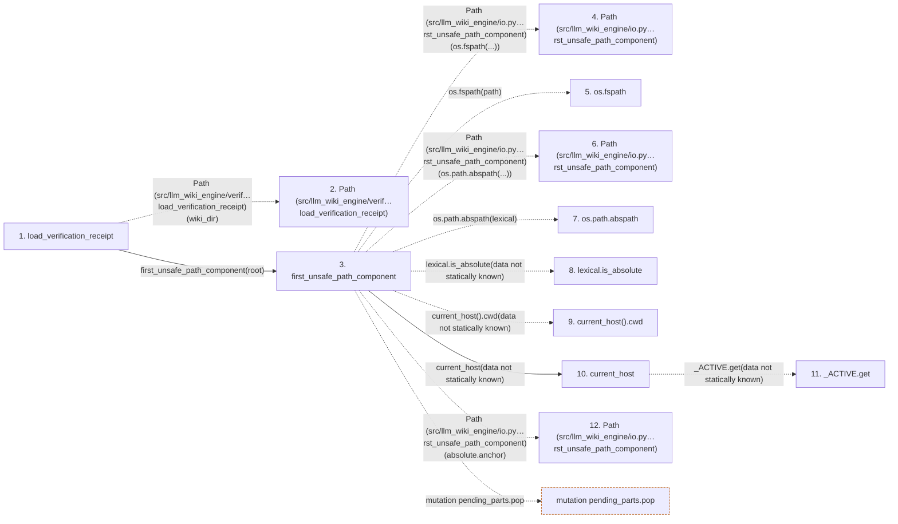

# load_verification_receipt

**Entry point:** `load_verification_receipt` (`api`)
**Source:** [verification_contracts](../modules/verification_contracts.md)
**Modules touched:** [canonical_json](../modules/canonical_json.md), [host](../modules/host.md), [io](../modules/io.md), [knowledge_evidence](../modules/knowledge_evidence.md), and 2 more

**Complete modules touched:**

- [canonical_json](../modules/canonical_json.md)
- [host](../modules/host.md)
- [io](../modules/io.md)
- [knowledge_evidence](../modules/knowledge_evidence.md)
- [validation](../modules/validation.md)
- [verification_contracts](../modules/verification_contracts.md)

## Call sequence

> Static overview in presentation order, not runtime execution order. Arrows retain captured callers; representative internal continuations and boundary examples precede repeated helper detail.

<!-- Auto-generated from static call edges. Dashed arrows are external or unresolved calls. Reviewed runtime conditions and side effects belong in Behavior. -->

```mermaid
sequenceDiagram
    participant p0 as load_verification_receipt
    participant p1 as first_unsafe_path_component
    participant p2 as _read_regular_receipt
    participant p3 as deserialize_verification_receipt
    participant p4 as VerificationReceiptError
    participant p5 as verification_receipt_path
    participant p6 as validate_verification_receipt
    participant p7 as serialize_verification_receipt
    participant p8 as formatted_json_bytes
    participant p9 as verification_receipt_to_payload
    participant p10 as _object
    participant p11 as _exact_fields
    participant p12 as _string
    participant p13 as _receipt_hash
    participant p14 as _scope_uid
    participant p15 as _receipt_anchor_mapping
    participant p16 as hash_json
    participant p17 as _parse_check
    participant p18 as require_mapping
    participant p19 as require_string
    participant p20 as _sha256
    participant p21 as _checker_id
    participant p22 as require_exact_fields
    participant p23 as _normalized_anchor_mapping
    participant p24 as compact_bytes
    participant p25 as _checker_version
    participant p26 as _array
    participant p27 as _parse_diagnostic
    participant p28 as _parse_coverage
    participant p29 as Path (src/llm_wiki_engine/verif…load_verification_receipt)
    participant p30 as root.is_symlink
    p0->>p1: first_unsafe_path_component
    p0->>p2: _read_regular_receipt
    p0->>p3: deserialize_verification_receipt
    p0->>p4: VerificationReceiptError
    p0->>p5: verification_receipt_path
    p3->>p6: validate_verification_receipt
    p3->>p7: serialize_verification_receipt
    p7->>p8: formatted_json_bytes
    p7->>p9: verification_receipt_to_payload
    p6->>p10: _object
    p6->>p11: _exact_fields
    p6->>p12: _string
    p6->>p13: _receipt_hash
    p6->>p14: _scope_uid
    p6->>p15: _receipt_anchor_mapping
    p6->>p16: hash_json
    p6->>p17: _parse_check
    p10->>p18: require_mapping
    p12->>p19: require_string
    p13->>p20: _sha256
    p17->>p21: _checker_id
    p11->>p22: require_exact_fields
    p15->>p23: _normalized_anchor_mapping
    p16->>p24: compact_bytes
    p17->>p25: _checker_version
    p17->>p26: _array
    p17->>p27: _parse_diagnostic
    p17->>p28: _parse_coverage
    p0-->>p29: Path (src/llm_wiki_engine/verif…load_verification_receipt)(wiki_dir)
    p0-->>p30: root.is_symlink
```

> Call sequence diagram shows 30 of 249 interactions; 219 omitted to keep the visualization within the 30-interaction and generated-diagram limits, with uncertain identities omitted rather than inferred.

> Captured boundary calls: external 1 of 88 (87 omitted); unresolved 1 of 32 (31 omitted). These counts cover the captured static trace.

Omitted captured detail, grouped by actual caller occurrence and target module:

| Caller | Parent step | Target module | Kind | Omitted interactions |
| --- | --- | --- | --- | --- |
| `src/llm_wiki_engine/io.py:first_unsafe_path_component` | 3 | - | external | 19 |
| `src/llm_wiki_engine/io.py:first_unsafe_path_component` | 3 | - | unresolved | 6 |
| `src/llm_wiki_engine/io.py:first_unsafe_path_component` | 3 | [src/llm_wiki_engine/host.py](../modules/host.md) | internal | 1 |
| `src/llm_wiki_engine/host.py:current_host` | 10 | - | unresolved | 1 |
| `src/llm_wiki_engine/verification_contracts.py:load_verification_receipt` | 1 | [src/llm_wiki_engine/verification_contracts.py](../modules/verification_contracts.md) | internal | 1 |
| `src/llm_wiki_engine/verification_contracts.py:verification_receipt_path` | 34 | - | external | 1 |
| `src/llm_wiki_engine/verification_contracts.py:_read_regular_receipt` | 36 | - | unresolved | 3 |
| `src/llm_wiki_engine/verification_contracts.py:_read_regular_receipt` | 36 | [src/llm_wiki_engine/verification_contracts.py](../modules/verification_contracts.md) | internal | 7 |
> Omission summary shows 8 of 78 groups; 70 further groups are not expanded here. Counts above include all omitted interactions.
> Detailed flow queries retain their own coverage and limits; omitted paths may execute at runtime.

> Trace truncated at the depth limit; deeper calls are omitted.

## Data flow

<!-- Auto-generated static analysis. Treat values and boundaries as best-effort hints, not runtime proof. -->

### Analysis coverage

**Effect analysis partially available.** Flow assembly and source effect analysis are separate; empty observations do not prove an empty handler body.

Source steps: 130; effect analysis evaluated: 74, partial: 2, unavailable: 54. Counts include steps omitted from the displayed trace.

Collector observations for 76 source steps with known totals: observed: 306, emitted: 301, omitted: 5. Unavailable totals are excluded.

- Callable record unavailable for one or more source steps; those steps have no represented callable body.
- Effect collector omitted observations before flow assembly; displayed effects are partial.
- Effect collector totals unavailable; observed counts cover captured records only.

| Step | Callable record | Effect analysis | Collector totals | Observed | Emitted | Omitted |
|---|---|---|---|---:|---:|---:|
| `load_verification_receipt` | `available` | `evaluated` | `available` | `4` | `4` | `0` |
| `Path (src/llm_wiki_engine/verif…load_verification_receipt)` | `not_applicable` | `not_applicable` | `not_applicable` | — | — | — |
| `first_unsafe_path_component` | `available` | `evaluated` | `available` | `14` | `14` | `0` |
| `Path (src/llm_wiki_engine/io.py…rst_unsafe_path_component)` | `not_applicable` | `not_applicable` | `not_applicable` | — | — | — |
| `os.fspath` | `not_applicable` | `not_applicable` | `not_applicable` | — | — | — |
| `Path (src/llm_wiki_engine/io.py…rst_unsafe_path_component)` | `not_applicable` | `not_applicable` | `not_applicable` | — | — | — |
| `os.path.abspath` | `not_applicable` | `not_applicable` | `not_applicable` | — | — | — |
| `lexical.is_absolute` | `not_applicable` | `not_applicable` | `not_applicable` | — | — | — |
| `current_host().cwd` | `not_applicable` | `not_applicable` | `not_applicable` | — | — | — |
| `current_host` | `available` | `evaluated` | `available` | `2` | `2` | `0` |
| `_ACTIVE.get` | `not_applicable` | `not_applicable` | `not_applicable` | — | — | — |
| `Path (src/llm_wiki_engine/io.py…rst_unsafe_path_component)` | `not_applicable` | `not_applicable` | `not_applicable` | — | — | — |

```mermaid
flowchart LR
    s1["1. load_verification_receipt"]
    s2["2. Path (src/llm_wiki_engine/verif…load_verification_receipt)"]
    s3["3. first_unsafe_path_component"]
    s4["4. Path (src/llm_wiki_engine/io.py…rst_unsafe_path_component)"]
    s5["5. os.fspath"]
    s6["6. Path (src/llm_wiki_engine/io.py…rst_unsafe_path_component)"]
    s7["7. os.path.abspath"]
    s8["8. lexical.is_absolute"]
    s9["9. current_host().cwd"]
    s10["10. current_host"]
    s11["11. _ACTIVE.get"]
    s12["12. Path (src/llm_wiki_engine/io.py…rst_unsafe_path_component)"]
    s1 -. "Path (src/llm_wiki_engine/verif…load_verification_receipt)(wiki_dir)" .-> s2
    s1 -->|"first_unsafe_path_component(root)"| s3
    s3 -. "Path (src/llm_wiki_engine/io.py…rst_unsafe_path_component)(os.fspath(...))" .-> s4
    s3 -. "os.fspath(path)" .-> s5
    s3 -. "Path (src/llm_wiki_engine/io.py…rst_unsafe_path_component)(os.path.abspath(...))" .-> s6
    s3 -. "os.path.abspath(lexical)" .-> s7
    s3 -. "lexical.is_absolute(data not statically known)" .-> s8
    s3 -. "current_host().cwd(data not statically known)" .-> s9
    s3 -->|"current_host(data not statically known)"| s10
    s10 -. "_ACTIVE.get(data not statically known)" .-> s11
    s3 -. "Path (src/llm_wiki_engine/io.py…rst_unsafe_path_component)(absolute.anchor)" .-> s12
    b0["mutation pending_parts.pop"]
    s3 -. "mutation pending_parts.pop" .-> b0
    click s1 "../modules/verification_contracts.md"
    click s3 "../modules/io.md"
    click s10 "../modules/host.md"
    classDef boundary stroke:#b45309,stroke-dasharray: 4 2
    class b0 boundary
```

### Step data

| Step | Inputs | Reads | Writes | Returns |
|---|---|---|---|---|
| `load_verification_receipt` | `wiki_dir: str \| Path`, `missing_ok: bool` | - | - | `None`, `deserialize_verification_receipt(...)` |
| `Path (src/llm_wiki_engine/verif…load_verification_receipt)` | - | - | - | - |
| `first_unsafe_path_component` | `path: str \| Path`, `trusted_symlink_uids: Set[int] \| None`, `trusted_symlink_owner: Callable[[Path], bool] \| None` | `stat`, `os` | - | `lexical`, `None`, `current`, `current`, `current`, `current`, `current`, `None` |
| `Path (src/llm_wiki_engine/io.py…rst_unsafe_path_component)` | - | - | - | - |
| `os.fspath` | - | - | - | - |
| `Path (src/llm_wiki_engine/io.py…rst_unsafe_path_component)` | - | - | - | - |
| `os.path.abspath` | - | - | - | - |
| `lexical.is_absolute` | - | - | - | - |
| `current_host().cwd` | - | - | - | - |
| `current_host` | - | `_DEFAULT` | - | `...` |
| `_ACTIVE.get` | - | - | - | - |
| `Path (src/llm_wiki_engine/io.py…rst_unsafe_path_component)` | - | - | - | - |

### Call data

| From | To | Line | Call |
|---|---|---:|---|
| load_verification_receipt | Path (src/llm_wiki_engine/verif…load_verification_receipt) | 987 | `Path(wiki_dir)` |
| load_verification_receipt | first_unsafe_path_component | 988 | `first_unsafe_path_component(root)` |
| first_unsafe_path_component | Path (src/llm_wiki_engine/io.py…rst_unsafe_path_component) | 52 | `Path(os.fspath(...))` |
| first_unsafe_path_component | os.fspath | 52 | `os.fspath(path)` |
| first_unsafe_path_component | Path (src/llm_wiki_engine/io.py…rst_unsafe_path_component) | 60 | `Path(os.path.abspath(...))` |
| first_unsafe_path_component | os.path.abspath | 60 | `os.path.abspath(lexical)` |
| first_unsafe_path_component | lexical.is_absolute | 61 | `lexical.is_absolute(data not statically known)` |
| first_unsafe_path_component | current_host().cwd | 67 | `current_host().cwd(data not statically known)` |
| first_unsafe_path_component | current_host | 67 | `current_host(data not statically known)` |
| current_host | _ACTIVE.get | 167 | `_ACTIVE.get(data not statically known)` |
| first_unsafe_path_component | Path (src/llm_wiki_engine/io.py…rst_unsafe_path_component) | 68 | `Path(absolute.anchor)` |

### Boundary effects

| Kind | Target | Step | Line |
|---|---|---|---:|
| mutation | `pending_parts.pop` | `first_unsafe_path_component` | 72 |

### Static analysis gaps

| Kind | Step | Target | Line |
|---|---|---|---:|
| external_call | `first_unsafe_path_component` | `os.fspath` | 52 |
| external_call | `first_unsafe_path_component` | `os.path.abspath` | 60 |
| unresolved_call | `first_unsafe_path_component` | `lexical.is_absolute` | 61 |
| unresolved_call | `first_unsafe_path_component` | `current_host().cwd` | 67 |
| unresolved_call | `current_host` | `_ACTIVE.get` | 167 |
| step_limit | `load_verification_receipt` | `first 12 steps` | 0 |
| truncated_flow | `load_verification_receipt` | `depth limit` | 0 |

## Behavior

This flow starts at `load_verification_receipt` and is classified as `api`. The generated call and data-flow sections are bounded static projections; runtime conditions and side effects require source-level confirmation.
