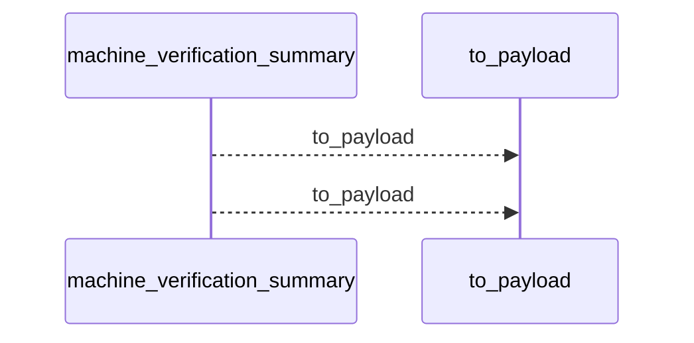
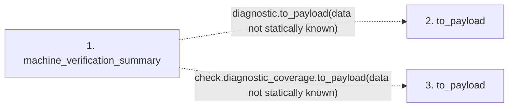

# machine_verification_summary

**Entry point:** `machine_verification_summary` (`api`)
**Source:** [knowledge_verification](../modules/knowledge_verification.md)
**Modules touched:** [knowledge_verification](../modules/knowledge_verification.md)

## Call sequence

<!-- Auto-generated from static call edges. Dashed arrows are external or unresolved calls. Reviewed runtime conditions and side effects belong in Behavior. -->

## Data flow

<!-- Auto-generated static analysis. Treat values and boundaries as best-effort hints, not runtime proof. -->

### Step data

| Step | Inputs | Reads | Writes | Returns |
|---|---|---|---|---|
| `machine_verification_summary` | `receipt: VerificationReceipt`, `valid: bool`, `reasons: list[str]` | `VerificationResult` | - | `{...}` |
| `to_payload` | - | - | - | - |
| `to_payload` | - | - | - | - |

### Call data

| From | To | Line | Call |
|---|---|---:|---|
| machine_verification_summary | to_payload | 252 | `diagnostic.to_payload(data not statically known)` |
| machine_verification_summary | to_payload | 254 | `check.diagnostic_coverage.to_payload(data not statically known)` |

### Boundary effects

*No boundary effects detected.*

### Static analysis gaps

| Kind | Step | Target | Line |
|---|---|---|---:|
| unresolved_call | `machine_verification_summary` | `diagnostic.to_payload` | 252 |
| unresolved_call | `machine_verification_summary` | `check.diagnostic_coverage.to_payload` | 254 |

## Behavior

This flow starts at `machine_verification_summary` and is classified as `api`. The generated call and data-flow sections are bounded static projections; runtime conditions and side effects require source-level confirmation.
