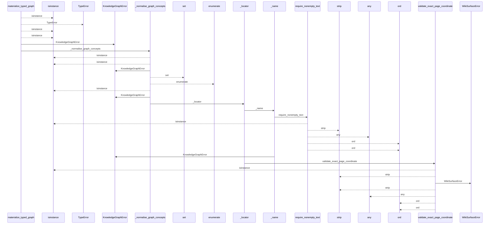
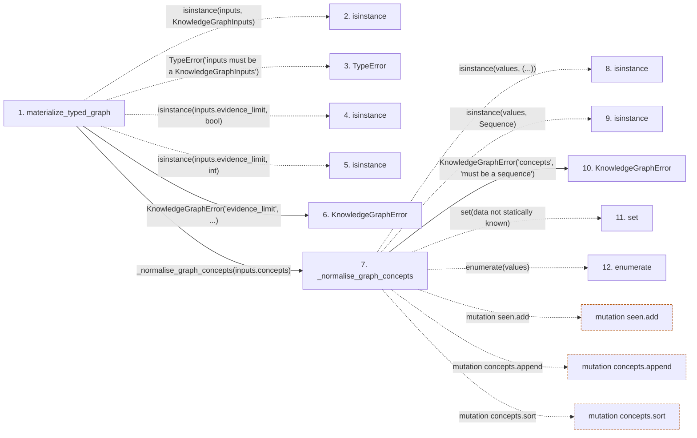

# materialize_typed_graph

**Entry point:** `materialize_typed_graph` (`api`)
**Source:** [knowledge_graph](../modules/knowledge_graph.md)
**Modules touched:** [knowledge_evidence](../modules/knowledge_evidence.md), [knowledge_graph](../modules/knowledge_graph.md), [validation](../modules/validation.md), [wiki_media](../modules/wiki_media.md), and 1 more

**Complete modules touched:**

- [knowledge_evidence](../modules/knowledge_evidence.md)
- [knowledge_graph](../modules/knowledge_graph.md)
- [validation](../modules/validation.md)
- [wiki_media](../modules/wiki_media.md)
- [wiki_surface](../modules/wiki_surface.md)

## Call sequence

<!-- Auto-generated from static call edges. Dashed arrows are external or unresolved calls. Reviewed runtime conditions and side effects belong in Behavior. -->

> Call sequence diagram shows 30 of 862 interactions; 832 omitted to keep the visualization within the 30-interaction and generated-diagram limits.

> Trace truncated at the depth limit; deeper calls are omitted.

## Data flow

<!-- Auto-generated static analysis. Treat values and boundaries as best-effort hints, not runtime proof. -->

### Step data

| Step | Inputs | Reads | Writes | Returns |
|---|---|---|---|---|
| `materialize_typed_graph` | `inputs: KnowledgeGraphInputs` | `KnowledgeGraphInputs`, `MAX_EVIDENCE_LIMIT`, `MAX_EVIDENCE_LIMIT`, `TYPED_GRAPH_SCHEMA_VERSION` | `input_hashes[...]` | `validate_typed_graph(...)` |
| `isinstance` | - | - | - | - |
| `TypeError` | - | - | - | - |
| `isinstance` | - | - | - | - |
| `isinstance` | - | - | - | - |
| `KnowledgeGraphError` | - | - | - | - |
| `_normalise_graph_concepts` | `values: Sequence[GraphConcept]` | `Mapping`, `Sequence`, `GraphConcept` | - | `tuple(...)` |
| `isinstance` | - | - | - | - |
| `isinstance` | - | - | - | - |
| `KnowledgeGraphError` | - | - | - | - |
| `set` | - | - | - | - |
| `enumerate` | - | - | - | - |

### Call data

| From | To | Line | Call |
|---|---|---:|---|
| materialize_typed_graph | isinstance | 315 | `isinstance(inputs, KnowledgeGraphInputs)` |
| materialize_typed_graph | TypeError | 316 | `TypeError('inputs must be a KnowledgeGraphInputs')` |
| materialize_typed_graph | isinstance | 318 | `isinstance(inputs.evidence_limit, bool)` |
| materialize_typed_graph | isinstance | 319 | `isinstance(inputs.evidence_limit, int)` |
| materialize_typed_graph | KnowledgeGraphError | 322 | `KnowledgeGraphError('evidence_limit', ...)` |
| materialize_typed_graph | _normalise_graph_concepts | 326 | `_normalise_graph_concepts(inputs.concepts)` |
| _normalise_graph_concepts | isinstance | 1222 | `isinstance(values, (...))` |
| _normalise_graph_concepts | isinstance | 1222 | `isinstance(values, Sequence)` |
| _normalise_graph_concepts | KnowledgeGraphError | 1223 | `KnowledgeGraphError('concepts', 'must be a sequence')` |
| _normalise_graph_concepts | set | 1225 | `set(data not statically known)` |
| _normalise_graph_concepts | enumerate | 1226 | `enumerate(values)` |

### Boundary effects

| Kind | Target | Step | Line |
|---|---|---|---:|
| mutation | `seen.add` | `_normalise_graph_concepts` | 1233 |
| mutation | `concepts.append` | `_normalise_graph_concepts` | 1253 |
| mutation | `concepts.sort` | `_normalise_graph_concepts` | 1263 |

### Static analysis gaps

| Kind | Step | Target | Line |
|---|---|---|---:|
| unresolved_call | `materialize_typed_graph` | `isinstance` | 315 |
| unresolved_call | `materialize_typed_graph` | `TypeError` | 316 |
| unresolved_call | `materialize_typed_graph` | `isinstance` | 318 |
| unresolved_call | `materialize_typed_graph` | `isinstance` | 319 |
| unresolved_call | `_normalise_graph_concepts` | `isinstance` | 1222 |
| unresolved_call | `_normalise_graph_concepts` | `enumerate` | 1226 |
| step_limit | `materialize_typed_graph` | `first 12 steps` | 0 |
| truncated_flow | `materialize_typed_graph` | `depth limit` | 0 |

## Behavior

This flow starts at `materialize_typed_graph` and is classified as `api`. The generated call and data-flow sections are bounded static projections; runtime conditions and side effects require source-level confirmation.
