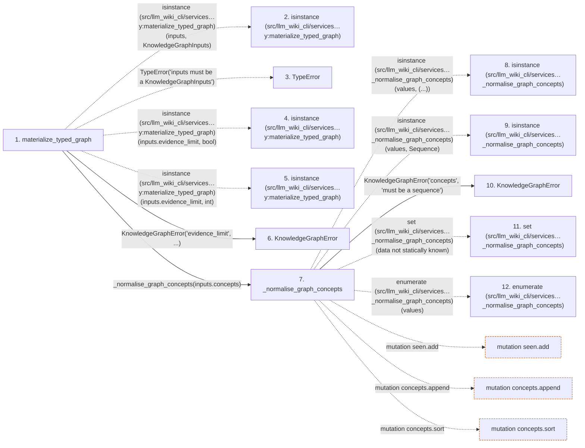

# materialize_typed_graph

**Entry point:** `materialize_typed_graph` (`api`)
**Source:** [knowledge_graph](../modules/knowledge_graph.md)
**Modules touched:** [knowledge_evidence](../modules/knowledge_evidence.md), [knowledge_graph](../modules/knowledge_graph.md), [validation](../modules/validation.md), [wiki_media](../modules/wiki_media.md), and 1 more

**Complete modules touched:**

- [knowledge_evidence](../modules/knowledge_evidence.md)
- [knowledge_graph](../modules/knowledge_graph.md)
- [validation](../modules/validation.md)
- [wiki_media](../modules/wiki_media.md)
- [wiki_surface](../modules/wiki_surface.md)

## Call sequence

```mermaid
sequenceDiagram
    participant p0 as materialize_typed_graph
    participant p1 as isinstance (src/llm_wiki_cli/services…y:materialize_typed_graph)
    participant p2 as TypeError
    participant p3 as KnowledgeGraphError
    participant p4 as _normalise_graph_concepts
    participant p5 as isinstance (src/llm_wiki_cli/services…_normalise_graph_concepts)
    participant p6 as set (src/llm_wiki_cli/services…_normalise_graph_concepts)
    participant p7 as enumerate (src/llm_wiki_cli/services…_normalise_graph_concepts)
    participant p8 as _locator
    participant p9 as _name
    participant p10 as require_nonempty_text
    participant p11 as isinstance (src/llm_wiki_cli/services….py:require_nonempty_text)
    participant p12 as value.strip (src/llm_wiki_cli/services….py:require_nonempty_text)
    participant p13 as any (src/llm_wiki_cli/services….py:require_nonempty_text)
    participant p14 as ord (src/llm_wiki_cli/services….py:require_nonempty_text)
    participant p15 as validate_exact_page_coordinate
    participant p16 as isinstance (src/llm_wiki_cli/services…ate_exact_page_coordinate)
    participant p17 as value.strip (src/llm_wiki_cli/services…ate_exact_page_coordinate)
    participant p18 as WikiSurfaceError
    participant p19 as any (src/llm_wiki_cli/services…ate_exact_page_coordinate)
    participant p20 as ord (src/llm_wiki_cli/services…ate_exact_page_coordinate)
    p0-->>p1: isinstance (src/llm_wiki_cli/services…y:materialize_typed_graph)
    p0-->>p2: TypeError
    p0-->>p1: isinstance (src/llm_wiki_cli/services…y:materialize_typed_graph)
    p0-->>p1: isinstance (src/llm_wiki_cli/services…y:materialize_typed_graph)
    p0->>p3: KnowledgeGraphError
    p0->>p4: _normalise_graph_concepts
    p4-->>p5: isinstance (src/llm_wiki_cli/services…_normalise_graph_concepts)
    p4-->>p5: isinstance (src/llm_wiki_cli/services…_normalise_graph_concepts)
    p4->>p3: KnowledgeGraphError
    p4-->>p6: set (src/llm_wiki_cli/services…_normalise_graph_concepts)
    p4-->>p7: enumerate (src/llm_wiki_cli/services…_normalise_graph_concepts)
    p4-->>p5: isinstance (src/llm_wiki_cli/services…_normalise_graph_concepts)
    p4->>p3: KnowledgeGraphError
    p4->>p8: _locator
    p8->>p9: _name
    p9->>p10: require_nonempty_text
    p10-->>p11: isinstance (src/llm_wiki_cli/services….py:require_nonempty_text)
    p10-->>p12: value.strip (src/llm_wiki_cli/services….py:require_nonempty_text)
    p10-->>p13: any (src/llm_wiki_cli/services….py:require_nonempty_text)
    p10-->>p14: ord (src/llm_wiki_cli/services….py:require_nonempty_text)
    p10-->>p14: ord (src/llm_wiki_cli/services….py:require_nonempty_text)
    p9->>p3: KnowledgeGraphError
    p8->>p15: validate_exact_page_coordinate
    p15-->>p16: isinstance (src/llm_wiki_cli/services…ate_exact_page_coordinate)
    p15-->>p17: value.strip (src/llm_wiki_cli/services…ate_exact_page_coordinate)
    p15->>p18: WikiSurfaceError
    p15-->>p17: value.strip (src/llm_wiki_cli/services…ate_exact_page_coordinate)
    p15-->>p19: any (src/llm_wiki_cli/services…ate_exact_page_coordinate)
    p15-->>p20: ord (src/llm_wiki_cli/services…ate_exact_page_coordinate)
    p15-->>p20: ord (src/llm_wiki_cli/services…ate_exact_page_coordinate)
```

<!-- Auto-generated from static call edges. Dashed arrows are external or unresolved calls. Reviewed runtime conditions and side effects belong in Behavior. -->

> Call sequence diagram shows 30 of 862 interactions; 832 omitted to keep the visualization within the 30-interaction and generated-diagram limits.

> Trace truncated at the depth limit; deeper calls are omitted.

## Data flow

<!-- Auto-generated static analysis. Treat values and boundaries as best-effort hints, not runtime proof. -->

### Step data

| Step | Inputs | Reads | Writes | Returns |
|---|---|---|---|---|
| `materialize_typed_graph` | `inputs: KnowledgeGraphInputs` | `KnowledgeGraphInputs`, `MAX_EVIDENCE_LIMIT`, `MAX_EVIDENCE_LIMIT`, `TYPED_GRAPH_SCHEMA_VERSION` | `input_hashes[...]` | `validate_typed_graph(...)` |
| `isinstance (src/llm_wiki_cli/services…y:materialize_typed_graph)` | - | - | - | - |
| `TypeError` | - | - | - | - |
| `isinstance (src/llm_wiki_cli/services…y:materialize_typed_graph)` | - | - | - | - |
| `isinstance (src/llm_wiki_cli/services…y:materialize_typed_graph)` | - | - | - | - |
| `KnowledgeGraphError` | - | - | - | - |
| `_normalise_graph_concepts` | `values: Sequence[GraphConcept]` | `Mapping`, `Sequence`, `GraphConcept` | - | `tuple(...)` |
| `isinstance (src/llm_wiki_cli/services…_normalise_graph_concepts)` | - | - | - | - |
| `isinstance (src/llm_wiki_cli/services…_normalise_graph_concepts)` | - | - | - | - |
| `KnowledgeGraphError` | - | - | - | - |
| `set (src/llm_wiki_cli/services…_normalise_graph_concepts)` | - | - | - | - |
| `enumerate (src/llm_wiki_cli/services…_normalise_graph_concepts)` | - | - | - | - |

### Call data

| From | To | Line | Call |
|---|---|---:|---|
| materialize_typed_graph | isinstance (src/llm_wiki_cli/services…y:materialize_typed_graph) | 318 | `isinstance(inputs, KnowledgeGraphInputs)` |
| materialize_typed_graph | TypeError | 319 | `TypeError('inputs must be a KnowledgeGraphInputs')` |
| materialize_typed_graph | isinstance (src/llm_wiki_cli/services…y:materialize_typed_graph) | 321 | `isinstance(inputs.evidence_limit, bool)` |
| materialize_typed_graph | isinstance (src/llm_wiki_cli/services…y:materialize_typed_graph) | 322 | `isinstance(inputs.evidence_limit, int)` |
| materialize_typed_graph | KnowledgeGraphError | 325 | `KnowledgeGraphError('evidence_limit', ...)` |
| materialize_typed_graph | _normalise_graph_concepts | 329 | `_normalise_graph_concepts(inputs.concepts)` |
| _normalise_graph_concepts | isinstance (src/llm_wiki_cli/services…_normalise_graph_concepts) | 1223 | `isinstance(values, (...))` |
| _normalise_graph_concepts | isinstance (src/llm_wiki_cli/services…_normalise_graph_concepts) | 1223 | `isinstance(values, Sequence)` |
| _normalise_graph_concepts | KnowledgeGraphError | 1224 | `KnowledgeGraphError('concepts', 'must be a sequence')` |
| _normalise_graph_concepts | set (src/llm_wiki_cli/services…_normalise_graph_concepts) | 1226 | `set(data not statically known)` |
| _normalise_graph_concepts | enumerate (src/llm_wiki_cli/services…_normalise_graph_concepts) | 1227 | `enumerate(values)` |

### Boundary effects

| Kind | Target | Step | Line |
|---|---|---|---:|
| mutation | `seen.add` | `_normalise_graph_concepts` | 1234 |
| mutation | `concepts.append` | `_normalise_graph_concepts` | 1254 |
| mutation | `concepts.sort` | `_normalise_graph_concepts` | 1264 |

### Static analysis gaps

| Kind | Step | Target | Line |
|---|---|---|---:|
| external_call | `materialize_typed_graph` | `isinstance` | 318 |
| external_call | `materialize_typed_graph` | `TypeError` | 319 |
| external_call | `materialize_typed_graph` | `isinstance` | 321 |
| external_call | `materialize_typed_graph` | `isinstance` | 322 |
| external_call | `_normalise_graph_concepts` | `isinstance` | 1223 |
| external_call | `_normalise_graph_concepts` | `enumerate` | 1227 |
| step_limit | `materialize_typed_graph` | `first 12 steps` | 0 |
| truncated_flow | `materialize_typed_graph` | `depth limit` | 0 |

## Behavior

This flow starts at `materialize_typed_graph` and is classified as `api`. The generated call and data-flow sections are bounded static projections; runtime conditions and side effects require source-level confirmation.
