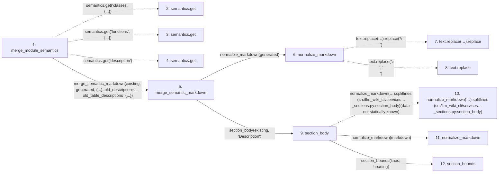

# merge_module_semantics

**Entry point:** `merge_module_semantics` (`api`)
**Source:** [section_ownership](../modules/section_ownership.md)
**Modules touched:** [markdown_sections](../modules/markdown_sections.md), [section_ownership](../modules/section_ownership.md)

## Call sequence

```mermaid
sequenceDiagram
    participant p0 as merge_module_semantics
    participant p1 as semantics.get
    participant p2 as merge_semantic_markdown
    participant p3 as normalize_markdown
    participant p4 as text.replace(…).replace
    participant p5 as text.replace
    participant p6 as section_body
    participant p7 as normalize_markdown(…).splitlines (src/llm_wiki_cli/services…_sections.py:section_body)
    participant p8 as section_bounds
    participant p9 as heading.casefold
    participant p10 as enumerate
    participant p11 as _LEGACY_HEADING_RE.match
    participant p12 as line.strip (src/llm_wiki_cli/services…ections.py:section_bounds)
    participant p13 as len (src/llm_wiki_cli/services…ections.py:section_bounds)
    participant p14 as match.group
    participant p15 as match.group(…).strip().casefold
    participant p16 as match.group(…).strip
    participant p17 as range (src/llm_wiki_cli/services…ections.py:section_bounds)
    participant p18 as lines[…].strip (src/llm_wiki_cli/services…ections.py:section_bounds)
    participant p19 as next_match.group
    participant p20 as (…).join(…).strip (src/llm_wiki_cli/services…_sections.py:section_body)
    participant p21 as '\n'.join (src/llm_wiki_cli/services…_sections.py:section_body)
    participant p22 as trim_blank_lines
    p0-->>p1: semantics.get
    p0-->>p1: semantics.get
    p0-->>p1: semantics.get
    p0->>p2: merge_semantic_markdown
    p2->>p3: normalize_markdown
    p3-->>p4: text.replace(…).replace
    p3-->>p5: text.replace
    p2->>p6: section_body
    p6-->>p7: normalize_markdown(…).splitlines (src/llm_wiki_cli/services…_sections.py:section_body)
    p6->>p3: normalize_markdown
    p6->>p8: section_bounds
    p8-->>p9: heading.casefold
    p8-->>p10: enumerate
    p8-->>p11: _LEGACY_HEADING_RE.match
    p8-->>p12: line.strip (src/llm_wiki_cli/services…ections.py:section_bounds)
    p8-->>p13: len (src/llm_wiki_cli/services…ections.py:section_bounds)
    p8-->>p14: match.group
    p8-->>p15: match.group(…).strip().casefold
    p8-->>p16: match.group(…).strip
    p8-->>p14: match.group
    p8-->>p13: len (src/llm_wiki_cli/services…ections.py:section_bounds)
    p8-->>p17: range (src/llm_wiki_cli/services…ections.py:section_bounds)
    p8-->>p13: len (src/llm_wiki_cli/services…ections.py:section_bounds)
    p8-->>p11: _LEGACY_HEADING_RE.match
    p8-->>p18: lines[…].strip (src/llm_wiki_cli/services…ections.py:section_bounds)
    p8-->>p13: len (src/llm_wiki_cli/services…ections.py:section_bounds)
    p8-->>p19: next_match.group
    p6-->>p20: (…).join(…).strip (src/llm_wiki_cli/services…_sections.py:section_body)
    p6-->>p21: '\n'.join (src/llm_wiki_cli/services…_sections.py:section_body)
    p6->>p22: trim_blank_lines
```

<!-- Auto-generated from static call edges. Dashed arrows are external or unresolved calls. Reviewed runtime conditions and side effects belong in Behavior. -->

> Call sequence diagram shows 30 of 112 interactions; 82 omitted to keep the visualization within the 30-interaction and generated-diagram limits.

## Data flow

<!-- Auto-generated static analysis. Treat values and boundaries as best-effort hints, not runtime proof. -->

### Step data

| Step | Inputs | Reads | Writes | Returns |
|---|---|---|---|---|
| `merge_module_semantics` | `existing: str`, `generated: str`, `old_semantics: Mapping[str, object] \| None` | `Mapping`, `Mapping` | - | `merge_semantic_markdown(...)` |
| `semantics.get` | - | - | - | - |
| `semantics.get` | - | - | - | - |
| `semantics.get` | - | - | - | - |
| `merge_semantic_markdown` | `existing: str`, `generated: str`, `table_headings: tuple[str, ...]`, `old_description: str \| None`, `old_table_descriptions: dict[str, dict[str, str]] \| None` | - | - | `SemanticMergeResult(...)` |
| `normalize_markdown` | `text: str` | - | - | `...` |
| `text.replace(…).replace` | - | - | - | - |
| `text.replace` | - | - | - | - |
| `section_body` | `markdown: str`, `heading: str` | - | - | `None`, `...` |
| `normalize_markdown(…).splitlines (src/llm_wiki_cli/services…_sections.py:section_body)` | - | - | - | - |
| `normalize_markdown` | `text: str` | - | - | `...` |
| `section_bounds` | `lines: list[str]`, `heading: str` | - | - | `(...)`, `None` |

### Call data

| From | To | Line | Call |
|---|---|---:|---|
| merge_module_semantics | semantics.get | 1214 | `semantics.get('classes', {...})` |
| merge_module_semantics | semantics.get | 1215 | `semantics.get('functions', {...})` |
| merge_module_semantics | semantics.get | 1216 | `semantics.get('description')` |
| merge_module_semantics | merge_semantic_markdown | 1217 | `merge_semantic_markdown(existing, generated, (...), old_description=..., old_table_descriptions={...})` |
| merge_semantic_markdown | normalize_markdown | 1155 | `normalize_markdown(generated)` |
| normalize_markdown | text.replace(…).replace | 81 | `text.replace('\r\n', '\n').replace('\r', '\n')` |
| normalize_markdown | text.replace | 81 | `text.replace('\r\n', '\n')` |
| merge_semantic_markdown | section_body | 1157 | `section_body(existing, 'Description')` |
| section_body | normalize_markdown(…).splitlines (src/llm_wiki_cli/services…_sections.py:section_body) | 695 | `normalize_markdown(markdown).splitlines(data not statically known)` |
| section_body | normalize_markdown | 695 | `normalize_markdown(markdown)` |
| section_body | section_bounds | 696 | `section_bounds(lines, heading)` |

### Boundary effects

*No boundary effects detected.*

### Static analysis gaps

| Kind | Step | Target | Line |
|---|---|---|---:|
| unresolved_call | `merge_module_semantics` | `semantics.get` | 1214 |
| unresolved_call | `merge_module_semantics` | `semantics.get` | 1215 |
| unresolved_call | `merge_module_semantics` | `semantics.get` | 1216 |
| unresolved_call | `normalize_markdown` | `text.replace('\r\n', '\n').replace` | 81 |
| unresolved_call | `normalize_markdown` | `text.replace` | 81 |
| unresolved_call | `section_body` | `normalize_markdown(markdown).splitlines` | 695 |
| step_limit | `merge_module_semantics` | `first 12 steps` | 0 |

## Behavior

This flow starts at `merge_module_semantics` and is classified as `api`. The generated call and data-flow sections are bounded static projections; runtime conditions and side effects require source-level confirmation.
