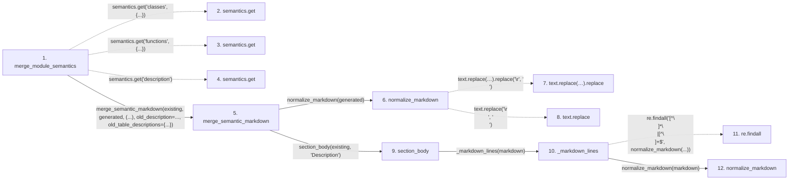

# merge_module_semantics

**Entry point:** `merge_module_semantics` (`api`)
**Source:** [section_ownership](../modules/section_ownership.md)
**Modules touched:** [knowledge_evidence](../modules/knowledge_evidence.md), [markdown_sections](../modules/markdown_sections.md), [section_ownership](../modules/section_ownership.md)

## Call sequence

> Static overview in presentation order, not runtime execution order. Arrows retain captured callers; representative internal continuations and boundary examples precede repeated helper detail.

<!-- Auto-generated from static call edges. Dashed arrows are external or unresolved calls. Reviewed runtime conditions and side effects belong in Behavior. -->

```mermaid
sequenceDiagram
    participant p0 as merge_module_semantics
    participant p1 as merge_semantic_markdown
    participant p2 as _retain_unmarked_overload_guidance
    participant p3 as parse_markdown_document
    participant p4 as section_body
    participant p5 as should_preserve_semantic_value
    participant p6 as replace_section_body
    participant p7 as table_description_cells
    participant p8 as preserve_table_description_cells
    participant p9 as _markdown_lines
    participant p10 as _iter_structural_headings
    participant p11 as hash_json
    participant p12 as _frontmatter_extent
    participant p13 as canonical_json_bytes
    participant p14 as normalize_markdown
    participant p15 as SemanticMergeResult
    participant p16 as is_placeholder_description
    participant p17 as section_bounds
    participant p18 as split_table_row
    participant p19 as trim_blank_lines
    participant p20 as is_table_separator
    participant p21 as semantic_table_key
    participant p22 as _HeadingCandidate
    participant p23 as format_table_row
    participant p24 as section_locator
    participant p25 as MarkdownSection
    participant p26 as sha256_bytes
    participant p27 as MarkdownSectionDocument
    participant p28 as _line_content
    participant p29 as isinstance (src/llm_wiki_cli/services…py:merge_module_semantics)
    participant p30 as semantics.get
    p0->>p1: merge_semantic_markdown
    p0->>p2: _retain_unmarked_overload_guidance
    p2->>p3: parse_markdown_document
    p1->>p4: section_body
    p1->>p5: should_preserve_semantic_value
    p1->>p6: replace_section_body
    p1->>p7: table_description_cells
    p1->>p8: preserve_table_description_cells
    p4->>p9: _markdown_lines
    p3->>p10: _iter_structural_headings
    p3->>p11: hash_json
    p10->>p12: _frontmatter_extent
    p11->>p13: canonical_json_bytes
    p1->>p14: normalize_markdown
    p1->>p15: SemanticMergeResult
    p5->>p16: is_placeholder_description
    p4->>p17: section_bounds
    p7->>p18: split_table_row
    p4->>p19: trim_blank_lines
    p7->>p20: is_table_separator
    p7->>p21: semantic_table_key
    p3->>p22: _HeadingCandidate
    p8->>p23: format_table_row
    p3->>p24: section_locator
    p3->>p25: MarkdownSection
    p3->>p26: sha256_bytes
    p3->>p27: MarkdownSectionDocument
    p9->>p28: _line_content
    p0-->>p29: isinstance (src/llm_wiki_cli/services…py:merge_module_semantics)(description, str)
    p0-->>p30: semantics.get('classes', {...})
```

> Call sequence diagram shows 30 of 206 interactions; 176 omitted to keep the visualization within the 30-interaction and generated-diagram limits, with uncertain identities omitted rather than inferred.

> Captured boundary calls: external 1 of 70 (69 omitted); unresolved 1 of 79 (78 omitted). These counts cover the captured static trace.

Omitted captured detail, grouped by actual caller occurrence and target module:

| Caller | Parent step | Target module | Kind | Omitted interactions |
| --- | --- | --- | --- | --- |
| `src/llm_wiki_cli/services/section_ownership.py:merge_module_semantics` | 1 | - | unresolved | 2 |
| `src/llm_wiki_cli/services/markdown_sections.py:normalize_markdown` | 6 | - | unresolved | 2 |
| `src/llm_wiki_cli/services/markdown_sections.py:_markdown_lines` | 10 | - | external | 1 |
| `src/llm_wiki_cli/services/markdown_sections.py:_markdown_lines` | 10 | [src/llm_wiki_cli/services/markdown_sections.py](../modules/markdown_sections.md) | internal | 1 |
| `src/llm_wiki_cli/services/markdown_sections.py:_line_content` | 13 | - | unresolved | 1 |
| `src/llm_wiki_cli/services/markdown_sections.py:section_bounds` | 15 | - | unresolved | 10 |
| `src/llm_wiki_cli/services/markdown_sections.py:section_bounds` | 15 | - | external | 6 |
| `src/llm_wiki_cli/services/markdown_sections.py:section_body` | 9 | - | unresolved | 2 |
> Omission summary shows 8 of 54 groups; 46 further groups are not expanded here. Counts above include all omitted interactions.
> Detailed flow queries retain their own coverage and limits; omitted paths may execute at runtime.

## Data flow

<!-- Auto-generated static analysis. Treat values and boundaries as best-effort hints, not runtime proof. -->

### Analysis coverage

**Effect analysis partially available.** Flow assembly and source effect analysis are separate; empty observations do not prove an empty handler body.

Source steps: 58; effect analysis evaluated: 53, partial: 0, unavailable: 5. Counts include steps omitted from the displayed trace.

Collector observations for 53 source steps with known totals: observed: 222, emitted: 222, omitted: 0. Unavailable totals are excluded.

- Callable record unavailable; the selected entry symbol has no represented callable body.
- Effect collector totals unavailable; observed counts cover captured records only.

| Step | Callable record | Effect analysis | Collector totals | Observed | Emitted | Omitted |
|---|---|---|---|---:|---:|---:|
| `merge_module_semantics` | `available` | `evaluated` | `available` | `6` | `6` | `0` |
| `semantics.get` | `not_applicable` | `not_applicable` | `not_applicable` | — | — | — |
| `semantics.get` | `not_applicable` | `not_applicable` | `not_applicable` | — | — | — |
| `semantics.get` | `not_applicable` | `not_applicable` | `not_applicable` | — | — | — |
| `merge_semantic_markdown` | `available` | `evaluated` | `available` | `6` | `6` | `0` |
| `normalize_markdown` | `available` | `evaluated` | `available` | `2` | `2` | `0` |
| `text.replace(…).replace` | `not_applicable` | `not_applicable` | `not_applicable` | — | — | — |
| `text.replace` | `not_applicable` | `not_applicable` | `not_applicable` | — | — | — |
| `section_body` | `available` | `evaluated` | `available` | `4` | `4` | `0` |
| `_markdown_lines` | `available` | `evaluated` | `available` | `3` | `3` | `0` |
| `re.findall` | `not_applicable` | `not_applicable` | `not_applicable` | — | — | — |
| `normalize_markdown` | `available` | `evaluated` | `available` | `2` | `2` | `0` |

```mermaid
flowchart LR
    s1["1. merge_module_semantics"]
    s2["2. semantics.get"]
    s3["3. semantics.get"]
    s4["4. semantics.get"]
    s5["5. merge_semantic_markdown"]
    s6["6. normalize_markdown"]
    s7["7. text.replace(…).replace"]
    s8["8. text.replace"]
    s9["9. section_body"]
    s10["10. _markdown_lines"]
    s11["11. re.findall"]
    s12["12. normalize_markdown"]
    s1 -. "semantics.get('classes', {...})" .-> s2
    s1 -. "semantics.get('functions', {...})" .-> s3
    s1 -. "semantics.get('description')" .-> s4
    s1 -->|"merge_semantic_markdown(existing, generated, (...), old_description=..., old_table_descriptions={...})"| s5
    s5 -->|"normalize_markdown(generated)"| s6
    s6 -. "text.replace(…).replace('\r', '\n')" .-> s7
    s6 -. "text.replace('\r\n', '\n')" .-> s8
    s5 -->|"section_body(existing, 'Description')"| s9
    s9 -->|"_markdown_lines(markdown)"| s10
    s10 -. "re.findall('[^\\n]*\\n|[^\\n]+$', normalize_markdown(...))" .-> s11
    s10 -->|"normalize_markdown(markdown)"| s12
    click s1 "../modules/section_ownership.md"
    click s5 "../modules/section_ownership.md"
    click s6 "../modules/markdown_sections.md"
    click s9 "../modules/markdown_sections.md"
    click s10 "../modules/markdown_sections.md"
    click s12 "../modules/markdown_sections.md"
```

### Step data

| Step | Inputs | Reads | Writes | Returns |
|---|---|---|---|---|
| `merge_module_semantics` | `existing: str`, `generated: str`, `old_semantics: Mapping[str, object] \| None` | `Mapping`, `Mapping` | - | `_retain_unmarked_overload_guidance(...)` |
| `semantics.get` | - | - | - | - |
| `semantics.get` | - | - | - | - |
| `semantics.get` | - | - | - | - |
| `merge_semantic_markdown` | `existing: str`, `generated: str`, `table_headings: tuple[str, ...]`, `old_description: str \| None`, `old_table_descriptions: dict[str, dict[str, str]] \| None` | - | - | `SemanticMergeResult(...)` |
| `normalize_markdown` | `text: str` | - | - | `...` |
| `text.replace(…).replace` | - | - | - | - |
| `text.replace` | - | - | - | - |
| `section_body` | `markdown: str`, `heading: str` | - | - | `None`, `...` |
| `_markdown_lines` | `markdown: str`, `keepends: bool` | - | - | `...` |
| `re.findall` | - | - | - | - |
| `normalize_markdown` | `text: str` | - | - | `...` |

### Call data

| From | To | Line | Call |
|---|---|---:|---|
| merge_module_semantics | semantics.get | 1237 | `semantics.get('classes', {...})` |
| merge_module_semantics | semantics.get | 1238 | `semantics.get('functions', {...})` |
| merge_module_semantics | semantics.get | 1239 | `semantics.get('description')` |
| merge_module_semantics | merge_semantic_markdown | 1240 | `merge_semantic_markdown(existing, generated, (...), old_description=..., old_table_descriptions={...})` |
| merge_semantic_markdown | normalize_markdown | 1158 | `normalize_markdown(generated)` |
| normalize_markdown | text.replace(…).replace | 82 | `text.replace('\r\n', '\n').replace('\r', '\n')` |
| normalize_markdown | text.replace | 82 | `text.replace('\r\n', '\n')` |
| merge_semantic_markdown | section_body | 1160 | `section_body(existing, 'Description')` |
| section_body | _markdown_lines | 703 | `_markdown_lines(markdown)` |
| _markdown_lines | re.findall | 218 | `re.findall('[^\\n]*\\n\|[^\\n]+$', normalize_markdown(...))` |
| _markdown_lines | normalize_markdown | 218 | `normalize_markdown(markdown)` |

### Boundary effects

*No boundary-effect observations were captured in this static trace.*

### Static analysis gaps

| Kind | Step | Target | Line |
|---|---|---|---:|
| unresolved_call | `merge_module_semantics` | `semantics.get` | 1237 |
| unresolved_call | `merge_module_semantics` | `semantics.get` | 1238 |
| unresolved_call | `merge_module_semantics` | `semantics.get` | 1239 |
| unresolved_call | `normalize_markdown` | `text.replace('\r\n', '\n').replace` | 82 |
| unresolved_call | `normalize_markdown` | `text.replace` | 82 |
| external_call | `_markdown_lines` | `re.findall` | 218 |
| step_limit | `merge_module_semantics` | `first 12 steps` | 0 |

## Behavior

This flow starts at `merge_module_semantics` and is classified as `api`. The generated call and data-flow sections are bounded static projections; runtime conditions and side effects require source-level confirmation.
