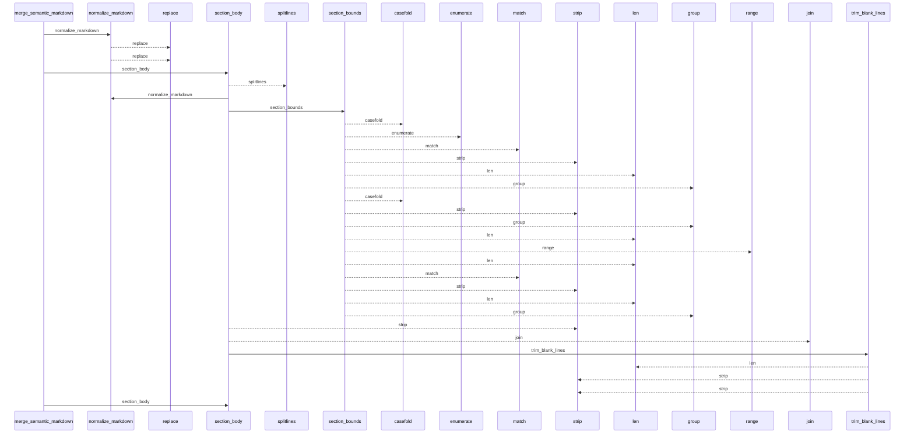
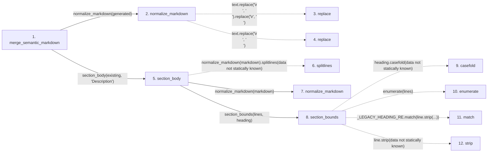

# merge_semantic_markdown

**Entry point:** `merge_semantic_markdown` (`api`)
**Source:** [section_ownership](../modules/section_ownership.md)
**Modules touched:** [markdown_sections](../modules/markdown_sections.md), [section_ownership](../modules/section_ownership.md)

## Call sequence

<!-- Auto-generated from static call edges. Dashed arrows are external or unresolved calls. Reviewed runtime conditions and side effects belong in Behavior. -->

> Call sequence diagram shows 30 of 103 interactions; 73 omitted to keep the visualization within the 30-interaction and generated-diagram limits.

## Data flow

<!-- Auto-generated static analysis. Treat values and boundaries as best-effort hints, not runtime proof. -->

### Step data

| Step | Inputs | Reads | Writes | Returns |
|---|---|---|---|---|
| `merge_semantic_markdown` | `existing: str`, `generated: str`, `table_headings: tuple[str, ...]`, `old_description: str \| None`, `old_table_descriptions: dict[str, dict[str, str]] \| None` | - | - | `SemanticMergeResult(...)` |
| `normalize_markdown` | `text: str` | - | - | `...` |
| `replace` | - | - | - | - |
| `replace` | - | - | - | - |
| `section_body` | `markdown: str`, `heading: str` | - | - | `None`, `...` |
| `splitlines` | - | - | - | - |
| `normalize_markdown` | `text: str` | - | - | `...` |
| `section_bounds` | `lines: list[str]`, `heading: str` | - | - | `(...)`, `None` |
| `casefold` | - | - | - | - |
| `enumerate` | - | - | - | - |
| `match` | - | - | - | - |
| `strip` | - | - | - | - |

### Call data

| From | To | Line | Call |
|---|---|---:|---|
| merge_semantic_markdown | normalize_markdown | 1155 | `normalize_markdown(generated)` |
| normalize_markdown | replace | 81 | `text.replace('\r\n', '\n').replace('\r', '\n')` |
| normalize_markdown | replace | 81 | `text.replace('\r\n', '\n')` |
| merge_semantic_markdown | section_body | 1157 | `section_body(existing, 'Description')` |
| section_body | splitlines | 695 | `normalize_markdown(markdown).splitlines(data not statically known)` |
| section_body | normalize_markdown | 695 | `normalize_markdown(markdown)` |
| section_body | section_bounds | 696 | `section_bounds(lines, heading)` |
| section_bounds | casefold | 661 | `heading.casefold(data not statically known)` |
| section_bounds | enumerate | 662 | `enumerate(lines)` |
| section_bounds | match | 663 | `_LEGACY_HEADING_RE.match(line.strip(...))` |
| section_bounds | strip | 663 | `line.strip(data not statically known)` |

### Boundary effects

*No boundary effects detected.*

### Static analysis gaps

| Kind | Step | Target | Line |
|---|---|---|---:|
| external_call | `normalize_markdown` | `text.replace('\r\n', '\n').replace` | 81 |
| external_call | `normalize_markdown` | `text.replace` | 81 |
| unresolved_call | `section_body` | `normalize_markdown(markdown).splitlines` | 695 |
| unresolved_call | `section_bounds` | `heading.casefold` | 661 |
| unresolved_call | `section_bounds` | `enumerate` | 662 |
| unresolved_call | `section_bounds` | `_LEGACY_HEADING_RE.match` | 663 |
| unresolved_call | `section_bounds` | `line.strip` | 663 |
| step_limit | `merge_semantic_markdown` | `first 12 steps` | 0 |

## Behavior

This flow starts at `merge_semantic_markdown` and is classified as `api`. The generated call and data-flow sections are bounded static projections; runtime conditions and side effects require source-level confirmation.
