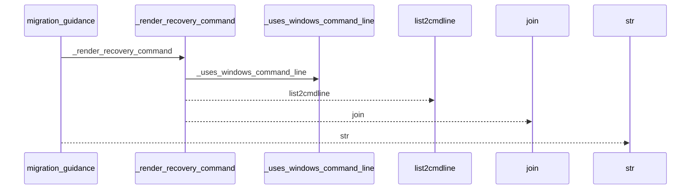
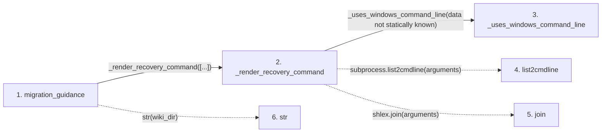

# migration_guidance

**Entry point:** `migration_guidance` (`api`)
**Source:** [wiki_lifecycle](../modules/wiki_lifecycle.md)
**Modules touched:** [wiki_lifecycle](../modules/wiki_lifecycle.md)

## Call sequence

<!-- Auto-generated from static call edges. Dashed arrows are external or unresolved calls. Reviewed runtime conditions and side effects belong in Behavior. -->

## Data flow

<!-- Auto-generated static analysis. Treat values and boundaries as best-effort hints, not runtime proof. -->

### Step data

| Step | Inputs | Reads | Writes | Returns |
|---|---|---|---|---|
| `migration_guidance` | `src_dir: str`, `wiki_dir: Union[str, Path]` | - | - | `...` |
| `_render_recovery_command` | `arguments: list[str]` | - | - | `subprocess.list2cmdline(...)`, `shlex.join(...)` |
| `_uses_windows_command_line` | - | `os` | - | `...` |
| `list2cmdline` | - | - | - | - |
| `join` | - | - | - | - |
| `str` | - | - | - | - |

### Call data

| From | To | Line | Call |
|---|---|---:|---|
| migration_guidance | _render_recovery_command | 300 | `_render_recovery_command([...])` |
| _render_recovery_command | _uses_windows_command_line | 148 | `_uses_windows_command_line(data not statically known)` |
| _render_recovery_command | list2cmdline | 149 | `subprocess.list2cmdline(arguments)` |
| _render_recovery_command | join | 150 | `shlex.join(arguments)` |
| migration_guidance | str | 308 | `str(wiki_dir)` |

### Boundary effects

*No boundary effects detected.*

### Static analysis gaps

| Kind | Step | Target | Line |
|---|---|---|---:|
| external_call | `_render_recovery_command` | `subprocess.list2cmdline` | 149 |
| external_call | `_render_recovery_command` | `shlex.join` | 150 |

## Behavior

This flow starts at `migration_guidance` and is classified as `api`. The generated call and data-flow sections are bounded static projections; runtime conditions and side effects require source-level confirmation.
