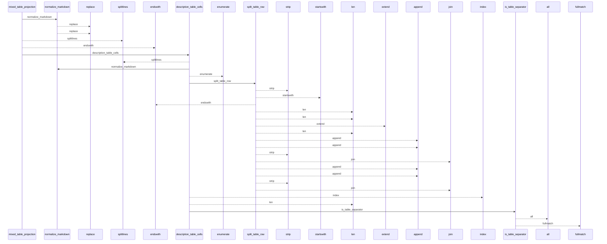
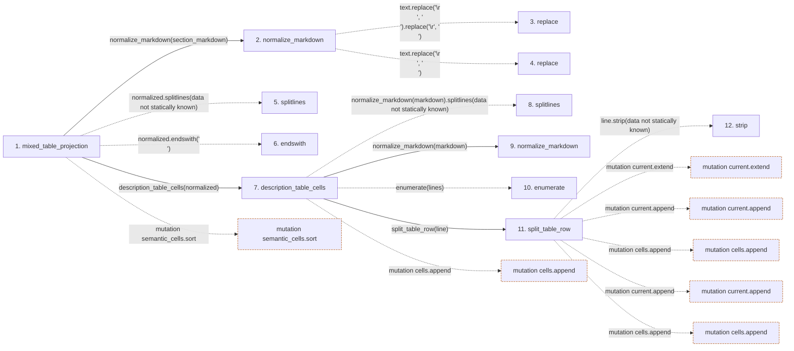

# mixed_table_projection

**Entry point:** `mixed_table_projection` (`api`)
**Source:** [markdown_sections](../modules/markdown_sections.md)
**Modules touched:** [knowledge_evidence](../modules/knowledge_evidence.md), [markdown_sections](../modules/markdown_sections.md)

## Call sequence

<!-- Auto-generated from static call edges. Dashed arrows are external or unresolved calls. Reviewed runtime conditions and side effects belong in Behavior. -->

> Call sequence diagram shows 30 of 71 interactions; 41 omitted to keep the visualization within the 30-interaction and generated-diagram limits.

## Data flow

<!-- Auto-generated static analysis. Treat values and boundaries as best-effort hints, not runtime proof. -->

### Step data

| Step | Inputs | Reads | Writes | Returns |
|---|---|---|---|---|
| `mixed_table_projection` | `section_markdown: str` | `MIXED_TABLE_DOMAIN`, `MIXED_TABLE_DOMAIN` | `row[...]`, `structural_lines[...]`, `semantic_by_key[...]` | `MixedTableProjection(...)` |
| `normalize_markdown` | `text: str` | - | - | `...` |
| `replace` | - | - | - | - |
| `replace` | - | - | - | - |
| `splitlines` | - | - | - | - |
| `endswith` | - | - | - | - |
| `description_table_cells` | `markdown: str` | - | `occurrences[...]` | `tuple(...)`, `(...)` |
| `splitlines` | - | - | - | - |
| `normalize_markdown` | `text: str` | - | - | `...` |
| `enumerate` | - | - | - | - |
| `split_table_row` | `line: str` | - | - | `[...]`, `cells` |
| `strip` | - | - | - | - |

### Call data

| From | To | Line | Call |
|---|---|---:|---|
| mixed_table_projection | normalize_markdown | 605 | `normalize_markdown(section_markdown)` |
| normalize_markdown | replace | 81 | `text.replace('\r\n', '\n').replace('\r', '\n')` |
| normalize_markdown | replace | 81 | `text.replace('\r\n', '\n')` |
| mixed_table_projection | splitlines | 606 | `normalized.splitlines(data not statically known)` |
| mixed_table_projection | endswith | 607 | `normalized.endswith('\n')` |
| mixed_table_projection | description_table_cells | 608 | `description_table_cells(normalized)` |
| description_table_cells | splitlines | 558 | `normalize_markdown(markdown).splitlines(data not statically known)` |
| description_table_cells | normalize_markdown | 558 | `normalize_markdown(markdown)` |
| description_table_cells | enumerate | 559 | `enumerate(lines)` |
| description_table_cells | split_table_row | 560 | `split_table_row(line)` |
| split_table_row | strip | 467 | `line.strip(data not statically known)` |

### Boundary effects

| Kind | Target | Step | Line |
|---|---|---|---:|
| mutation | `semantic_cells.sort` | `mixed_table_projection` | 629 |
| mutation | `cells.append` | `description_table_cells` | 581 |
| mutation | `current.extend` | `split_table_row` | 478 |
| mutation | `current.append` | `split_table_row` | 486 |
| mutation | `cells.append` | `split_table_row` | 494 |
| mutation | `current.append` | `split_table_row` | 497 |
| mutation | `cells.append` | `split_table_row` | 499 |

### Static analysis gaps

| Kind | Step | Target | Line |
|---|---|---|---:|
| external_call | `normalize_markdown` | `text.replace('\r\n', '\n').replace` | 81 |
| external_call | `normalize_markdown` | `text.replace` | 81 |
| unresolved_call | `mixed_table_projection` | `normalized.splitlines` | 606 |
| unresolved_call | `mixed_table_projection` | `normalized.endswith` | 607 |
| unresolved_call | `description_table_cells` | `normalize_markdown(markdown).splitlines` | 558 |
| unresolved_call | `description_table_cells` | `enumerate` | 559 |
| unresolved_call | `split_table_row` | `line.strip` | 467 |
| step_limit | `mixed_table_projection` | `first 12 steps` | 0 |

## Behavior

This flow starts at `mixed_table_projection` and is classified as `api`. The generated call and data-flow sections are bounded static projections; runtime conditions and side effects require source-level confirmation.
